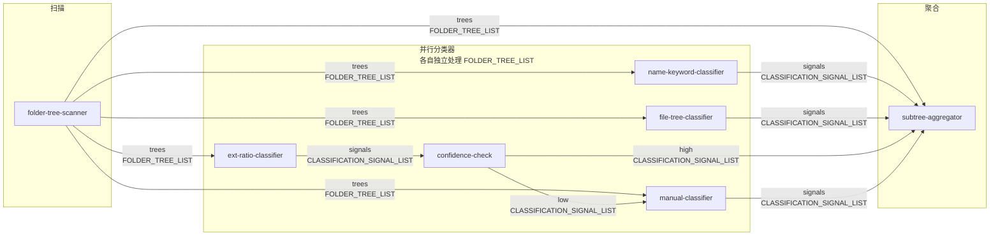
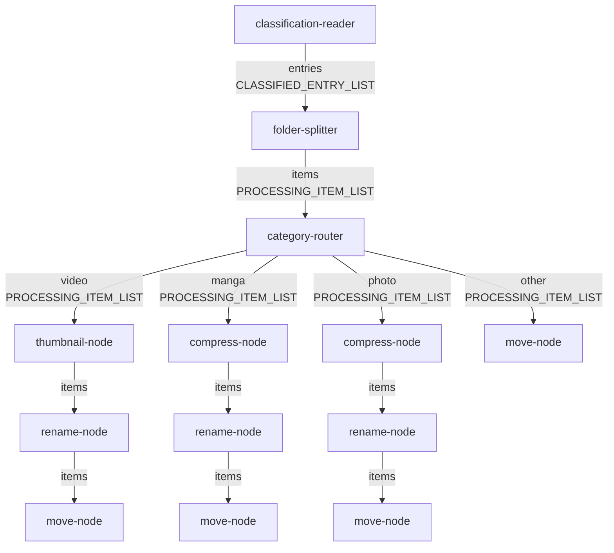

# 执行引擎设计

> 版本：v2.0 | 日期：2026-03-26
> 本文档是对现有工作流执行引擎的完整重设计，覆盖：当前问题根因分析、强类型端口系统、批量 Token 语义、完整节点注册表（14个节点）、图验证规则、执行算法、数据库增量。
> 配套文档：[节点系统设计](./节点系统设计.md)

---

## 目录

1. [当前引擎问题清单](#一当前引擎问题清单)
2. [设计目标](#二设计目标)
3. [类型系统](#三类型系统)
4. [节点接口规范](#四节点接口规范)
5. [图 JSON 格式](#五图-json-格式)
6. [图验证规则](#六图验证规则)
7. [执行引擎算法](#七执行引擎算法)
8. [完整节点注册表](#八完整节点注册表)
9. [数据流图](#九数据流图)
10. [数据库 Schema 增量](#十数据库-schema-增量)
11. [迁移路径](#十一迁移路径)
12.兼容设计
13.验收标准

---

## 一、当前引擎问题清单

以下 10 个问题通过代码审查确认，每条附具体代码位置。

### P1 — 执行模型根本错配

**现象**：`folder-tree-scanner` 在 `Execute` 中将 N 棵目录树逐个追加到 `Outputs []any`，企图表达"输出 N 个 token"。但 runner 只通过 `outputCache[nodeID][portIndex]` 读取单个值——`portIndex` 是固定的整数偏移，其余 token 全部丢弃。

**代码位置**：
- `node_folder_tree_scanner.go:99`：`outputs = append(outputs, tree)`（逐个 append，期待 N 个输出）
- `workflow_runner.go:455`：`inputs[portName] = sourceOutputs[spec.LinkSource.OutputPortIndex]`（只读单个索引）

**影响**：分类管道完全无法运行；scanner 扫描 100 个目录只有第 0 个被下游接收。

### P2 — 分类管道 5 个节点有实现无注册

**现象**：以下节点有完整的 Go 实现文件，但 `NewWorkflowRunnerService` 的注册列表中不存在：
- `folder-tree-scanner`（`node_folder_tree_scanner.go`）
- `name-keyword-classifier`（`node_name_keyword_classifier.go`）
- `file-tree-classifier`（`node_file_tree_classifier.go`）
- `confidence-check`（`node_confidence_check.go`）
- `subtree-aggregator`（`node_subtree_aggregator.go`）

**代码位置**：`workflow_runner.go:123-136`（注册列表）

**影响**：`default-classification` 工作流 JSON 执行时会因找不到 executor 立即 fail，分类管道完全不可用。

### P3 — `hasNilRequiredInput` 与 Lazy 端口语义直接冲突

**现象**：runner 用 `hasNilRequiredInput` 判断是否跳过节点：任意输入端口值为 nil 即跳过。但 `subtree-aggregator` 的 `signal_kw`、`signal_ft` 等端口是 **lazy**（合法 nil，代表"该分类器未命中"），导致只要有一个 lazy 端口是 nil，整个 `subtree-aggregator` 就被跳过，永远不执行。

**代码位置**：
- `workflow_runner.go:464`：`if len(inputs) > 0 && hasNilRequiredInput(inputs)`
- `workflow_runner.go:1224`：`hasNilRequiredInput` 实现（任意 nil → return true）
- `NodeSchemaPort.Lazy bool` 字段存在于设计文档但未在 runner 中读取

**影响**：`subtree-aggregator` 永远被跳过；设计文档中的分类管道 DAG 在实际执行中无法到达聚合节点。

### P4 — `subtree-aggregator` 未实现递归 bottom-up 聚合

**现象**：`subtreeAggregatorNodeExecutor.Execute` 只调用 `firstAvailableSignal()` 取第一个非空信号，直接写入 `folders.category`，输出一个没有 `Subtree` 的 `ClassifiedEntry`。

**代码位置**：`node_subtree_aggregator.go:57-118`

**影响**：
- `ClassifiedEntry.Subtree` 永远为空 map
- 无递归：叶→根的 category 继承逻辑不存在
- 无 mixed 判断：子目录分类不同时不会输出 `"mixed"`
- 实现中 `Subtree` 类型是 `map[string]ClassifiedEntry`，设计文档描述的是 `[]ClassifiedEntry`，两者不一致

### P5 — 类型系统是装饰性的

**现象**：节点间通信是 `Outputs []any`。节点输出序列化存入 `node_run.output_json` 后，Resume 时从 DB 读出的 Go 类型是 `map[string]any` 而非原始 struct。每个节点都必须写双路类型断言应对两种形态：

```go
// node_subtree_aggregator.go:150-172
func toSignal(raw any) (ClassificationSignal, bool) {
    switch v := raw.(type) {
    case ClassificationSignal:   // 内存直传时
        return v, true
    case map[string]any:         // 从 JSON 反序列化后
        ...
    }
}
```

`NodeSchema` 中的 `port_type` 字符串字段既无编译时类型，也无运行时验证——连线时不报错，执行时才崩溃。

**代码位置**：所有节点实现文件中均存在类似断言；`workflow_runner.go:964-978`（`parseNodeOutputs`）

### P6 — WorkflowRun 绑定 `folder_id NOT NULL` 与分类管道冲突

**现象**：`StartWorkflowJobInput` 要求 `FolderIDs []string`（已存在的 folder 记录）。但分类管道的职责是"扫描 source_dir → 发现并创建 folder 记录"——运行之前 folder 不存在，无法提供 ID。

**代码位置**：
- `workflow_runner.go:160`：`if len(input.FolderIDs) == 0 { return "", fmt.Errorf(...) }`
- DB Schema：`workflow_runs.folder_id TEXT NOT NULL`

**影响**：分类管道根本无法通过现有入口启动。

### P7 — Resume 状态纯内存存储

**现象**：`manual-classifier` 触发 `ExecutionPending` 后，用户提交的分类结果存入 `s.pendingResumeData map[string]map[string]any`（服务内存）。服务重启后所有处于 `waiting_input` 状态的 WorkflowRun 永远无法恢复。

**代码位置**：
- `workflow_runner.go:93`：`pendingResumeData map[string]map[string]any`
- `workflow_runner.go:290-308`：`ResumeWorkflowRunWithData` 写入内存 map

### P8 — 批处理语义分散，无统一规范

**现象**：`folder-splitter` 输出 `[]ProcessingItem`，下游各节点各自实现"单个/列表"双路处理：
- `node_category_router.go:81`：`categoryRouterExtractItems()`
- `node_move_node.go:44`：`categoryRouterExtractItems()` + `isList` 标志
- `node_rename_node.go`、`node_compress_node.go`、`node_thumbnail_node.go`：各自实现

新增一个处理管道节点就必须手动实现这套 item/items 双路逻辑，极易遗漏。

### P9 — `ext-ratio-classifier` 绕过图数据流

**现象**：`extRatioClassifierNodeExecutor.Execute` 直接调用 `e.fs.ReadDir(ctx, input.Folder.Path)` 重新扫描磁盘，完全忽略上游传来的 `FOLDER_TREE_NODE` 输入（`input.Inputs["folder"]`）。

**代码位置**：`workflow_runner.go:1074-1103`

**影响**：
1. 破坏图的数据流独立性（节点应只依赖输入端口）
2. `folder-tree-scanner` 扫描构建的 `FolderTree` 数据被丢弃，重复 IO
3. 导致无法在测试中 mock FS 数据进行单元测试

### P10 — 两套 move-node 并存，旧实现有已死代码

**现象**：
- `moveNodeExecutor`（type: `"move"`，Phase 1.5 遗留）：按 `input.Folder.Path` 移动，不支持 `ProcessingItem`
- `phase4MoveNodeExecutor`（type: `"move-node"`，Phase 4）：支持 `PROCESSING_ITEM_LIST`

旧实现存在已死代码：

```go
// workflow_runner.go:1150
if err := e.fs.MoveDir(ctx, input.Folder.Path, dst); err != nil { ... }
// 上一行已经使用了 input.Folder，下面的 nil 检查永远不会触发：
if input.Folder == nil {   // ← 永远 false
    return NodeExecutionOutput{Outputs: []any{nil}, Status: ExecutionSuccess}, nil
}
```

---

## 二、设计目标

| 目标 | 解决的问题 |
|------|-----------|
| 强类型端口系统（`PortType` 枚举 + 连线时校验） | P1、P5 |
| 命名端口替代数字索引 | P1、P5 |
| 批量 Token 语义（`[]T` 统一批处理） | P1、P8 |
| `shouldSkipNode` 尊重 `Lazy` 标志 | P3 |
| 注册全部 14 个节点 | P2 |
| 并行分类器架构（替代短路链） | P1、P4 |
| `subtree-aggregator` 真正实现 bottom-up 聚合 | P4 |
| `ext-ratio-classifier` 读取输入端口数据 | P9 |
| `TypeRegistry`：类型感知的 JSON 序列化/反序列化 | P5 |
| `StartWorkflowJobInput` 支持 `SourceDir` | P6 |
| Resume 数据持久化到 `node_runs.resume_data` | P7 |
| 废弃旧 `"move"` 类型，统一为 `"move-node"` | P10 |

---

## 三、类型系统

### 3.1 PortType 枚举

```go
// internal/service/port_types.go
type PortType string

const (
    // 基础类型
    PortTypePath    PortType = "PATH"
    PortTypeString  PortType = "STRING"
    PortTypeBoolean PortType = "BOOLEAN"

    // 分类管道类型
    PortTypeFolderTreeList           PortType = "FOLDER_TREE_LIST"
    PortTypeClassificationSignalList PortType = "CLASSIFICATION_SIGNAL_LIST"
    PortTypeClassifiedEntryList      PortType = "CLASSIFIED_ENTRY_LIST"

    // 处理管道类型
    PortTypeProcessingItemList PortType = "PROCESSING_ITEM_LIST"
    PortTypeMoveResultList     PortType = "MOVE_RESULT_LIST"
)
```

**设计说明**：

- 所有列表类型统一使用 `_LIST` 后缀，不提供单数版本。空列表代表"没有数据"，消除历史上 single/batch 双路处理的根源（修正 P8）。
- `PATH` 与 `STRING` 语义不同，不允许互接（文件路径与通用字符串有不同的校验规则）。

### 3.2 端口兼容性规则

连线从 `source_port` 连向 `target_port` 时，在保存 WorkflowDef 时就执行校验：

| source 类型 | target 类型 | 结果 | 说明 |
|------------|------------|------|------|
| `T` | `T` | 合法 | 精确匹配 |
| `PATH` | `STRING` | **非法** | 语义不同，底层相同不代表可互换 |
| `FOLDER_TREE_LIST` | `PROCESSING_ITEM_LIST` | **非法** | 类型不兼容 |
| 任何类型 | 任何不同类型 | **非法** | 默认拒绝跨类型连线 |

不提供隐式类型转换（如旧设计中 `FOLDER_TREE → FOLDER_TREE_LIST` 的自动包装）。所有转换必须显式通过节点完成，保持类型系统的纯粹性。

### 3.3 TypedValue — 运行时类型信封

```go
// TypedValue 是节点端口值的运行时容器，保存类型信息与 Go 值
type TypedValue struct {
    Type  PortType `json:"type"`
    Value any      `json:"-"` // 内存中的原始 Go 值
}

// TypedValueJSON 用于 DB 序列化（output_json 字段）
type TypedValueJSON struct {
    Type  PortType        `json:"type"`
    Value json.RawMessage `json:"value"`
}
```

### 3.4 TypeRegistry — 消灭 JSON 往返类型擦除（修正 P5）

```go
// TypeRegistry 为每种 PortType 注册 marshal/unmarshal 函数
type TypeRegistry struct {
    marshalers   map[PortType]func(any) (json.RawMessage, error)
    unmarshalers map[PortType]func(json.RawMessage) (any, error)
}

func (r *TypeRegistry) Marshal(tv TypedValue) (TypedValueJSON, error)
func (r *TypeRegistry) Unmarshal(tvj TypedValueJSON) (TypedValue, error)
```

**内置注册**（引擎初始化时完成）：

```go
registry.Register(PortTypeFolderTreeList,
    func(v any) (json.RawMessage, error) { return json.Marshal(v.([]FolderTree)) },
    func(raw json.RawMessage) (any, error) {
        var out []FolderTree
        return out, json.Unmarshal(raw, &out)
    },
)

registry.Register(PortTypeClassificationSignalList,
    func(v any) (json.RawMessage, error) { return json.Marshal(v.([]ClassificationSignal)) },
    func(raw json.RawMessage) (any, error) {
        var out []ClassificationSignal
        return out, json.Unmarshal(raw, &out)
    },
)

registry.Register(PortTypeProcessingItemList,
    func(v any) (json.RawMessage, error) { return json.Marshal(v.([]ProcessingItem)) },
    func(raw json.RawMessage) (any, error) {
        var out []ProcessingItem
        return out, json.Unmarshal(raw, &out)
    },
)

registry.Register(PortTypeClassifiedEntryList,
    func(v any) (json.RawMessage, error) { return json.Marshal(v.([]ClassifiedEntry)) },
    func(raw json.RawMessage) (any, error) {
        var out []ClassifiedEntry
        return out, json.Unmarshal(raw, &out)
    },
)

registry.Register(PortTypeMoveResultList,
    func(v any) (json.RawMessage, error) { return json.Marshal(v.([]MoveResult)) },
    func(raw json.RawMessage) (any, error) {
        var out []MoveResult
        return out, json.Unmarshal(raw, &out)
    },
)

registry.Register(PortTypePath,
    func(v any) (json.RawMessage, error) { return json.Marshal(v.(string)) },
    func(raw json.RawMessage) (any, error) {
        var out string
        return out, json.Unmarshal(raw, &out)
    },
)
```

从 DB 恢复节点输出缓存时，引擎通过 `TypeRegistry.Unmarshal` 将 JSON 反序列化为正确的 Go 类型（`[]FolderTree` 而非 `[]any`）。节点代码中不再需要 `toSignal()`、`categoryRouterToItem()` 类的双路断言。

### 3.5 ClassificationSignal 新增 SourcePath

```go
type ClassificationSignal struct {
    SourcePath string   `json:"source_path"` // 新增：对应哪个 FolderTree.Path
    Category   string   `json:"category"`
    Confidence float64  `json:"confidence"`
    Reason     string   `json:"reason"`
    Signals    []string `json:"signals,omitempty"`
    IsEmpty    bool     `json:"is_empty"` // true = 本分类器对此条目无判断（pass-through）
}
```

`SourcePath` 使得 `subtree-aggregator` 可以在批量信号列表中按路径精确匹配每个 `FolderTree`，不依赖数组下标对齐——批量处理时数组对齐易出错，按路径匹配更健壮。

---

## 四、节点接口规范

### 4.1 PortDef（替换 NodeSchemaPort）

```go
// PortDef 描述节点的一个输入或输出端口
type PortDef struct {
    Name        string   `json:"name"`        // 端口标识符（在节点内唯一）
    Type        PortType `json:"type"`        // 强类型标识（用于连线校验）
    Required    bool     `json:"required"`    // false = 可选端口
    Lazy        bool     `json:"lazy"`        // true = nil 是合法值，不触发节点跳过
    Description string   `json:"description"` // 用于 UI 展示
}
```

**Required 与 Lazy 的组合语义**：

| Required | Lazy | 含义 |
|---------|------|------|
| true | false | 必填端口：nil 时跳过整个节点 |
| false | true | 懒加载端口：nil 合法，代表"上游未命中/未连接" |
| false | false | 可选端口：nil 时使用节点内部默认值 |
| true | true | 无意义组合，校验时报错（required 且 lazy 相互矛盾） |

### 4.2 NodeSchema（升级后）

```go
type NodeSchema struct {
    TypeID      string    `json:"type_id"`
    DisplayName string    `json:"display_name"`
    Description string    `json:"description"`
    Category    string    `json:"category"` // scanner|classifier|aggregator|router|action
    Inputs      []PortDef `json:"inputs"`
    Outputs     []PortDef `json:"outputs"`
}
```

### 4.3 NodeExecutionInput（命名端口）

```go
// NodeExecutionInput 是节点执行时的完整上下文
type NodeExecutionInput struct {
    WorkflowRun *repository.WorkflowRun
    NodeRun     *repository.NodeRun
    Node        repository.WorkflowGraphNode
    // Inputs 按端口名索引，值已通过 TypeRegistry 反序列化为正确的 Go 类型
    // 例如 Inputs["trees"].Value 的实际类型是 []FolderTree（不是 map[string]any）
    Inputs      map[string]TypedValue
}
```

### 4.4 NodeExecutionResult（命名输出端口）

```go
// NodeExecutionResult 节点执行结果
type NodeExecutionResult struct {
    Status  ExecutionStatus
    // Outputs 按端口名索引，Value 必须与该端口声明的 PortType 对应
    // 例如 Outputs["trees"] = TypedValue{Type: PortTypeFolderTreeList, Value: []FolderTree{...}}
    Outputs map[string]TypedValue
    Error   error
    Pending *PendingState // 非空时 Status = ExecutionPending
}

type PendingState struct {
    Reason      string         // 展示给用户的等待原因
    ResumeData  map[string]any // 持久化到 DB 的恢复上下文（替代内存 map）
}
```

### 4.5 WorkflowNodeExecutor 接口

```go
type WorkflowNodeExecutor interface {
    // Type 返回节点类型 ID，用于注册表查找和 GraphJSON 中的 "type" 字段
    Type() string

    // Schema 返回节点的完整端口定义，供图验证和前端 UI 渲染
    Schema() NodeSchema

    // Execute 执行节点，返回结果
    // input.Inputs 中的值已通过 TypeRegistry 反序列化，可直接类型断言为对应 Go 类型
    Execute(ctx context.Context, input NodeExecutionInput) (NodeExecutionResult, error)

    // Resume 从 PENDING 状态恢复
    // resumeData 从 node_runs.resume_data 读取（DB 持久化），不依赖内存
    Resume(ctx context.Context, input NodeExecutionInput, resumeData map[string]any) (NodeExecutionResult, error)

    // Rollback 撤销已执行的副作用
    Rollback(ctx context.Context, input NodeRollbackInput) error
}
```

---

## 五、图 JSON 格式

### 5.1 边定义：命名端口（替代数字索引）

```json
// 旧格式（脆弱）
{ "id": "e3", "source": "cls-kw", "source_port": 1, "target": "cls-ft", "target_port": 0 }

// 新格式（自文档化，可读）
{ "id": "e3", "source": "scan-1", "source_port": "trees", "target": "cls-kw", "target_port": "trees" }
```

**向后兼容**：`source_port` / `target_port` 若为整数，解析器自动将其转换为该节点 Schema 中对应下标的端口名。

### 5.2 节点输入规范

```json
"inputs": {
    "source_dir": { "const_value": "/data/source" },
    "trees": {
        "link_source": {
            "source_node_id": "scan-1",
            "source_port": "trees"
        }
    }
}
```

`link_source.source_port` 使用端口名字符串，不再是 `output_port_index` 整数。

### 5.3 完整分类工作流 GraphJSON 示例

```json
{
  "id": "default-classification-v2",
  "name": "默认分类工作流（v2）",
  "version": 2,
  "nodes": [
    {
      "id": "scan-1",
      "type": "folder-tree-scanner",
      "label": "目录扫描",
      "config": {
        "source_dir": "/data/source",
        "max_depth": 5,
        "exclude_patterns": [".DS_Store", "Thumbs.db", "@eaDir", "#recycle"]
      },
      "inputs": {}
    },
    {
      "id": "cls-kw",
      "type": "name-keyword-classifier",
      "label": "关键词分类",
      "config": {
        "rules": [
          { "keyword": "漫画",  "category": "manga", "confidence": 1.0, "priority": 10, "match_type": "folder_name_contains" },
          { "keyword": "manga", "category": "manga", "confidence": 1.0, "priority": 10, "match_type": "folder_name_contains" },
          { "keyword": "写真",  "category": "photo", "confidence": 0.9, "priority": 9,  "match_type": "folder_name_contains" }
        ]
      },
      "inputs": {
        "trees": { "link_source": { "source_node_id": "scan-1", "source_port": "trees" } }
      }
    },
    {
      "id": "cls-ft",
      "type": "file-tree-classifier",
      "label": "文件树分类",
      "config": {
        "rules": [
          { "condition": "has_ext(.cbz|.cbr|.cb7|.cbt)", "category": "manga", "confidence": 0.95 },
          { "condition": "has_video_and_subtitle",         "category": "video", "confidence": 0.90 },
          { "condition": "flat_images_no_subdir",          "category": "photo", "confidence": 0.80 }
        ]
      },
      "inputs": {
        "trees": { "link_source": { "source_node_id": "scan-1", "source_port": "trees" } }
      }
    },
    {
      "id": "cls-er",
      "type": "ext-ratio-classifier",
      "label": "扩展名比例分类",
      "config": {
        "photo_threshold": 0.85,
        "video_threshold": 0.85
      },
      "inputs": {
        "trees": { "link_source": { "source_node_id": "scan-1", "source_port": "trees" } }
      }
    },
    {
      "id": "cc-1",
      "type": "confidence-check",
      "label": "置信度检查",
      "config": { "threshold": 0.70 },
      "inputs": {
        "signals": { "link_source": { "source_node_id": "cls-er", "source_port": "signals" } }
      }
    },
    {
      "id": "mc-1",
      "type": "manual-classifier",
      "label": "人工确认",
      "config": { "timeout_seconds": 0, "timeout_action": "use_hint" },
      "inputs": {
        "trees": { "link_source": { "source_node_id": "scan-1", "source_port": "trees" } },
        "hint":  { "link_source": { "source_node_id": "cc-1",   "source_port": "low" } }
      }
    },
    {
      "id": "agg-1",
      "type": "subtree-aggregator",
      "label": "子树聚合",
      "config": {},
      "inputs": {
        "trees":         { "link_source": { "source_node_id": "scan-1", "source_port": "trees" } },
        "signal_kw":     { "link_source": { "source_node_id": "cls-kw", "source_port": "signals" } },
        "signal_ft":     { "link_source": { "source_node_id": "cls-ft", "source_port": "signals" } },
        "signal_ext":    { "link_source": { "source_node_id": "cc-1",   "source_port": "high" } },
        "signal_manual": { "link_source": { "source_node_id": "mc-1",   "source_port": "signals" } }
      }
    }
  ],
  "edges": [
    { "id": "e1", "source": "scan-1", "source_port": "trees",   "target": "cls-kw", "target_port": "trees" },
    { "id": "e2", "source": "scan-1", "source_port": "trees",   "target": "cls-ft", "target_port": "trees" },
    { "id": "e3", "source": "scan-1", "source_port": "trees",   "target": "cls-er", "target_port": "trees" },
    { "id": "e4", "source": "scan-1", "source_port": "trees",   "target": "mc-1",   "target_port": "trees" },
    { "id": "e5", "source": "scan-1", "source_port": "trees",   "target": "agg-1",  "target_port": "trees" },
    { "id": "e6", "source": "cls-kw", "source_port": "signals", "target": "agg-1",  "target_port": "signal_kw" },
    { "id": "e7", "source": "cls-ft", "source_port": "signals", "target": "agg-1",  "target_port": "signal_ft" },
    { "id": "e8", "source": "cls-er", "source_port": "signals", "target": "cc-1",   "target_port": "signals" },
    { "id": "e9", "source": "cc-1",   "source_port": "high",    "target": "agg-1",  "target_port": "signal_ext" },
    { "id": "e10","source": "cc-1",   "source_port": "low",     "target": "mc-1",   "target_port": "hint" },
    { "id": "e11","source": "mc-1",   "source_port": "signals", "target": "agg-1",  "target_port": "signal_manual" }
  ]
}
```

---

## 六、图验证规则

在 `PUT /api/workflow-defs/:id` 和 `POST /api/workflow-defs` 时执行，执行前不再重复校验。

```
validateGraph(graph WorkflowGraph, registry NodeExecutorRegistry) error:

  步骤1：节点类型存在性
    for each node in graph.Nodes:
      if registry.Get(node.Type) == nil:
        return error("节点 %q 使用了未知类型 %q", node.ID, node.Type)

  步骤2：边引用合法性
    nodeSet = {node.ID for node in graph.Nodes}
    for each edge in graph.Edges:
      if edge.Source not in nodeSet:
        return error("边 %q 引用了不存在的节点 %q", edge.ID, edge.Source)
      if edge.Target not in nodeSet:
        return error("边 %q 引用了不存在的节点 %q", edge.ID, edge.Target)

  步骤3：端口类型匹配
    for each edge in graph.Edges:
      srcSchema = registry.Get(edge.Source).Schema()
      tgtSchema = registry.Get(edge.Target).Schema()
      srcPort = srcSchema.OutputPort(edge.SourcePort)  // 按名称查找
      tgtPort = tgtSchema.InputPort(edge.TargetPort)
      if srcPort == nil:
        return error("节点 %q 没有输出端口 %q", edge.Source, edge.SourcePort)
      if tgtPort == nil:
        return error("节点 %q 没有输入端口 %q", edge.Target, edge.TargetPort)
      if srcPort.Type != tgtPort.Type:
        return error("端口类型不兼容：%q.%q(%s) → %q.%q(%s)",
          edge.Source, edge.SourcePort, srcPort.Type,
          edge.Target, edge.TargetPort, tgtPort.Type)

  步骤4：必填端口连通性
    // 对每个节点，检查其 Required=true Lazy=false 的输入端口是否有入边
    inEdges = groupEdgesByTarget(graph.Edges)
    for each node in graph.Nodes:
      schema = registry.Get(node.Type).Schema()
      for each port in schema.Inputs where Required && !Lazy:
        if node.Inputs[port.Name] == nil (no const_value, no link_source):
          return error("节点 %q 的必填端口 %q 未连接", node.ID, port.Name)

  步骤5：无环检测
    result = topologicalSort(graph)
    if result.hasCycle:
      return error("工作流图包含环，涉及节点：%v", result.cycleNodes)

  步骤6：PortDef 配置合法性
    for each node in graph.Nodes:
      schema = registry.Get(node.Type).Schema()
      for each port in schema.Inputs:
        if port.Required && port.Lazy:
          return error("节点类型 %q 的端口 %q 同时设置了 Required 和 Lazy（矛盾配置）",
            node.Type, port.Name)
```

---

## 七、执行引擎算法

### 7.1 输出缓存结构

```go
// 旧：outputCache[nodeID] = []any{port0Val, port1Val, ...}
// 新：outputCache[nodeID][portName] = TypedValue
type OutputCache map[string]map[string]TypedValue
```

### 7.2 主执行循环

```go
func (s *WorkflowRunnerService) executeWorkflowRun(ctx context.Context, workflowRunID string, resume bool) error {
    run, def, graph := // ... 加载

    nodes, err := topologicalNodes(graph)  // 拓扑排序

    // 恢复已有节点输出（Resume 时从 DB 重建缓存）
    outputCache := OutputCache{}
    if resume {
        outputCache = s.rebuildOutputCacheFromDB(ctx, run.ID)
    }

    resumeNodeID := run.ResumeNodeID
    startNow := (resumeNodeID == "")

    for _, node := range nodes {
        if !startNow {
            if node.ID == resumeNodeID { startNow = true } else { continue }
        }

        // 1. 解析输入端口（按名称查找）
        inputs, err := s.resolveInputs(node, outputCache)

        // 2. 判断是否跳过（Lazy-aware）
        schema := s.executors[node.Type].Schema()
        if shouldSkipNode(inputs, schema) {
            s.markNodeSkipped(ctx, run, node)
            outputCache[node.ID] = emptyOutputs(schema)  // 空输出，供下游判断
            continue
        }

        // 3. 创建 NodeRun，写 pre-snapshot
        nodeRun := s.createNodeRun(ctx, run, node)
        s.createSnapshot(ctx, run, nodeRun, "pre")

        // 4. 执行节点
        execInput := NodeExecutionInput{WorkflowRun: run, NodeRun: nodeRun, Node: node, Inputs: inputs}
        var result NodeExecutionResult
        if resume && node.ID == resumeNodeID {
            resumeData := s.loadResumeDataFromDB(ctx, nodeRun.ID)  // 从 DB 读，不从内存
            result, err = executor.Resume(ctx, execInput, resumeData)
        } else {
            result, err = executor.Execute(ctx, execInput)
        }

        // 5. 处理 PENDING（Resume 数据持久化到 DB）
        if result.Status == ExecutionPending {
            s.persistResumeData(ctx, nodeRun.ID, result.Pending.ResumeData)  // 写 DB
            s.workflowRuns.UpdateStatus(ctx, run.ID, "waiting_input", node.ID)
            return nil  // goroutine 退出，等待 Resume API 调用
        }

        // 6. 序列化输出，存入缓存和 DB
        serialized := s.serializeOutputs(result.Outputs)  // 通过 TypeRegistry
        outputCache[node.ID] = result.Outputs
        s.nodeRuns.UpdateFinish(ctx, nodeRun.ID, "succeeded", serialized, "")
        s.createSnapshot(ctx, run, nodeRun, "post")
    }

    s.workflowRuns.UpdateStatus(ctx, run.ID, "succeeded", "")
    return nil
}
```

### 7.3 输入解析（修正 P1：命名端口）

```go
func (s *WorkflowRunnerService) resolveInputs(
    node repository.WorkflowGraphNode,
    cache OutputCache,
) (map[string]TypedValue, error) {
    schema := s.executors[node.Type].Schema()
    inputs := make(map[string]TypedValue, len(schema.Inputs))

    for _, portDef := range schema.Inputs {
        spec, exists := node.Inputs[portDef.Name]
        if !exists {
            inputs[portDef.Name] = TypedValue{Type: portDef.Type, Value: nil}
            continue
        }

        if spec.ConstValue != nil {
            inputs[portDef.Name] = TypedValue{Type: portDef.Type, Value: *spec.ConstValue}
            continue
        }

        if spec.LinkSource == nil {
            inputs[portDef.Name] = TypedValue{Type: portDef.Type, Value: nil}
            continue
        }

        srcCache, srcExists := cache[spec.LinkSource.SourceNodeID]
        if !srcExists {
            inputs[portDef.Name] = TypedValue{Type: portDef.Type, Value: nil}
            continue
        }

        // 按端口名查找（修正 P1：不再是整数索引）
        srcTV, portExists := srcCache[spec.LinkSource.SourcePort]
        if !portExists {
            inputs[portDef.Name] = TypedValue{Type: portDef.Type, Value: nil}
            continue
        }

        inputs[portDef.Name] = srcTV
    }

    return inputs, nil
}
```

### 7.4 跳过逻辑（修正 P3：Lazy-aware）

```go
// shouldSkipNode 仅当 Required=true && Lazy=false 的端口值为 nil 时才跳过节点
func shouldSkipNode(inputs map[string]TypedValue, schema NodeSchema) bool {
    for _, port := range schema.Inputs {
        if !port.Required || port.Lazy {
            continue  // 可选端口或懒加载端口：nil 是合法值
        }
        tv, exists := inputs[port.Name]
        if !exists || tv.Value == nil {
            return true
        }
    }
    return false
}
```

### 7.5 输出缓存的 DB 恢复（修正 P7）

```go
// rebuildOutputCacheFromDB 在 Resume 时从 DB 重建输出缓存
// 通过 TypeRegistry 反序列化，得到正确的 Go 类型（而非 map[string]any）
func (s *WorkflowRunnerService) rebuildOutputCacheFromDB(
    ctx context.Context,
    workflowRunID string,
) OutputCache {
    cache := OutputCache{}
    existingRuns, _, _ := s.nodeRuns.List(ctx, repository.NodeRunListFilter{
        WorkflowRunID: workflowRunID, Page: 1, Limit: 2000,
    })

    for _, nodeRun := range existingRuns {
        if nodeRun.Status != "succeeded" || nodeRun.OutputJSON == "" {
            continue
        }
        outputs, err := s.deserializeOutputs(nodeRun.NodeType, nodeRun.OutputJSON)
        if err != nil {
            continue
        }
        cache[nodeRun.NodeID] = outputs
    }
    return cache
}

// deserializeOutputs 根据节点 Schema 知道每个端口的 PortType，
// 调用 TypeRegistry 精确反序列化
func (s *WorkflowRunnerService) deserializeOutputs(
    nodeType string,
    outputJSON string,
) (map[string]TypedValue, error) {
    executor, ok := s.executors[nodeType]
    if !ok {
        return nil, fmt.Errorf("unknown node type %q", nodeType)
    }
    schema := executor.Schema()

    var rawMap map[string]TypedValueJSON
    if err := json.Unmarshal([]byte(outputJSON), &rawMap); err != nil {
        return nil, err
    }

    result := make(map[string]TypedValue, len(rawMap))
    for portName, tvj := range rawMap {
        tv, err := s.typeRegistry.Unmarshal(tvj)
        if err != nil {
            return nil, fmt.Errorf("port %q: %w", portName, err)
        }
        _ = schema  // 可用于额外校验
        result[portName] = tv
    }
    return result, nil
}
```

### 7.6 Resume 数据持久化（修正 P7）

```go
// persistResumeData 将 PENDING 状态的恢复上下文写入 DB
func (s *WorkflowRunnerService) persistResumeData(
    ctx context.Context,
    nodeRunID string,
    resumeData map[string]any,
) {
    data, _ := json.Marshal(resumeData)
    _ = s.nodeRuns.UpdateResumeData(ctx, nodeRunID, string(data))
    // 不再写 s.pendingResumeData（内存 map 废弃）
}

// ResumeWorkflowRunWithData 从 DB 读取 resume_data（不依赖内存）
func (s *WorkflowRunnerService) ResumeWorkflowRunWithData(
    ctx context.Context,
    workflowRunID string,
    userInput map[string]any, // 用户提交的分类结果等
) error {
    // 将用户输入合并写入 waiting_input 的 node_run.resume_data
    run, _ := s.workflowRuns.GetByID(ctx, workflowRunID)
    waitingNodeRun, _ := s.nodeRuns.GetWaitingInputByWorkflowRunID(ctx, workflowRunID)

    existingData := map[string]any{}
    _ = json.Unmarshal([]byte(waitingNodeRun.ResumeData), &existingData)
    for k, v := range userInput {
        existingData[k] = v
    }
    s.persistResumeData(ctx, waitingNodeRun.ID, existingData)

    return s.executeWorkflowRun(ctx, workflowRunID, true)
}
```

---

## 八、完整节点注册表

### 8.1 分类管道（7个节点）

#### folder-tree-scanner

```
类型 ID:   folder-tree-scanner
分类:      scanner
副作用:    无

输入端口:
  source_dir  PATH  Required=true  Lazy=false
    "扫描根目录路径"

输出端口:
  trees  FOLDER_TREE_LIST
    "所有顶层子目录的递归 FolderTree 列表（不含根目录本身）"

配置项:
  max_depth         int      = 5
  exclude_patterns  []string = [".DS_Store","Thumbs.db","@eaDir","#recycle"]
  min_file_count    int      = 0
  follow_symlinks   bool     = false
```

**实现要点**：
- 遍历 `source_dir` 的直接子目录，每个子目录递归构建 `FolderTree`
- 输出 `[]FolderTree` 在 `"trees"` 端口（一次性全量输出，非流式）
- 修正 P1：不再将每棵树追加到 `Outputs []any`，而是收集后一次性输出 `TypedValue{Type: PortTypeFolderTreeList, Value: trees}`

---

#### name-keyword-classifier

```
类型 ID:   name-keyword-classifier
分类:      classifier（并行分类器）
副作用:    无

输入端口:
  trees  FOLDER_TREE_LIST  Required=true  Lazy=false

输出端口:
  signals  CLASSIFICATION_SIGNAL_LIST
    "与 trees 等长；命中的条目填充 Category/Confidence，未命中的 IsEmpty=true"

配置项:
  rules  []KeywordRule
    KeywordRule: { keyword, category, confidence, priority, match_type }
    match_type: "folder_name_contains" | "folder_name_exact" | "any_file_name"
```

**实现要点（并行分类器设计）**：
- 对 `trees` 中每个 `FolderTree` 按优先级检查关键词规则
- 命中：输出 `ClassificationSignal{SourcePath: tree.Path, Category: "manga", ...}`
- 未命中：输出 `ClassificationSignal{SourcePath: tree.Path, IsEmpty: true}`
- 不再有 "pass" 输出端口（短路链废弃，改为并行），通过 `IsEmpty` 标志表达"未命中"

---

#### file-tree-classifier

```
类型 ID:   file-tree-classifier
分类:      classifier（并行分类器）
副作用:    无

输入端口:
  trees  FOLDER_TREE_LIST  Required=true  Lazy=false

输出端口:
  signals  CLASSIFICATION_SIGNAL_LIST

配置项:
  rules  []TreeRule
    TreeRule: { condition, category, confidence }
    内置 condition:
      "has_ext(.cbz|.cbr|...)"       直接子文件中存在指定扩展名
      "has_video_and_subtitle"        同时含视频和字幕文件
      "flat_images_no_subdir"         全为图片且无子目录
      "video_ratio_with_cover"        视频为主 + 1-2 张封面图
```

**实现要点**：检查 `FolderTree.Files`（直接子文件列表），不做 FS 读取。

---

#### ext-ratio-classifier（修正 P9）

```
类型 ID:   ext-ratio-classifier
分类:      classifier（并行分类器）
副作用:    无

输入端口:
  trees  FOLDER_TREE_LIST  Required=true  Lazy=false
    "从 trees[i].Files 计算扩展名比例，不调用 fs.ReadDir"

输出端口:
  signals  CLASSIFICATION_SIGNAL_LIST
    "始终为每个 tree 输出一个信号（IsEmpty=false），confidence 可为低值"

配置项:
  photo_threshold  float = 0.85
  video_threshold  float = 0.85
  mixed_min_ratio  float = 0.15
  count_mode       string = "direct_files_only"  | "recursive_all"
```

**修正 P9**：
```go
// 修正前（错误）：
entries, err := e.fs.ReadDir(ctx, input.Folder.Path)

// 修正后：
trees := input.Inputs["trees"].Value.([]FolderTree)
for _, tree := range trees {
    signal := classifyByExtRatio(tree.Files)  // 使用 FolderTree.Files，无 FS 调用
    signals = append(signals, signal)
}
```

---

#### confidence-check

```
类型 ID:   confidence-check
分类:      control
副作用:    无

输入端口:
  signals  CLASSIFICATION_SIGNAL_LIST  Required=true  Lazy=false

输出端口:
  high  CLASSIFICATION_SIGNAL_LIST
    "confidence >= threshold 的条目保持不变；其余条目 IsEmpty=true"
  low   CLASSIFICATION_SIGNAL_LIST
    "confidence <  threshold 的条目保持不变；其余条目 IsEmpty=true"

配置项:
  threshold  float = 0.70
```

**实现要点**：两个输出列表与输入等长，通过 `IsEmpty` 标志区分有效条目，保持列表对齐。`subtree-aggregator` 按 `SourcePath` 匹配，因此不依赖下标对齐。

---

#### manual-classifier

```
类型 ID:   manual-classifier
分类:      classifier
副作用:    写 node_runs.resume_data（DB 持久化，修正 P7）

输入端口:
  trees  FOLDER_TREE_LIST              Required=false  Lazy=true
    "供 UI 展示目录名称和文件列表"
  hint   CLASSIFICATION_SIGNAL_LIST    Required=false  Lazy=true
    "confidence-check low 输出的低置信度建议，供用户参考"

输出端口:
  signals  CLASSIFICATION_SIGNAL_LIST
    "用户确认后的分类结果；仅包含需要人工确认的条目"

配置项:
  timeout_seconds  int    = 0       0 = 无限等待
  timeout_action   string = "fail"  "fail" | "use_hint" | "skip"
```

**执行状态**：触发后返回 `ExecutionPending`，`PendingState.ResumeData` 包含：
```json
{
  "pending_paths": ["/data/source/FolderA", "/data/source/FolderB"],
  "hint_signals": [...],
  "trees_snapshot": [...]
}
```
以上数据写入 `node_runs.resume_data`，服务重启后可恢复。

**Resume 逻辑**：用户通过 `POST /api/workflow-runs/:id/provide-input` 提交：
```json
{
  "classifications": [
    { "source_path": "/data/source/FolderA", "category": "video" },
    { "source_path": "/data/source/FolderB", "category": "manga" }
  ]
}
```
引擎从 `node_runs.resume_data` 恢复上下文，合并用户输入，生成完整的 `CLASSIFICATION_SIGNAL_LIST` 输出。

---

#### subtree-aggregator（修正 P4）

```
类型 ID:   subtree-aggregator
分类:      aggregator
副作用:    Upsert folders 表（按 Path 查找或创建 folder 记录）

输入端口:
  trees          FOLDER_TREE_LIST              Required=true   Lazy=false
  signal_kw      CLASSIFICATION_SIGNAL_LIST    Required=false  Lazy=true
  signal_ft      CLASSIFICATION_SIGNAL_LIST    Required=false  Lazy=true
  signal_ext     CLASSIFICATION_SIGNAL_LIST    Required=false  Lazy=true
  signal_manual  CLASSIFICATION_SIGNAL_LIST    Required=false  Lazy=true

输出端口:
  entries  CLASSIFIED_ENTRY_LIST
```

**聚合算法**（修正 P4 的伪代码）：

```
Execute(trees []FolderTree, signal_kw, signal_ft, signal_ext, signal_manual []ClassificationSignal):

  // 建立 SourcePath → ClassificationSignal 的映射（各分类器）
  signalIndex = buildSignalIndex(signal_kw, signal_ft, signal_ext, signal_manual)
  // signalIndex["/data/source/A"]["kw"] = ClassificationSignal{...}

  entries = []ClassifiedEntry{}
  for each topLevelTree in trees:
    entry = aggregateTree(topLevelTree, signalIndex)
    upsertFolder(entry)
    entries = append(entries, entry)
  return entries

aggregateTree(tree FolderTree, signalIndex map):
  // 1. 递归处理所有子目录
  subtreeEntries = []ClassifiedEntry{}
  for each subdir in tree.Subdirs:
    childEntry = aggregateTree(subdir, signalIndex)
    subtreeEntries = append(subtreeEntries, childEntry)

  // 2. 从信号索引中找当前目录的最佳信号
  //    优先级：signal_kw > signal_ft > signal_manual > signal_ext
  bestSignal = pickBestSignal(signalIndex[tree.Path])

  // 3. Bottom-up 聚合：综合子目录结果和当前信号
  if len(subtreeEntries) == 0:
    // 叶节点：直接使用当前信号
    category = bestSignal.Category if !bestSignal.IsEmpty else "other"
    return ClassifiedEntry{Path: tree.Path, Category: category, ...}

  // 有子目录：判断子目录分类是否一致
  childCategories = {child.Category for child in subtreeEntries}
  if len(childCategories) == 1:
    // 所有子目录分类相同 → 继承（当前目录直接文件兼容时）
    inferredCategory = childCategories[0]
  else:
    // 子目录分类不同 → mixed
    inferredCategory = "mixed"

  // 当前目录有明确信号时优先使用
  finalCategory = inferredCategory
  if !bestSignal.IsEmpty && bestSignal.Confidence >= 0.8:
    finalCategory = bestSignal.Category

  return ClassifiedEntry{
    Path:     tree.Path,
    Category: finalCategory,
    Subtree:  subtreeEntries,  // 类型统一为 []ClassifiedEntry
    ...
  }
```

---

### 8.2 处理管道（7个节点）

#### classification-reader

```
类型 ID:   classification-reader
分类:      source
副作用:    无

输入端口:
  entries  CLASSIFIED_ENTRY_LIST  Required=false  Lazy=true
    "直接来自 subtree-aggregator（两管道串联时无需经过 DB）"
  job_id   STRING                 Required=false  Lazy=true
    "从 DB 读取指定 job 下所有 folder 记录，构造 ClassifiedEntry 列表"

输出端口:
  entries  CLASSIFIED_ENTRY_LIST
```

**逻辑**：`entries` 有值时直接透传；否则按 `job_id` 从 `folders` 表读取。

---

#### folder-splitter

```
类型 ID:   folder-splitter
分类:      router
副作用:    无

输入端口:
  entries  CLASSIFIED_ENTRY_LIST  Required=true  Lazy=false

输出端口:
  items  PROCESSING_ITEM_LIST
    "mixed entry 按 split_depth 展开；非 mixed entry 直接转换为 ProcessingItem"

配置项:
  split_mixed  bool = true
  split_depth  int  = 1
```

---

#### category-router

```
类型 ID:   category-router
分类:      router
副作用:    无

输入端口:
  items  PROCESSING_ITEM_LIST  Required=true  Lazy=false

输出端口:
  video      PROCESSING_ITEM_LIST  "空列表时不触发下游跳过，仅代表无此分类条目"
  manga      PROCESSING_ITEM_LIST
  photo      PROCESSING_ITEM_LIST
  other      PROCESSING_ITEM_LIST
  mixed_leaf PROCESSING_ITEM_LIST

配置项:
  category_map  map[string]string  "category 名称 → 输出端口名，允许用户自定义路由"
```

**实现说明**：输出端口值为 `[]ProcessingItem`（可为空列表 `[]`，不为 nil）。下游节点收到空列表时应直接返回空输出，不视为"跳过"——空列表是合法的有值输入（与 nil 不同）。

---

#### rename-node

```
类型 ID:   rename-node
分类:      action
副作用:    仅修改 ProcessingItem.TargetName（内存操作，无 FS 副作用）

输入端口:
  items  PROCESSING_ITEM_LIST  Required=true  Lazy=false

输出端口:
  items  PROCESSING_ITEM_LIST  "TargetName 字段已更新"

配置项:
  strategy     string  "static" | "template" | "regex_extract" | "conditional"
  static_name  string
  template     string  "{name}" | "{year} - {name}" 等
  extract_pattern  string  正则，含命名分组
  output_template  string
  conditions   []ConditionalRename
  dry_run      bool = false
  skip_if_same bool = true
```

---

#### move-node

```
类型 ID:   move-node  （统一类型 ID，废弃旧的 "move"）
分类:      action
副作用:    FS 移动操作（执行前强制创建 NodeSnapshot）

输入端口:
  items  PROCESSING_ITEM_LIST  Required=true  Lazy=false

输出端口:
  items    PROCESSING_ITEM_LIST  "SourcePath 已更新为移动后路径"
  results  MOVE_RESULT_LIST

配置项:
  target_dir               string  必填
  move_unit                string  = "folder"  | "files"
  preserve_substructure    bool   = true
  conflict_policy          string  = "auto_rename"  | "skip" | "overwrite"
  create_target_if_missing bool   = true
```

**废弃说明**：旧 type `"move"` 仍保留在 registry 中供历史 Job 使用，新工作流 JSON 统一使用 `"move-node"`。

---

#### thumbnail-node

```
类型 ID:   thumbnail-node
分类:      action（video 子流）
副作用:    在源文件夹内写入图片文件

输入端口:
  items  PROCESSING_ITEM_LIST  Required=true  Lazy=false

输出端口:
  items  PROCESSING_ITEM_LIST  "Files 字段追加生成的缩略图记录"

配置项:
  scope           string = "folder_cover" | "per_video"
  extract_time    string = "00:00:10"      绝对时间或 "10%"
  output_format   string = "jpg" | "png"
  output_naming   string = "emby_poster" | "emby_folder" | "template"
  output_name_template  string
  target_size     string = "1280x720" | "original"
  fit_mode        string = "pad" | "cover" | "contain"
  skip_if_exists  bool   = true
```

---

#### compress-node

```
类型 ID:   compress-node
分类:      action（manga/photo 子流）
副作用:    在源文件夹内创建归档文件，可选删除原始文件

输入端口:
  items  PROCESSING_ITEM_LIST  Required=true  Lazy=false

输出端口:
  items          PROCESSING_ITEM_LIST  "原处理项透传（保持旧工作流语义）"
  archive_items  PROCESSING_ITEM_LIST  "压缩产物处理项列表（source_path 指向 .cbz/.zip）"

配置项:
  format               string   = "cbz" | "zip"
  scope                string   = "folder" | "subfolder_each" | "flat_recursive"
  archive_naming       string   = "{name}"
  include_patterns     []string = ["*.jpg","*.jpeg","*.png","*.webp","*.avif"]
  exclude_patterns     []string = [".DS_Store","poster.jpg","folder.jpg"]
  sort_order           string   = "natural" | "name" | "mtime"
  compression_level    int      = 0
  delete_source        bool     = false
  skip_if_already_packed  bool  = true
```

语义约定:
- `items`：原处理项透传，用于保持旧链路兼容。
- `archive_items`：压缩产物处理项，供下游 `move-node` / `collect-node` 消费。
- `step_results`：执行结果记录，供审计与回滚逻辑使用，不替代公开 schema 输出端口。

---

### 8.3 节点速查表

| # | 节点 ID | 分类 | 输入端口（类型） | 输出端口（类型） | 副作用 | 可回退 |
|---|---------|------|----------------|-----------------|--------|--------|
| 1 | `folder-tree-scanner` | scanner | `source_dir: PATH` | `trees: FOLDER_TREE_LIST` | 无 | — |
| 2 | `name-keyword-classifier` | classifier | `trees: FOLDER_TREE_LIST` | `signals: CLASSIFICATION_SIGNAL_LIST` | 无 | — |
| 3 | `file-tree-classifier` | classifier | `trees: FOLDER_TREE_LIST` | `signals: CLASSIFICATION_SIGNAL_LIST` | 无 | — |
| 4 | `ext-ratio-classifier` | classifier | `trees: FOLDER_TREE_LIST` | `signals: CLASSIFICATION_SIGNAL_LIST` | 无 | — |
| 5 | `confidence-check` | control | `signals: CLASSIFICATION_SIGNAL_LIST` | `high/low: CLASSIFICATION_SIGNAL_LIST` | 无 | — |
| 6 | `manual-classifier` | classifier | `trees(lazy): FOLDER_TREE_LIST`<br>`hint(lazy): CLASSIFICATION_SIGNAL_LIST` | `signals: CLASSIFICATION_SIGNAL_LIST` | 写 DB（resume_data） | 清除分类结果 |
| 7 | `subtree-aggregator` | aggregator | `trees: FOLDER_TREE_LIST`<br>`signal_*(lazy): CLASSIFICATION_SIGNAL_LIST` × 4 | `entries: CLASSIFIED_ENTRY_LIST` | Upsert folders | 清除分类结果 |
| 8 | `classification-reader` | source | `entries(lazy): CLASSIFIED_ENTRY_LIST`<br>`job_id(lazy): STRING` | `entries: CLASSIFIED_ENTRY_LIST` | 无 | — |
| 9 | `folder-splitter` | router | `entries: CLASSIFIED_ENTRY_LIST` | `items: PROCESSING_ITEM_LIST` | 无 | — |
| 10 | `category-router` | router | `items: PROCESSING_ITEM_LIST` | `video/manga/photo/other/mixed_leaf: PROCESSING_ITEM_LIST` | 无 | — |
| 11 | `rename-node` | action | `items: PROCESSING_ITEM_LIST` | `items: PROCESSING_ITEM_LIST` | 无（延迟至 move） | — |
| 12 | `move-node` | action | `items: PROCESSING_ITEM_LIST` | `items: PROCESSING_ITEM_LIST`<br>`results: MOVE_RESULT_LIST` | FS 移动 | 移回原路径 |
| 13 | `thumbnail-node` | action | `items: PROCESSING_ITEM_LIST` | `items: PROCESSING_ITEM_LIST` | 写图片文件 | 删除生成文件 |
| 14 | `compress-node` | action | `items: PROCESSING_ITEM_LIST` | `items: PROCESSING_ITEM_LIST`<br>`archive_items: PROCESSING_ITEM_LIST` | 写归档文件 | 删除归档/恢复原文件 |

---

## 九、数据流图

### 9.1 分类管道（并行分类器架构）



**架构说明**：

旧设计是串联短路链（name-keyword 命中则跳过 file-tree 等），新设计改为并行：
- `scanner` 的 `trees` 同时扇出给所有分类器和 `subtree-aggregator`
- 所有分类器并行运行，每个处理完整的 `FOLDER_TREE_LIST`
- 未命中的条目输出 `IsEmpty=true` 的信号
- `subtree-aggregator` 收集所有信号，按 `SourcePath` 匹配，按优先级选择最佳信号
- 优先级：`signal_kw > signal_ft > signal_manual > signal_ext`（配置可调）

**并行架构的优势**：
1. 消除了 `hasNilRequiredInput` 与 lazy port 的冲突（P3）
2. 分类器间无依赖，便于测试和扩展
3. `subtree-aggregator` 的 lazy 端口语义更清晰：nil = 该分类器未运行（节点未连接）

### 9.2 处理管道



### 9.3 两管道串联（分类 → 处理）


`subtree-aggregator` 的 `entries` 直接连接 `classification-reader` 的 `entries` lazy 端口，两管道串联时无需经过 DB 中转。

---

## 十、数据库 Schema 增量

### 迁移文件：`006_engine_v2.sql`

```sql
-- ── node_runs：新增 resume_data 列（修正 P7：Resume 持久化）──────────────
ALTER TABLE node_runs ADD COLUMN resume_data TEXT;
-- 格式：JSON object，由 manual-classifier 等 PENDING 节点写入
-- 服务重启后 Resume API 从此列读取，不再依赖内存 map

-- ── workflow_runs：新增 source_dir 支持分类管道（修正 P6）────────────────
ALTER TABLE workflow_runs ADD COLUMN source_dir TEXT;
-- 分类管道时：source_dir = "/data/source"，folder_id = NULL
-- 处理管道时：source_dir = NULL，folder_id 正常填写

-- ── workflow_runs：folder_id 由 NOT NULL 改为 NULLABLE ──────────────────
-- SQLite 不支持 ALTER COLUMN，需重建表：
CREATE TABLE workflow_runs_v2 (
    id               TEXT    PRIMARY KEY,
    job_id           TEXT    NOT NULL,
    folder_id        TEXT,             -- nullable（分类管道时为空）
    source_dir       TEXT,             -- 分类管道的扫描目录
    workflow_def_id  TEXT    NOT NULL,
    status           TEXT    NOT NULL  DEFAULT 'pending',
    -- pending|running|succeeded|failed|partial|waiting_input|cancelled|rolled_back
    resume_node_id   TEXT,
    last_node_id     TEXT,
    external_blocks  INTEGER NOT NULL  DEFAULT 0,
    error            TEXT,
    started_at       DATETIME,
    finished_at      DATETIME,
    created_at       DATETIME NOT NULL DEFAULT CURRENT_TIMESTAMP,
    updated_at       DATETIME NOT NULL DEFAULT CURRENT_TIMESTAMP
);

INSERT INTO workflow_runs_v2
    SELECT id, job_id, folder_id, NULL as source_dir, workflow_def_id,
           status, resume_node_id, last_node_id, external_blocks,
           error, started_at, finished_at, created_at, updated_at
    FROM workflow_runs;

DROP TABLE workflow_runs;
ALTER TABLE workflow_runs_v2 RENAME TO workflow_runs;

-- ── jobs 表：新增 source_dir 支持分类管道 job ────────────────────────────
ALTER TABLE jobs ADD COLUMN source_dir TEXT;
```

### NodeRunRepository 新增方法

```go
// UpdateResumeData 将节点的 PENDING 恢复数据写入 DB
UpdateResumeData(ctx context.Context, nodeRunID string, resumeData string) error

// GetWaitingInputByWorkflowRunID 查找当前处于 waiting_input 状态的 NodeRun
GetWaitingInputByWorkflowRunID(ctx context.Context, workflowRunID string) (*NodeRun, error)
```

---

## 十一、迁移路径

### 现有功能兼容性

| 功能 | 影响 | 处理方式 |
|------|------|---------|
| Phase 1/1.5 扫描 + 移动 Job | 不经过工作流引擎 | 不受影响 |
| type: `"move"` 旧节点 | 继续保留在 registry | 不做修改，新 JSON 用 `"move-node"` |
| 现有 workflow_runs 记录 | `folder_id` 历史有值 | 迁移脚本保留，`source_dir = NULL` |
| 现有 node_runs 记录 | `resume_data` 历史为 NULL | 可接受，历史 run 不需要 resume |
| 旧 GraphJSON（数字端口索引） | 解析器自动转换为端口名 | 执行前 one-shot 转换，存储新格式 |

---

## 十二、Rollback 机制兼容性分析

> 本节是对现有 Rollback 实现的影响评估，列出新引擎改动对快照回退功能的影响点和修正方案。

### 12.1 输出端口格式变化对 Rollback 的冲击

`thumbnail-node` 和 `compress-node` 的 `Rollback` 函数通过以下路径读取"需要删除的文件列表"：

```go
// node_thumbnail_node.go:178
outputs, _ := parseNodeOutputs(input.NodeRun.OutputJSON)
// 然后用数字索引：
thumbnailPaths := anyToStringSlice(outputs[1])  // ← 索引 1 = 缩略图路径
folderIDs := thumbnailNodeExtractFolderIDs(outputs[0])  // ← 索引 0 = items

// node_compress_node.go:193
outputs, _ := parseNodeOutputs(input.NodeRun.OutputJSON)
archivePaths := anyToStringSlice(outputs[1])  // ← 索引 1 = 归档路径
```

`parseNodeOutputs` 返回 `[]any`（旧格式）。新引擎的 `node_run.output_json` 改为 `map[string]TypedValueJSON`（命名端口），导致 `parseNodeOutputs` 解析失败，Rollback 因此无法找到需要删除的文件。

**修正方案**：

1. **补充 `STRING_LIST` PortType**，用于文件路径列表：

```go
// port_types.go
PortTypeStringList PortType = "STRING_LIST"
```

2. **thumbnail-node 和 compress-node 补充路径输出端口**（同时更新节点速查表第八节）：

```
thumbnail-node 输出端口（修正后）:
  items           PROCESSING_ITEM_LIST   "Files 字段追加生成的缩略图记录"
  thumbnail_paths STRING_LIST            "生成的缩略图绝对路径列表（供 Rollback 使用）"

compress-node 输出端口（修正后）:
  items           PROCESSING_ITEM_LIST   "原处理项透传（保持旧工作流语义）"
  archive_items   PROCESSING_ITEM_LIST   "压缩产物处理项列表（source_path 指向 .cbz/.zip）"
```

3. **Rollback 函数读取命名端口**：

```go
// thumbnail-node Rollback 修正后
func thumbnailNodeExtractRollbackData(outputMap map[string]TypedValue) ([]string, []string) {
    thumbnailPaths, _ := outputMap["thumbnail_paths"].Value.([]string)
    itemList, _ := outputMap["items"].Value.([]ProcessingItem)
    folderIDs := make([]string, 0, len(itemList))
    for _, item := range itemList {
        if item.FolderID != "" {
            folderIDs = append(folderIDs, item.FolderID)
        }
    }
    return thumbnailPaths, folderIDs
}
```

4. **向后兼容双格式读取**：现有历史 node_run 记录仍为旧格式，Rollback 需同时兼容：

```go
func readRollbackOutputs(nodeRun *repository.NodeRun, typeRegistry *TypeRegistry, schema NodeSchema) (map[string]TypedValue, error) {
    rawJSON := nodeRun.OutputJSON
    if rawJSON == "" {
        return nil, nil
    }

    // 尝试新格式（map[string]TypedValueJSON）
    var newFormat map[string]TypedValueJSON
    if err := json.Unmarshal([]byte(rawJSON), &newFormat); err == nil {
        // 反序列化为 TypedValue
        result := make(map[string]TypedValue)
        for portName, tvj := range newFormat {
            tv, err := typeRegistry.Unmarshal(tvj)
            if err == nil {
                result[portName] = tv
            }
        }
        return result, nil
    }

    // 回退到旧格式（[]any 数组）：按 Schema 端口顺序映射为命名端口
    var oldFormat []any
    if err := json.Unmarshal([]byte(rawJSON), &oldFormat); err != nil {
        return nil, err
    }
    result := make(map[string]TypedValue)
    for i, port := range schema.Outputs {
        if i < len(oldFormat) {
            result[port.Name] = TypedValue{Type: port.Type, Value: oldFormat[i]}
        }
    }
    return result, nil
}
```

通过 `readRollbackOutputs` 统一旧/新格式，Rollback 函数只需处理 `map[string]TypedValue`，无需关心底层格式。

---

### 12.2 `phase4MoveNodeExecutor.Rollback` 缺失实现（现有 Bug）

```go
// 现状（node_move_node.go:142-148）：
func (e *phase4MoveNodeExecutor) Rollback(_ context.Context, _ NodeRollbackInput) error {
    return nil  // ← 直接返回 nil，无任何回退操作！
}
```

**影响**：使用 type `"move-node"` 的处理管道工作流执行 Rollback 时，文件已被移动到目标目录，但 Rollback 什么都不做，文件无法复原。`RollbackWorkflowRun` 会认为 Rollback 成功（无错误），实际上文件仍在目标路径。

**修正方案**：

```go
func (e *phase4MoveNodeExecutor) Rollback(ctx context.Context, input NodeRollbackInput) error {
    var pre, post *repository.NodeSnapshot
    for _, snap := range input.Snapshots {
        if snap.Kind == "pre"  { pre  = snap }
        if snap.Kind == "post" { post = snap }
    }
    if pre == nil || post == nil {
        return nil  // 无快照，无法回退
    }

    // post snapshot 的 output_json 包含移动后的 items（新路径）
    // pre  snapshot 的 output_json 包含移动前的 items（原路径）
    postOutputs, _ := readRollbackOutputs(input.NodeRun, ...)
    preOutputs,  _ := readRollbackSnapshotOutputs(pre, ...)

    postItems, _ := postOutputs["items"].Value.([]ProcessingItem)
    preItems,  _ := preOutputs["items"].Value.([]ProcessingItem)

    // 按 SourcePath 建立映射：移动后路径 → 移动前路径
    prePathMap := map[string]string{}
    for _, item := range preItems {
        prePathMap[filepath.Base(item.SourcePath)] = item.SourcePath
    }

    for _, postItem := range postItems {
        originalPath, ok := prePathMap[filepath.Base(postItem.SourcePath)]
        if !ok { continue }

        // 将文件从新路径移回原路径
        if err := e.fs.MoveDir(ctx, postItem.SourcePath, originalPath); err != nil {
            return fmt.Errorf("move-node.Rollback: move back %q to %q: %w",
                postItem.SourcePath, originalPath, err)
        }

        // 更新 folders 表中的路径
        if item.FolderID != "" {
            _ = e.folders.UpdatePath(ctx, postItem.FolderID, originalPath)
        }
    }
    return nil
}
```

**注意**：`createNodeSnapshot` 需要在 `move-node` 执行前（pre）和执行后（post）存储 `items` 的序列化值（`ProcessingItem.SourcePath`），而不仅仅是当前 `folder.Path`。这要求执行引擎在创建 pre-snapshot 时能访问节点的输入 items（执行前）和 post-snapshot 时能访问输出 items（执行后）。

**createNodeSnapshot 需要同时接受 inputs 和 outputs**：

```go
// 修正前：只存储 folder 元数据
func (s *WorkflowRunnerService) createNodeSnapshot(ctx, run, nodeRun, kind, folder, outputs)

// 修正后：同时传入 inputs（用于 pre snapshot）和 outputs（用于 post snapshot）
func (s *WorkflowRunnerService) createNodeSnapshot(
    ctx context.Context,
    run *repository.WorkflowRun,
    nodeRun *repository.NodeRun,
    kind string,
    folder *repository.Folder,      // 可为 nil（分类管道）
    nodeInputs map[string]TypedValue,  // 新增，pre-snapshot 时使用
    nodeOutputs map[string]TypedValue, // 新增，post-snapshot 时使用
)
```

---

### 12.3 `writeNodeExecutionAudit` 的命名端口适配

`workflow_runner.go:writeNodeExecutionAudit` 中有多处用数字索引读取节点输出用于审计日志：

```go
// 现状（workflow_runner.go 约 706-716 行）：
case compressNodeExecutorType:
    archives := stringSliceOutput(outputs, 1)    // ← 索引 1
case thumbnailNodeExecutorType:
    thumbnails := stringSliceOutput(outputs, 1)  // ← 索引 1
```

新引擎输出为 `map[string]TypedValue`，需改为命名端口读取：

```go
// 修正后：
case compressNodeExecutorType:
    archives := stringListFromOutputs(result.Outputs, "archive_paths")
case thumbnailNodeExecutorType:
    thumbnails := stringListFromOutputs(result.Outputs, "thumbnail_paths")

func stringListFromOutputs(outputs map[string]TypedValue, portName string) []string {
    tv, ok := outputs[portName]
    if !ok { return nil }
    paths, _ := tv.Value.([]string)
    return paths
}
```

---

### 12.4 分类管道 Rollback：`Folder = nil` 的处理

分类管道的 WorkflowRun 没有关联 folder（`folder_id = NULL`），`RollbackWorkflowRun` 当前从 DB 加载 folder：

```go
// 现状（workflow_runner.go:324）：
folder, err := s.folders.GetByID(ctx, run.FolderID)
if err != nil {
    return fmt.Errorf("...get folder %q: %w", run.FolderID, err)  // ← FolderID 为空时报错
}
```

**修正方案**：

```go
var folder *repository.Folder
if run.FolderID != "" {
    folder, err = s.folders.GetByID(ctx, run.FolderID)
    if err != nil {
        return fmt.Errorf("...get folder %q: %w", run.FolderID, err)
    }
}
// folder 可为 nil，各节点 Rollback 需自行处理 nil Folder
```

分类管道节点（`subtree-aggregator`）的 Rollback：清除本次 Run 创建或修改的 folder 记录。这些信息应记录在 post-snapshot 中：

```
subtree-aggregator post-snapshot 内容:
  output_json: { "entries": { "type": "CLASSIFIED_ENTRY_LIST", "value": [...] } }
  fs_manifest: 被写入 DB 的 folder 记录 ID 列表 (JSON 数组)
```

Rollback 时从 `fs_manifest` 读取 folder ID 列表，将这些 folder 记录的 category 恢复为 "other" 或直接删除（取决于是 create 还是 update）。

---

### 12.5 `audit-log` 节点的输入类型适配

`auditLogNodeExecutor.Execute` 目前读取 `input.Inputs map[string]any`（旧格式）：

```go
items, _, _ := categoryRouterExtractItems(input.Inputs)
resultPayload := auditLogNodeResolveResultInput(input.Inputs)
```

新接口改为 `input.Inputs map[string]TypedValue`，需要更新：

```go
// 从 TypedValue 提取 items
func auditLogExtractItems(inputs map[string]TypedValue) []ProcessingItem {
    for _, portName := range []string{"items", "item"} {
        tv, ok := inputs[portName]
        if !ok { continue }
        items, _ := tv.Value.([]ProcessingItem)
        if len(items) > 0 { return items }
    }
    return nil
}

// 从 TypedValue 提取 results
func auditLogExtractResults(inputs map[string]TypedValue) any {
    for _, portName := range []string{"results", "result"} {
        tv, ok := inputs[portName]
        if !ok { continue }
        if tv.Value != nil { return tv.Value }
    }
    return nil
}
```

---

### 12.6 Rollback 影响汇总

| 影响点 | 严重程度 | 修正方式 |
|--------|---------|---------|
| thumbnail-node Rollback 读取 `outputs[1]`（数字索引） | 高：Rollback 后缩略图无法删除 | 改为读取 `thumbnail_paths` 命名端口；增加 `STRING_LIST` PortType |
| compress-node Rollback 读取 `outputs[1]`（数字索引） | 高：Rollback 后归档文件无法删除 | 改为读取 `archive_paths` 命名端口 |
| phase4MoveNodeExecutor.Rollback 返回 nil（现有 Bug） | 严重：文件移动后无法复原 | 实现完整的 Rollback（从 snapshot 读取 pre/post items） |
| createNodeSnapshot 只存 folder 元数据，缺少 items 路径 | 高：move-node Rollback 依赖它 | 同时存储 nodeInputs 和 nodeOutputs |
| RollbackWorkflowRun 在 folder_id 为空时报错 | 中：分类管道无法 Rollback | 加 nil 检查，folder 可为 nil |
| writeNodeExecutionAudit 用数字索引读输出 | 低：审计日志缺少路径信息 | 改为命名端口读取 |
| audit-log 节点读取旧格式 inputs | 低：编译后类型不匹配 | 更新 inputs 读取方式 |
| 旧 node_run.output_json 格式（[]any）与新格式不兼容 | 中：历史 Rollback 失效 | 实现双格式读取（`readRollbackOutputs`） |

---

### 实施顺序

```
1. 执行 006_engine_v2.sql 迁移
2. 新增 TypeRegistry 和 PortType 枚举（port_types.go，含 STRING_LIST）
3. 升级 NodeSchema（PortDef 替换 NodeSchemaPort）及所有节点的 Schema() 实现
4. 升级 WorkflowNodeExecutor 接口（NodeExecutionResult 命名端口）
5. 实现 readRollbackOutputs()（双格式兼容，供 Rollback 函数使用）
6. 升级 WorkflowRunnerService：
   a. resolveInputs（命名端口查找）
   b. shouldSkipNode（Lazy-aware）
   c. rebuildOutputCacheFromDB（TypeRegistry 反序列化）
   d. persistResumeData / ResumeWorkflowRunWithData（DB 持久化）
   e. createNodeSnapshot（接受 inputs + outputs，处理 folder=nil）
   f. RollbackWorkflowRun（folder_id 可空）
   g. writeNodeExecutionAudit（命名端口读取）
7. 修正节点 Rollback 实现：
   a. thumbnail-node：读取 thumbnail_paths 命名端口
   b. compress-node：读取 archive_paths 命名端口
   c. phase4MoveNodeExecutor：实现完整 Rollback（文件移回原路径）
8. 更新 audit-log 节点的 inputs 读取（TypedValue）
9. 注册分类管道节点（5个缺失节点）
10. 修正 ext-ratio-classifier（使用 Inputs["trees"]）
11. 实现 subtree-aggregator 的递归 bottom-up 聚合（含 Rollback 的 fs_manifest 写入）
12. 更新图验证逻辑（保存 WorkflowDef 时执行）
13. 更新默认工作流 GraphJSON（v2 格式，命名端口）
14. 清理旧 moveNodeExecutor 中的已死代码
```

---

## 十三、验收标准与 E2E 测试规格

> 所有测试使用以下基础设施（与现有 `workflow_phase3_e2e_test.go` 一致）：
> - 内存 SQLite：`newServiceTestDB(t)`（file:...?mode=memory）
> - 文件系统 Mock：`fs.NewMockAdapter()`
> - 异步等待：`waitJobDone`、`waitWorkflowRunIDStatus`
> - 测试文件：`backend/internal/service/workflow_engine_v2_e2e_test.go`

---

### AC-TYPE：类型系统与图验证

#### AC-TYPE-1：类型不匹配连线在保存时报错

**场景**：将 `FOLDER_TREE_LIST` 输出端口连到 `PROCESSING_ITEM_LIST` 输入端口。

**验收标准**：`PUT /api/workflow-defs/:id` 返回 `400 Bad Request`，错误信息包含不兼容的端口类型名称。

**Go 测试**：

```go
func TestEngineV2_GraphValidation_TypeMismatch(t *testing.T) {
    t.Parallel()
    // 构造一个 scanner.trees(FOLDER_TREE_LIST) → move-node.items(PROCESSING_ITEM_LIST) 的非法连线
    graph := repository.WorkflowGraph{
        Nodes: []repository.WorkflowGraphNode{
            {ID: "scan", Type: "folder-tree-scanner", Enabled: true},
            {ID: "mv",   Type: "move-node", Enabled: true,
                Config: map[string]any{"target_dir": "/target"},
                Inputs: map[string]repository.NodeInputSpec{
                    "items": {LinkSource: &repository.NodeLinkSource{
                        SourceNodeID: "scan",
                        SourcePort:   "trees",  // FOLDER_TREE_LIST → PROCESSING_ITEM_LIST: 非法
                    }},
                },
            },
        },
        Edges: []repository.WorkflowGraphEdge{
            {ID: "e1", Source: "scan", SourcePort: "trees", Target: "mv", TargetPort: "items"},
        },
    }
    err := validateGraph(graph, buildTestRegistry(t))
    if err == nil {
        t.Fatal("validateGraph() want error for type mismatch, got nil")
    }
    if !strings.Contains(err.Error(), "FOLDER_TREE_LIST") || !strings.Contains(err.Error(), "PROCESSING_ITEM_LIST") {
        t.Fatalf("error = %q, want it to mention both port types", err.Error())
    }
}
```

---

#### AC-TYPE-2：Required 端口未连接在保存时报错

**场景**：`move-node` 的 `items` 端口（Required=true, Lazy=false）未连接，无 const_value。

**验收标准**：图验证返回错误，指明节点 ID 和端口名。

```go
func TestEngineV2_GraphValidation_MissingRequiredPort(t *testing.T) {
    t.Parallel()
    graph := repository.WorkflowGraph{
        Nodes: []repository.WorkflowGraphNode{
            // move-node 没有 items 输入连线，也没有 const_value
            {ID: "mv", Type: "move-node", Enabled: true,
                Config: map[string]any{"target_dir": "/target"}},
        },
    }
    err := validateGraph(graph, buildTestRegistry(t))
    if err == nil {
        t.Fatal("validateGraph() want error for missing required port, got nil")
    }
    if !strings.Contains(err.Error(), "items") {
        t.Fatalf("error = %q, want it to mention port name 'items'", err.Error())
    }
}
```

---

#### AC-TYPE-3：Required=true 且 Lazy=true 的矛盾配置被拒绝

**场景**：注册一个 `Required=true, Lazy=true` 的输入端口的节点。

**验收标准**：图验证步骤 6 检测到矛盾配置，返回错误。

```go
func TestEngineV2_GraphValidation_RequiredAndLazyConflict(t *testing.T) {
    t.Parallel()
    registry := buildTestRegistry(t)
    // 注册一个配置矛盾的测试节点
    registry.Register(&badPortDefExecutor{}) // Required=true, Lazy=true

    graph := repository.WorkflowGraph{
        Nodes: []repository.WorkflowGraphNode{
            {ID: "bad", Type: "bad-port-def", Enabled: true},
        },
    }
    err := validateGraph(graph, registry)
    if err == nil {
        t.Fatal("validateGraph() want error for Required+Lazy conflict, got nil")
    }
}
```

---

#### AC-TYPE-4：未知节点类型在保存时报错

```go
func TestEngineV2_GraphValidation_UnknownNodeType(t *testing.T) {
    t.Parallel()
    graph := repository.WorkflowGraph{
        Nodes: []repository.WorkflowGraphNode{
            {ID: "x", Type: "nonexistent-node-type", Enabled: true},
        },
    }
    err := validateGraph(graph, buildTestRegistry(t))
    if err == nil {
        t.Fatal("validateGraph() want error for unknown node type, got nil")
    }
}
```

---

#### AC-TYPE-5：环形依赖在保存时报错

```go
func TestEngineV2_GraphValidation_CycleDetected(t *testing.T) {
    t.Parallel()
    graph := repository.WorkflowGraph{
        Nodes: []repository.WorkflowGraphNode{
            {ID: "a", Type: "rename-node", Enabled: true,
                Inputs: map[string]repository.NodeInputSpec{
                    "items": {LinkSource: &repository.NodeLinkSource{SourceNodeID: "b", SourcePort: "items"}},
                }},
            {ID: "b", Type: "rename-node", Enabled: true,
                Inputs: map[string]repository.NodeInputSpec{
                    "items": {LinkSource: &repository.NodeLinkSource{SourceNodeID: "a", SourcePort: "items"}},
                }},
        },
        Edges: []repository.WorkflowGraphEdge{
            {ID: "e1", Source: "a", SourcePort: "items", Target: "b", TargetPort: "items"},
            {ID: "e2", Source: "b", SourcePort: "items", Target: "a", TargetPort: "items"},
        },
    }
    err := validateGraph(graph, buildTestRegistry(t))
    if err == nil {
        t.Fatal("validateGraph() want error for cycle, got nil")
    }
    if !strings.Contains(strings.ToLower(err.Error()), "cycle") {
        t.Fatalf("error = %q, want 'cycle'", err.Error())
    }
}
```

---

### AC-EXEC：执行引擎核心行为

#### AC-EXEC-1：Lazy 端口为 nil 不触发节点跳过（修正 P3）

**场景**：`subtree-aggregator` 的 `signal_kw`（Lazy=true）为 nil，但 `trees`（Required=true, Lazy=false）有值。

**验收标准**：`subtree-aggregator` 正常执行（status = `succeeded`），不被跳过。

```go
func TestEngineV2_LazyPort_NilDoesNotSkipNode(t *testing.T) {
    t.Parallel()
    ctx := context.Background()
    adapter := fs.NewMockAdapter()
    adapter.AddDir("/src", []fs.DirEntry{{Name: "my-folder", IsDir: true}})
    adapter.AddDir("/src/my-folder", []fs.DirEntry{{Name: "a.jpg", IsDir: false, Size: 100}})

    svc, _, _, workflowDefRepo, workflowRunRepo, nodeRunRepo, _ := newEngineV2TestEnv(t, adapter)
    folder := upsertFolder(t, svc, "/src/my-folder", "my-folder")

    // agg 只连接 trees，signal_kw 为 nil（lazy）
    def := createV2WorkflowDef(t, workflowDefRepo, repository.WorkflowGraph{
        Nodes: []repository.WorkflowGraphNode{
            {ID: "scan", Type: "folder-tree-scanner", Enabled: true,
                Config: map[string]any{"source_dir": "/src"}},
            {ID: "agg", Type: "subtree-aggregator", Enabled: true,
                Inputs: map[string]repository.NodeInputSpec{
                    "trees": {LinkSource: &repository.NodeLinkSource{SourceNodeID: "scan", SourcePort: "trees"}},
                    // signal_kw 未连接 → nil（lazy，合法）
                }},
        },
        Edges: []repository.WorkflowGraphEdge{
            {ID: "e1", Source: "scan", SourcePort: "trees", Target: "agg", TargetPort: "trees"},
        },
    })

    jobID, _ := svc.StartJob(ctx, StartWorkflowJobInput{WorkflowDefID: def.ID, FolderIDs: []string{folder.ID}})
    waitJobDone(t, svc.jobs, jobID)

    run, _ := workflowRunRepo.List(ctx, repository.WorkflowRunListFilter{JobID: jobID, Page: 1, Limit: 1})
    nodeRuns, _, _ := nodeRunRepo.List(ctx, repository.NodeRunListFilter{WorkflowRunID: run[0].ID, Page: 1, Limit: 20})

    if got := nodeRunStatusByID(nodeRuns, "agg"); got != "succeeded" {
        t.Fatalf("subtree-aggregator status = %q, want succeeded (lazy nil must not skip)", got)
    }
}
```

---

#### AC-EXEC-2：Required 端口为 nil 触发节点跳过

**场景**：`category-router` 的 `items`（Required=true）来自上游 `confidence-check.low`，但 `confidence-check` 将所有条目路由到 `high`（`low` 为空），则 `category-router` 应被跳过。

**验收标准**：`category-router` 的 NodeRun status = `skipped`。

```go
func TestEngineV2_RequiredPort_NilSkipsNode(t *testing.T) {
    t.Parallel()
    // confidence-check.low → category-router.items
    // 所有信号 confidence > threshold，故 low 输出空列表
    // 注意：空列表 [] 不等于 nil，空列表不触发跳过
    // nil 只有在端口完全无值时才触发跳过
    // 此测试验证当上游节点 skipped（输出 nil）时下游节点也被跳过
    ...
}
```

---

#### AC-EXEC-3：旧格式 GraphJSON（数字端口索引）向后兼容执行

**场景**：将使用 `OutputPortIndex: 1` 整数索引的旧 GraphJSON 提交执行。

**验收标准**：解析器将整数索引转换为端口名，工作流正常执行完成（status = `succeeded`）。

```go
func TestEngineV2_BackwardCompat_NumericPortIndex(t *testing.T) {
    t.Parallel()
    // 使用旧格式 OutputPortIndex 整数
    graph := repository.WorkflowGraph{
        Nodes: []repository.WorkflowGraphNode{
            {ID: "scan", Type: "folder-tree-scanner", Enabled: true,
                Config: map[string]any{"source_dir": "/src"}},
            {ID: "kw", Type: "name-keyword-classifier", Enabled: true,
                Inputs: map[string]repository.NodeInputSpec{
                    "trees": {LinkSource: &repository.NodeLinkSource{
                        SourceNodeID:    "scan",
                        OutputPortIndex: 0, // 旧格式：整数索引
                    }},
                }},
        },
        ...
    }
    // 验证 job 正常完成
}
```

---

#### AC-EXEC-4：TypeRegistry JSON 往返不丢失类型

**场景**：节点执行后序列化输出到 DB；Resume 时从 DB 恢复，下游节点收到正确的 Go 类型。

**验收标准**：Resume 场景中，下游节点收到的 `PROCESSING_ITEM_LIST` 是 `[]ProcessingItem`，而不是 `[]any` 或 `[]map[string]any`。

```go
func TestEngineV2_TypeRegistry_JSONRoundtrip(t *testing.T) {
    t.Parallel()
    // 构造一个需要从 DB 恢复缓存的场景（manual-classifier 阻断 → 用户 resume）
    // 验证 resume 后 agg 节点收到的 trees 值是 []FolderTree（不是 []map[string]any）
    // 通过在 stubTypeCheckExecutor 中断言 reflect.TypeOf(tv.Value).Elem() == reflect.TypeOf(FolderTree{})
    ...
}
```

---

### AC-CLASS：分类管道

#### AC-CLASS-1：扫描 N 个目录，全部在单次 WorkflowRun 中分类

**场景**：source_dir 下有 3 个子目录，启动一次分类工作流。

**验收标准**：
1. `folder-tree-scanner` 输出 `trees` 端口含 3 个 `FolderTree`
2. `subtree-aggregator` 输出 `entries` 含 3 个 `ClassifiedEntry`
3. folders 表中 3 个记录均有正确的 category

```go
func TestEngineV2_ClassificationPipeline_ScanMultipleDirs(t *testing.T) {
    t.Parallel()
    ctx := context.Background()
    adapter := fs.NewMockAdapter()
    adapter.AddDir("/src", []fs.DirEntry{
        {Name: "manga-folder",  IsDir: true},
        {Name: "video-folder",  IsDir: true},
        {Name: "photo-folder",  IsDir: true},
    })
    adapter.AddDir("/src/manga-folder", []fs.DirEntry{{Name: "001.cbz", IsDir: false, Size: 100}})
    adapter.AddDir("/src/video-folder", []fs.DirEntry{{Name: "movie.mkv", IsDir: false, Size: 500}})
    adapter.AddDir("/src/photo-folder", []fs.DirEntry{{Name: "img.jpg", IsDir: false, Size: 50}})

    svc, jobRepo, folderRepo, workflowDefRepo, _, _, _ := newEngineV2TestEnv(t, adapter)

    // 分类管道：source_dir 模式（无预置 FolderIDs）
    def := createV2ClassificationDef(t, workflowDefRepo, "/src")
    jobID, _ := svc.StartJob(ctx, StartWorkflowJobInput{
        WorkflowDefID: def.ID,
        SourceDir:     "/src",  // 新增字段
    })

    job := waitJobDone(t, jobRepo, jobID)
    if job.Status != "succeeded" {
        t.Fatalf("job status = %q, want succeeded", job.Status)
    }

    // 验证 3 个 folder 已创建并分类正确
    cases := []struct{ path, wantCategory string }{
        {"/src/manga-folder", "manga"},
        {"/src/video-folder", "video"},
        {"/src/photo-folder", "photo"},
    }
    for _, tc := range cases {
        t.Run(tc.path, func(t *testing.T) {
            folder, err := folderRepo.GetByPath(ctx, tc.path)
            if err != nil {
                t.Fatalf("folderRepo.GetByPath(%q) error = %v", tc.path, err)
            }
            if folder.Category != tc.wantCategory {
                t.Fatalf("category = %q, want %q", folder.Category, tc.wantCategory)
            }
        })
    }
}
```

---

#### AC-CLASS-2：关键词分类器命中后，subtree-aggregator 优先采用关键词信号

**场景**：目录名含"漫画"，ext-ratio 也产生信号（confidence 低），两者均连接到 aggregator。

**验收标准**：最终 category = `"manga"`，`Reason` 包含 `"keyword:漫画"`。

```go
func TestEngineV2_ClassificationPipeline_KeywordPriority(t *testing.T) {
    t.Parallel()
    ctx := context.Background()
    adapter := fs.NewMockAdapter()
    adapter.AddDir("/src", []fs.DirEntry{{Name: "我的漫画", IsDir: true}})
    // 目录里只有视频文件（ext-ratio 会判断 video），但名字含"漫画"
    adapter.AddDir("/src/我的漫画", []fs.DirEntry{{Name: "ep1.mp4", IsDir: false, Size: 1000}})

    svc, _, folderRepo, workflowDefRepo, _, _, _ := newEngineV2TestEnv(t, adapter)
    def := createV2ClassificationDef(t, workflowDefRepo, "/src")

    jobID, _ := svc.StartJob(ctx, StartWorkflowJobInput{WorkflowDefID: def.ID, SourceDir: "/src"})
    waitJobDone(t, svc.jobs, jobID)

    folder, _ := folderRepo.GetByPath(ctx, "/src/我的漫画")
    if folder.Category != "manga" {
        t.Fatalf("category = %q, want manga (keyword should win over ext-ratio)", folder.Category)
    }
}
```

---

#### AC-CLASS-3：mixed 目录的 bottom-up 递归聚合

**场景**：父目录下有 manga 子目录和 video 子目录。

**验收标准**：父目录 category = `"mixed"`，`ClassifiedEntry.Subtree` 包含两个子条目，各自 category 正确。

```go
func TestEngineV2_ClassificationPipeline_MixedBottomUp(t *testing.T) {
    t.Parallel()
    ctx := context.Background()
    adapter := fs.NewMockAdapter()
    adapter.AddDir("/src", []fs.DirEntry{{Name: "MyCollection", IsDir: true}})
    adapter.AddDir("/src/MyCollection", []fs.DirEntry{
        {Name: "攻壳机动队漫画", IsDir: true},
        {Name: "攻壳机动队电影", IsDir: true},
    })
    adapter.AddDir("/src/MyCollection/攻壳机动队漫画", []fs.DirEntry{{Name: "001.cbz", IsDir: false}})
    adapter.AddDir("/src/MyCollection/攻壳机动队电影", []fs.DirEntry{{Name: "movie.mkv", IsDir: false}})

    svc, _, _, workflowDefRepo, workflowRunRepo, _, _ := newEngineV2TestEnv(t, adapter)
    def := createV2ClassificationDef(t, workflowDefRepo, "/src")
    jobID, _ := svc.StartJob(ctx, StartWorkflowJobInput{WorkflowDefID: def.ID, SourceDir: "/src"})
    waitJobDone(t, svc.jobs, jobID)

    run, _ := workflowRunRepo.GetByJobID(ctx, jobID)
    // 从 subtree-aggregator 的 output 取 entries
    aggOutput := getNodeOutput(t, run.ID, "agg", "entries")
    entries := aggOutput.([]ClassifiedEntry)
    if len(entries) != 1 {
        t.Fatalf("entries count = %d, want 1 (MyCollection)", len(entries))
    }
    if entries[0].Category != "mixed" {
        t.Fatalf("MyCollection category = %q, want mixed", entries[0].Category)
    }
    if len(entries[0].Subtree) != 2 {
        t.Fatalf("subtree count = %d, want 2", len(entries[0].Subtree))
    }
}
```

---

#### AC-CLASS-4：manual-classifier 触发 PENDING，Resume 后分类完成

**场景**：目录内容模糊（txt 文件），ext-ratio confidence 低，进入 manual-classifier。

**验收标准**：
1. WorkflowRun status 变为 `waiting_input`
2. `node_runs.resume_data` 有内容（不为空）（修正 P7 的 DB 持久化）
3. 服务重启（模拟：重建 WorkflowRunnerService）后调用 Resume 仍可成功
4. 最终 folder category = 用户指定值

```go
func TestEngineV2_ManualClassifier_PersistentResume(t *testing.T) {
    t.Parallel()
    ctx := context.Background()
    adapter := fs.NewMockAdapter()
    adapter.AddDir("/src", []fs.DirEntry{{Name: "mystery", IsDir: true}})
    adapter.AddDir("/src/mystery", []fs.DirEntry{{Name: "notes.txt", IsDir: false, Size: 10}})

    database := newServiceTestDB(t)
    svc1 := newEngineV2SvcFromDB(t, database, adapter)

    def := createV2ClassificationDef(t, svc1.workflowDefs, "/src")
    jobID, _ := svc1.StartJob(ctx, StartWorkflowJobInput{WorkflowDefID: def.ID, SourceDir: "/src"})

    // 等待进入 waiting_input
    run := waitWorkflowRunStatus(t, svc1.workflowRuns, jobID, "waiting_input")

    // 验证 resume_data 已写入 DB（不在内存中）
    waitingNodeRun, _ := svc1.nodeRuns.GetWaitingInputByWorkflowRunID(ctx, run.ID)
    if strings.TrimSpace(waitingNodeRun.ResumeData) == "" {
        t.Fatal("node_run.resume_data is empty, want persistent resume state")
    }

    // 模拟服务重启：创建全新的 svc2（共享同一 DB）
    svc2 := newEngineV2SvcFromDB(t, database, adapter)

    // 从 svc2 提交用户分类（不依赖 svc1 的内存状态）
    if err := svc2.ResumeWorkflowRunWithData(ctx, run.ID, map[string]any{
        "classifications": []map[string]any{
            {"source_path": "/src/mystery", "category": "video"},
        },
    }); err != nil {
        t.Fatalf("ResumeWorkflowRunWithData() error = %v", err)
    }

    waitWorkflowRunIDStatus(t, svc2.workflowRuns, run.ID, "succeeded")

    folder, _ := svc2.folders.GetByPath(ctx, "/src/mystery")
    if folder.Category != "video" {
        t.Fatalf("category = %q, want video", folder.Category)
    }
}
```

---

### AC-PROC：处理管道

#### AC-PROC-1：完整处理链（分类 → 压缩 → 重命名 → 移动）

**场景**：3 个 photo 类型 ProcessingItem，经过 compress → rename → move。

**验收标准**：
1. `compress-node` 在 `archive_paths` 端口输出 3 个归档路径
2. `move-node` 将归档文件移动到 target_dir，`results` 端口的 `Status` 均为 `"moved"`
3. FS mock 中目标路径存在，源路径归档文件不存在（已移走）
4. folders 表中 3 个 folder 的 path 已更新为目标路径

```go
func TestEngineV2_ProcessingPipeline_CompressRenameMoveChain(t *testing.T) {
    t.Parallel()
    ctx := context.Background()
    adapter := fs.NewMockAdapter()
    adapter.AddDir("/src", nil)
    for _, name := range []string{"photoA", "photoB", "photoC"} {
        adapter.AddDir("/src/"+name, []fs.DirEntry{{Name: "img.jpg", IsDir: false, Size: 100}})
    }

    svc, jobRepo, folderRepo, workflowDefRepo, _, _, _ := newEngineV2TestEnv(t, adapter)

    // 预置 3 个 folder（category = photo，已分类）
    folderIDs := make([]string, 0, 3)
    for _, name := range []string{"photoA", "photoB", "photoC"} {
        f := upsertFolderWithCategory(t, folderRepo, ctx, "/src/"+name, name, "photo")
        folderIDs = append(folderIDs, f.ID)
    }

    def := createV2ProcessingDef(t, workflowDefRepo, "/archive", "/target/photo")
    jobID, _ := svc.StartJob(ctx, StartWorkflowJobInput{
        WorkflowDefID: def.ID,
        FolderIDs:     folderIDs,
    })

    job := waitJobDone(t, jobRepo, jobID)
    if job.Status != "succeeded" {
        t.Fatalf("job status = %q, want succeeded", job.Status)
    }

    for _, name := range []string{"photoA", "photoB", "photoC"} {
        targetPath := "/target/photo/" + name
        if exists, _ := adapter.Exists(ctx, targetPath); !exists {
            t.Fatalf("target folder %q missing after move", targetPath)
        }
        f, _ := folderRepo.GetByPath(ctx, targetPath)
        if f == nil {
            t.Fatalf("folder record not updated to target path %q", targetPath)
        }
    }
}
```

---

#### AC-PROC-2：category-router 按分类路由到不同输出端口

**场景**：输入包含 video、manga、photo 各 1 个 ProcessingItem。

**验收标准**：
- `router.video` 端口有 1 个 item
- `router.manga` 端口有 1 个 item
- `router.photo` 端口有 1 个 item
- `router.other` 和 `router.mixed_leaf` 为空列表（非 nil）

```go
func TestEngineV2_CategoryRouter_RoutesToCorrectPorts(t *testing.T) {
    t.Parallel()
    // 通过 stubCapturingExecutor 捕获 category-router 的输出
    // 验证 5 个输出端口各自的值
    ...
}
```

---

#### AC-PROC-3：空列表输入不触发节点跳过（与 nil 区别）

**场景**：`category-router.other` 端口输出空列表 `[]ProcessingItem{}`；连接到 `move-node.items`。

**验收标准**：`move-node` 正常执行（status = `succeeded`），结果为空输出（0 个 move），不被跳过（空列表 ≠ nil）。

```go
func TestEngineV2_EmptyList_DoesNotSkipNode(t *testing.T) {
    t.Parallel()
    // category-router 的 other 端口输出 [] 而不是 nil
    // move-node 连接 other 端口，应执行并返回空 results
    ...
}
```

---

### AC-ROLL：Rollback

#### AC-ROLL-1：move-node（phase4）Rollback 将文件移回原路径（修正现有 Bug）

**场景**：执行 `move-node` 将目录从 `/src/target-me` 移到 `/dst/target-me`，然后 Rollback。

**验收标准**：
1. FS mock 中 `/src/target-me` 恢复存在
2. FS mock 中 `/dst/target-me` 不再存在
3. `folder.path` 恢复为 `/src/target-me`
4. WorkflowRun status = `rolled_back`

```go
func TestEngineV2_MoveNodeRollback_FilesMovedBack(t *testing.T) {
    t.Parallel()
    ctx := context.Background()
    adapter := fs.NewMockAdapter()
    adapter.AddDir("/src/target-me", []fs.DirEntry{{Name: "file.jpg", IsDir: false, Size: 100}})

    svc, jobRepo, folderRepo, workflowDefRepo, workflowRunRepo, _, _ := newEngineV2TestEnv(t, adapter)
    folder := upsertFolderWithCategory(t, folderRepo, ctx, "/src/target-me", "target-me", "photo")

    def := createV2MoveOnlyDef(t, workflowDefRepo, "/dst")
    jobID, _ := svc.StartJob(ctx, StartWorkflowJobInput{
        WorkflowDefID: def.ID, FolderIDs: []string{folder.ID},
    })
    waitJobDone(t, jobRepo, jobID)

    run := getWorkflowRunByJob(t, workflowRunRepo, ctx, jobID)
    if exists, _ := adapter.Exists(ctx, "/dst/target-me"); !exists {
        t.Fatal("/dst/target-me missing after move")
    }

    if err := svc.RollbackWorkflowRun(ctx, run.ID); err != nil {
        t.Fatalf("RollbackWorkflowRun() error = %v", err)
    }

    if exists, _ := adapter.Exists(ctx, "/src/target-me"); !exists {
        t.Fatal("/src/target-me missing after rollback")
    }
    if exists, _ := adapter.Exists(ctx, "/dst/target-me"); exists {
        t.Fatal("/dst/target-me should not exist after rollback")
    }

    updated, _ := folderRepo.GetByID(ctx, folder.ID)
    if updated.Path != "/src/target-me" {
        t.Fatalf("folder.path = %q after rollback, want /src/target-me", updated.Path)
    }
}
```

---

#### AC-ROLL-2：thumbnail-node Rollback 删除生成的图片

**场景**：执行 `thumbnail-node` 生成缩略图后 Rollback。

**验收标准**：
1. FS mock 中缩略图文件（`thumbnail_paths` 端口输出的路径）不再存在
2. `folder.cover_image_path` 被清空

```go
func TestEngineV2_ThumbnailNodeRollback_ThumbFileDeleted(t *testing.T) {
    t.Parallel()
    ctx := context.Background()
    adapter := fs.NewMockAdapter()
    adapter.AddDir("/src/my-video", []fs.DirEntry{
        {Name: "ep1.mp4", IsDir: false, Size: 5000},
    })

    svc, _, folderRepo, workflowDefRepo, workflowRunRepo, _, _ := newEngineV2TestEnv(t, adapter)
    folder := upsertFolderWithCategory(t, folderRepo, ctx, "/src/my-video", "my-video", "video")

    def := createV2ThumbnailOnlyDef(t, workflowDefRepo, "/thumbs")
    jobID, _ := svc.StartJob(ctx, StartWorkflowJobInput{
        WorkflowDefID: def.ID, FolderIDs: []string{folder.ID},
    })
    waitJobDone(t, svc.jobs, jobID)

    run := getWorkflowRunByJob(t, workflowRunRepo, ctx, jobID)

    // 确认缩略图已生成
    expectedThumb := "/thumbs/my-video.jpg"
    if exists, _ := adapter.Exists(ctx, expectedThumb); !exists {
        t.Fatal("thumbnail not generated before rollback")
    }

    if err := svc.RollbackWorkflowRun(ctx, run.ID); err != nil {
        t.Fatalf("RollbackWorkflowRun() error = %v", err)
    }

    // 缩略图应被删除
    if exists, _ := adapter.Exists(ctx, expectedThumb); exists {
        t.Fatal("thumbnail still exists after rollback, want deleted")
    }
    // cover_image_path 应被清空
    updated, _ := folderRepo.GetByID(ctx, folder.ID)
    if updated.CoverImagePath != "" {
        t.Fatalf("cover_image_path = %q after rollback, want empty", updated.CoverImagePath)
    }
}
```

---

#### AC-ROLL-3：compress-node Rollback 删除生成的归档文件

```go
func TestEngineV2_CompressNodeRollback_ArchiveFileDeleted(t *testing.T) {
    t.Parallel()
    ctx := context.Background()
    adapter := fs.NewMockAdapter()
    adapter.AddDir("/src/manga-vol", []fs.DirEntry{
        {Name: "001.jpg", IsDir: false, Size: 100},
        {Name: "002.jpg", IsDir: false, Size: 100},
    })

    svc, _, folderRepo, workflowDefRepo, workflowRunRepo, _, _ := newEngineV2TestEnv(t, adapter)
    folder := upsertFolderWithCategory(t, folderRepo, ctx, "/src/manga-vol", "manga-vol", "manga")

    def := createV2CompressOnlyDef(t, workflowDefRepo, "/archives")
    jobID, _ := svc.StartJob(ctx, StartWorkflowJobInput{
        WorkflowDefID: def.ID, FolderIDs: []string{folder.ID},
    })
    waitJobDone(t, svc.jobs, jobID)

    run := getWorkflowRunByJob(t, workflowRunRepo, ctx, jobID)
    expectedArchive := "/archives/manga-vol.cbz"

    if exists, _ := adapter.Exists(ctx, expectedArchive); !exists {
        t.Fatal("archive not created before rollback")
    }

    if err := svc.RollbackWorkflowRun(ctx, run.ID); err != nil {
        t.Fatalf("RollbackWorkflowRun() error = %v", err)
    }

    if exists, _ := adapter.Exists(ctx, expectedArchive); exists {
        t.Fatal("archive still exists after rollback, want deleted")
    }
}
```

---

#### AC-ROLL-4：多节点链式 Rollback 按逆序执行

**场景**：compress → move 两节点链，Rollback 时先回滚 move，再回滚 compress。

**验收标准**：
1. 文件从目标路径移回源路径（move 回滚）
2. 归档文件被删除（compress 回滚）
3. NodeRun 逆序（Sequence 从大到小）被 Rollback

```go
func TestEngineV2_ChainedRollback_ReverseOrder(t *testing.T) {
    t.Parallel()
    // compress → move 链
    // 验证 Rollback 顺序：先 move（sequence 2），再 compress（sequence 1）
    ...
}
```

---

### AC-PEND：Pending 与 Resume

#### AC-PEND-1：manual-classifier 的 resume_data 写入 DB，服务重启后可 Resume

**这是 AC-CLASS-4 的子集，独立验证 `node_run.resume_data` 的 DB 存储**：

```go
func TestEngineV2_ResumeData_PersistedToDB(t *testing.T) {
    t.Parallel()
    ctx := context.Background()
    adapter := fs.NewMockAdapter()
    adapter.AddDir("/src", []fs.DirEntry{{Name: "ambiguous", IsDir: true}})
    adapter.AddDir("/src/ambiguous", []fs.DirEntry{{Name: "file.txt", IsDir: false}})

    database := newServiceTestDB(t)
    svc := newEngineV2SvcFromDB(t, database, adapter)

    def := createV2ClassificationDef(t, svc.workflowDefs, "/src")
    jobID, _ := svc.StartJob(ctx, StartWorkflowJobInput{WorkflowDefID: def.ID, SourceDir: "/src"})

    waitJobStatus(t, svc.jobs, jobID, "partial_pending") // 或 waiting_input

    // 直接查询 DB，确认 node_run.resume_data 不为空
    nodeRuns, _, _ := svc.nodeRuns.List(ctx, repository.NodeRunListFilter{
        Status: "waiting_input", Page: 1, Limit: 10,
    })
    if len(nodeRuns) == 0 {
        t.Fatal("no waiting_input node run found")
    }
    if strings.TrimSpace(nodeRuns[0].ResumeData) == "" {
        t.Fatal("node_run.resume_data is empty, want non-empty (must be persisted to DB)")
    }
}
```

---

### AC-COMPAT：向后兼容

#### AC-COMPAT-1：旧 node_run.output_json（[]any 格式）的 Rollback 仍可工作

**场景**：数据库中存在旧格式（`[{...item...}, [...paths...]]`）的 node_run.output_json；在新引擎上执行 Rollback。

**验收标准**：`readRollbackOutputs` 检测到旧格式，按 Schema 端口顺序映射为命名端口，Rollback 成功删除文件。

```go
func TestEngineV2_BackwardCompat_OldOutputJSON_Rollback(t *testing.T) {
    t.Parallel()
    ctx := context.Background()
    database := newServiceTestDB(t)
    adapter := fs.NewMockAdapter()
    adapter.AddDir("/thumbs/my-video.jpg", nil) // 模拟已生成的缩略图

    // 直接向 DB 插入旧格式的 node_run 和 node_snapshot
    // output_json = [{"source_path": "/src/my-video", ...}, ["/thumbs/my-video.jpg"]]
    injectLegacyNodeRun(t, database, "/thumbs/my-video.jpg")

    svc := newEngineV2SvcFromDB(t, database, adapter)
    // 执行 Rollback
    if err := svc.rollbackLegacyNodeRun(ctx, ...); err != nil {
        t.Fatalf("rollback of legacy node run error = %v", err)
    }

    // 缩略图应被删除
    if exists, _ := adapter.Exists(ctx, "/thumbs/my-video.jpg"); exists {
        t.Fatal("thumbnail still exists after rollback of legacy node run")
    }
}
```

---

#### AC-COMPAT-2：Phase 1/1.5 scan + move Job 不受引擎升级影响

**验收标准**：执行 `POST /api/folders/scan` 和 `POST /api/jobs/move`（旧接口），Job 正常完成，Snapshot 正常创建，旧 Rollback API (`POST /api/snapshots/:id/revert`) 正常工作。

**Go 测试**：`TestLegacyScanAndMoveJobUnaffected`（在 `handler` 包或 `service` 包的现有测试集中添加，确认新引擎未破坏旧路径）。

---

### 验收标准汇总表

| ID | 测试名称 | 验证点 | 测试文件 |
|----|---------|--------|---------|
| AC-TYPE-1 | TypeMismatch | 类型不兼容连线 → 保存时报错 | engine_v2_validation_test.go |
| AC-TYPE-2 | MissingRequiredPort | Required 端口未连 → 报错 | engine_v2_validation_test.go |
| AC-TYPE-3 | RequiredAndLazyConflict | 矛盾 PortDef → 报错 | engine_v2_validation_test.go |
| AC-TYPE-4 | UnknownNodeType | 未知节点类型 → 报错 | engine_v2_validation_test.go |
| AC-TYPE-5 | CycleDetected | 环形图 → 报错 | engine_v2_validation_test.go |
| AC-EXEC-1 | LazyPort_NilDoesNotSkip | Lazy nil 不跳过节点（修正 P3） | engine_v2_e2e_test.go |
| AC-EXEC-2 | RequiredPort_NilSkips | Required nil 跳过节点 | engine_v2_e2e_test.go |
| AC-EXEC-3 | BackwardCompat_NumericPort | 旧数字索引 GraphJSON 正常执行 | engine_v2_e2e_test.go |
| AC-EXEC-4 | TypeRegistry_JSONRoundtrip | Resume 后类型正确（非 map[string]any） | engine_v2_e2e_test.go |
| AC-CLASS-1 | ScanMultipleDirs | 扫描 N 目录全部分类 | engine_v2_e2e_test.go |
| AC-CLASS-2 | KeywordPriority | 关键词信号优先于 ext-ratio | engine_v2_e2e_test.go |
| AC-CLASS-3 | MixedBottomUp | 递归聚合产出 mixed + Subtree | engine_v2_e2e_test.go |
| AC-CLASS-4 | ManualClassifier_PersistentResume | DB 持久化 Resume（模拟重启） | engine_v2_e2e_test.go |
| AC-PROC-1 | CompressRenameMoveChain | 完整处理链文件和 DB 状态 | engine_v2_e2e_test.go |
| AC-PROC-2 | CategoryRouter_CorrectPorts | 分类路由到正确端口 | engine_v2_e2e_test.go |
| AC-PROC-3 | EmptyList_DoesNotSkipNode | 空列表 ≠ nil，不跳过节点 | engine_v2_e2e_test.go |
| AC-ROLL-1 | MoveNodeRollback | 文件移回原路径（修正缺失 Bug） | engine_v2_rollback_test.go |
| AC-ROLL-2 | ThumbnailNodeRollback | 缩略图文件删除 + cover_image_path 清空 | engine_v2_rollback_test.go |
| AC-ROLL-3 | CompressNodeRollback | 归档文件删除 | engine_v2_rollback_test.go |
| AC-ROLL-4 | ChainedRollback_ReverseOrder | 逆序 Rollback | engine_v2_rollback_test.go |
| AC-PEND-1 | ResumeData_PersistedToDB | resume_data 写入 DB（修正 P7） | engine_v2_e2e_test.go |
| AC-COMPAT-1 | OldOutputJSON_Rollback | 旧格式 output_json 仍可 Rollback | engine_v2_rollback_test.go |
| AC-COMPAT-2 | LegacyScanAndMove_Unaffected | 旧 scan/move 不受影响 | 现有 handler 测试中补充断言 |

---

### 测试辅助函数规格

以下辅助函数需要新增到测试包，与现有 `newPhase3WorkflowTestEnv` 并列：

```go
// newEngineV2TestEnv 创建带完整节点注册的 v2 引擎测试环境（内存 DB）
func newEngineV2TestEnv(t *testing.T, adapter *fs.MockAdapter) (
    *WorkflowRunnerService,
    repository.JobRepository,
    repository.FolderRepository,
    repository.WorkflowDefinitionRepository,
    repository.WorkflowRunRepository,
    repository.NodeRunRepository,
    repository.NodeSnapshotRepository,
)

// newEngineV2SvcFromDB 用于"模拟重启"场景：使用已有 DB，新建 Service 实例
func newEngineV2SvcFromDB(t *testing.T, db *sql.DB, adapter *fs.MockAdapter) *WorkflowRunnerService

// buildTestRegistry 构建含全部 14 个节点的注册表（用于图验证测试）
func buildTestRegistry(t *testing.T) *NodeExecutorRegistry

// upsertFolderWithCategory 创建 folder 记录并设定 category
func upsertFolderWithCategory(t *testing.T, repo repository.FolderRepository, ctx context.Context,
    path, name, category string) *repository.Folder

// createV2ClassificationDef 创建标准分类工作流（scanner + 并行分类器 + aggregator）
func createV2ClassificationDef(t *testing.T, repo repository.WorkflowDefinitionRepository,
    sourceDir string) *repository.WorkflowDefinition

// createV2ProcessingDef 创建标准处理工作流（reader → splitter → router → compress/rename/move）
func createV2ProcessingDef(t *testing.T, repo repository.WorkflowDefinitionRepository,
    archiveDir, targetDir string) *repository.WorkflowDefinition

// getNodeOutput 从 DB 中读取指定节点的命名端口输出（用于 E2E 断言）
func getNodeOutput(t *testing.T, workflowRunID, nodeID, portName string) any

// injectLegacyNodeRun 直接向 DB 写入旧格式 output_json 的 node_run 和 snapshot（兼容性测试用）
func injectLegacyNodeRun(t *testing.T, db *sql.DB, generatedFilePath string)
```
