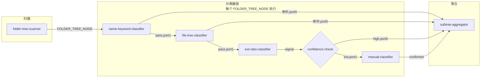
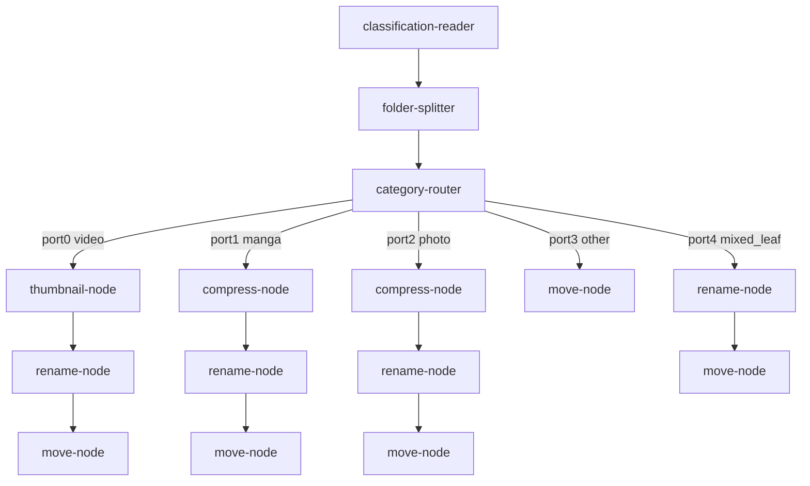

# 节点系统设计

> **注意**：本文档描述了节点的功能规格（配置项、业务逻辑）。执行引擎的底层机制（类型系统、端口语义、图验证、执行算法）已全面重设计，请参阅 **[执行引擎设计](./执行引擎设计.md)**。两文档存在以下不一致，以执行引擎设计为准：
> - 端口类型命名（本文档用 `CLASSIFICATION_SIGNAL`，新引擎统一为 `CLASSIFICATION_SIGNAL_LIST`）
> - 分类器架构（本文档描述短路链，新引擎改为并行分类器）
> - `ClassifiedEntry.Subtree` 类型（本文档为 `[]ClassifiedEntry`，实现为 `map[string]ClassifiedEntry`，新引擎统一为 `[]ClassifiedEntry`）
> - GraphJSON 边定义（本文档用数字索引，新引擎改为命名端口字符串）

> 版本：v1.0 | 日期：2026-03-23
> 覆盖范围：分类管道（Classification Pipeline）+ 处理管道（Processing Pipeline）的全部 14 个节点规格、数据类型定义、Go 接口、默认工作流 GraphJSON、数据库 Schema 增量。

---

## 目录

1. [设计概述](#一设计概述)
2. [核心数据类型](#二核心数据类型)
3. [端口类型系统](#三端口类型系统)
4. [分类管道节点（1–7）](#四分类管道节点)
5. [处理管道节点（8–14）](#五处理管道节点)
6. [节点框架层（Go 接口）](#六节点框架层)
7. [默认工作流 GraphJSON](#七默认工作流-graphjson)
8. [数据库 Schema 增量](#八数据库-schema-增量)
9. [与现有代码的接驳点](#九与现有代码的接驳点)
10. [节点速查表](#十节点速查表)

---

## 一、设计概述

### 两条管道

系统由两条独立但可串联的工作流管道构成：

```
分类管道 (Classification Pipeline)
  输入：source_dir（源目录路径）
  输出：ClassifiedEntry（每个顶层文件夹的分类结果树）

处理管道 (Processing Pipeline)
  输入：ClassifiedEntry（来自分类管道或数据库）
  输出：MoveResult（移动/处理操作结果）
```

两条管道既可合并为一个 Job（扫描 → 分类 → 处理一气呵成），也可分开执行（先分类，人工审查后再处理）。

### 分类逻辑：从下往上（Bottom-Up）

分类管道的核心在于**递归树形分类**，而非仅看单层文件：

```
对每个顶层文件夹 F：
  1. 递归深度优先遍历 F 的子树
  2. 对每个叶节点（无子目录的目录）运行分类器链
  3. 从叶向根聚合：
     - 若父目录的所有子项分类相同 → 父目录继承该分类
     - 若子项分类不同 → 父目录标记为 mixed，子树信息保留
  4. 最终每个顶层文件夹得到一个带 subtree 的 ClassifiedEntry
```

举例：
```
MyCollection/                → mixed（三种不同子分类）
├── 进击的巨人/              → manga（.cbz 文件）
├── 权力的游戏/              → video（.mkv 文件）
│   ├── Season 1/            → video
│   └── Season 2/            → video
└── 写真集-夏日/             → photo（jpg 文件为主）
```

### 处理逻辑：拆分路由

```
ClassifiedEntry（mixed）
  → folder-splitter 拆分为各子项
  → category-router 按分类路由
     ├── video  → thumbnail-node → rename-node → move-node
     ├── manga  → compress-node  → rename-node → move-node
     ├── photo  → compress-node  → rename-node → move-node
     └── other  → move-node
```

---

## 二、核心数据类型

### Go Struct 定义

```go
// FileEntry 表示一个文件的基础元数据
type FileEntry struct {
    Name      string `json:"name"`
    Ext       string `json:"ext"`        // 小写扩展名，不含点，如 "jpg"
    SizeBytes int64  `json:"size_bytes"`
}

// FolderTree 是递归目录扫描结果（分类管道的基本传输单元）
type FolderTree struct {
    Path    string       `json:"path"`    // 绝对路径
    Name    string       `json:"name"`    // 目录名（不含父路径）
    Files   []FileEntry  `json:"files"`   // 直接子文件（不含子目录内的文件）
    Subdirs []FolderTree `json:"subdirs"` // 直接子目录（递归）
}

// ClassificationSignal 是单个分类器节点的输出信号
type ClassificationSignal struct {
    Category   string   `json:"category"`             // photo|video|manga|mixed|other
    Confidence float64  `json:"confidence"`            // 0.0–1.0
    Reason     string   `json:"reason"`                // 可读原因，如 "keyword:漫画"
    Signals    []string `json:"signals,omitempty"`     // 辅助信号列表
    IsEmpty    bool     `json:"is_empty"`              // true 表示该分类器未做判断（pass-through）
}

// ClassifiedEntry 是 subtree-aggregator 输出的完整分类结果
type ClassifiedEntry struct {
    SourcePath  string               `json:"source_path"`
    FolderName  string               `json:"folder_name"`
    Category    string               `json:"category"`    // photo|video|manga|mixed|other
    Confidence  float64              `json:"confidence"`
    Reason      string               `json:"reason"`
    Classifier  string               `json:"classifier"`  // 做出最终判定的节点 type_id
    Files       []FileEntry          `json:"files"`       // 当前节点的直接子文件
    Subtree     []ClassifiedEntry    `json:"subtree,omitempty"` // mixed 时填充子项
}

// ProcessingItem 是处理管道的工作单元，贯穿所有 action 节点
type ProcessingItem struct {
    SourcePath  string      `json:"source_path"`
    FolderName  string      `json:"folder_name"`  // 当前名称（rename-node 会修改此字段）
    TargetName  string      `json:"target_name"`  // rename-node 输出的目标名（未修改时与 FolderName 相同）
    Category    string      `json:"category"`
    Files       []FileEntry `json:"files"`        // 直接子文件列表
    ParentPath  string      `json:"parent_path"`  // 原始父目录路径（用于保持相对结构）
}

// MoveResult 是 move-node 的输出
type MoveResult struct {
    SourcePath string `json:"source_path"`
    TargetPath string `json:"target_path"`
    Status     string `json:"status"`  // "success" | "skipped" | "failed"
    Error      string `json:"error,omitempty"`
}
```

---

## 三、端口类型系统

节点的输入输出端口都绑定到一个类型标识符，连线时验证类型兼容性。

| 类型标识 | Go 类型 | 说明 |
|---------|---------|------|
| `FOLDER_TREE` | `FolderTree` | 递归目录扫描结果 |
| `FOLDER_TREE_NODE` | `FolderTree` | 树中单个目录节点（分类器操作的原子单元） |
| `CLASSIFICATION_SIGNAL` | `ClassificationSignal` | 单次分类器判定信号 |
| `CLASSIFIED_ENTRY` | `ClassifiedEntry` | 聚合后含 subtree 的完整分类结果 |
| `PROCESSING_ITEM` | `ProcessingItem` | 处理管道工作单元，贯穿 action 节点 |
| `MOVE_RESULT` | `MoveResult` | 移动操作结果（终端类型） |
| `PATH` | `string` | 文件系统路径 |
| `STRING` | `string` | 通用字符串 |
| `BOOLEAN` | `bool` | 条件分支布尔值 |

---

## 四、分类管道节点

### 管道总览



---

### 节点 1：`folder-tree-scanner`

**分类**：scanner | **管道**：分类 | **副作用**：无

```
输入端口：
  source_dir   PATH          必填，扫描根目录

输出端口：
  port0  tree   FOLDER_TREE  每个顶层子目录各输出一个 FolderTree

配置项：
  max_depth          int      = 5
    // 递归深度上限，防止超大目录树耗尽内存
  exclude_patterns   []string = [".DS_Store","Thumbs.db","desktop.ini","@eaDir"]
    // 跳过的目录名模式（精确匹配或含 * 通配）
  min_file_count     int      = 0
    // 过滤直接子文件数低于此值的目录（0 = 不过滤）
  follow_symlinks    bool     = false
```

**与现有代码的关系**：替代 `ScannerService.discoverTargets()`，深度递归而非仅扫描直接子目录。

---

### 节点 2：`name-keyword-classifier`

**分类**：classifier | **管道**：分类 | **副作用**：无

```
输入端口：
  port0  folder   FOLDER_TREE_NODE   必填

输出端口：
  port0  result   CLASSIFICATION_SIGNAL   命中时输出（confidence = 1.0）
  port1  pass     FOLDER_TREE_NODE        未命中时透传，供下一分类器使用

配置项：
  rules  []KeywordRule
    // 每条规则按 priority 降序优先匹配
    KeywordRule:
      keywords    []string   关键词列表（不区分大小写）
      category    string     匹配后输出的分类
      priority    int        优先级（数字越大越优先）

  match_mode  string = "folder_name_contains"
    // "folder_name_contains"  — 文件夹名包含关键词
    // "folder_name_exact"     — 文件夹名完整匹配
    // "any_file_name"         — 任意子文件名包含关键词

默认 rules：
  [
    { "keywords": ["漫画","manga","comic","Comics","Manga"], "category": "manga", "priority": 10 },
    { "keywords": ["写真","photobook","gravure","写真集"],    "category": "photo", "priority": 9  },
    { "keywords": ["电影","movie","film","Movie","Film"],    "category": "video", "priority": 8  }
  ]
```

---

### 节点 3：`file-tree-classifier`

**分类**：classifier | **管道**：分类 | **副作用**：无

```
输入端口：
  port0  folder   FOLDER_TREE_NODE   必填（来自 name-keyword 的 pass 端口）

输出端口：
  port0  result   CLASSIFICATION_SIGNAL   命中时输出
  port1  pass     FOLDER_TREE_NODE        未命中时透传

配置项：
  rules  []TreeRule
    TreeRule:
      condition    string   内置条件表达式
      category     string
      confidence   float64

内置条件表达式（condition 字段）：
  "has_ext(EXT1|EXT2)"            直接子文件中存在指定扩展名
  "has_video_and_subtitle"        同时含视频文件和字幕文件（.srt/.ass/.sub）
  "flat_images_no_subdir"         全为图片文件且无子目录
  "all_subdirs_same_category"     所有子目录分类相同（需前序递归已完成）
  "video_ratio_with_cover"        视频文件为主 + 恰好有 1-2 张图片（封面图，不视为 mixed）

默认 rules：
  [
    { "condition": "has_ext(.cbz|.cbr|.cb7|.cbt)", "category": "manga",  "confidence": 0.95 },
    { "condition": "has_video_and_subtitle",         "category": "video",  "confidence": 0.90 },
    { "condition": "video_ratio_with_cover",         "category": "video",  "confidence": 0.88 },
    { "condition": "flat_images_no_subdir",          "category": "photo",  "confidence": 0.80 }
  ]
```

---

### 节点 4：`ext-ratio-classifier`

**分类**：classifier | **管道**：分类 | **副作用**：无

```
输入端口：
  port0  folder   FOLDER_TREE_NODE   必填（来自 file-tree 的 pass 端口）

输出端口：
  port0  result   CLASSIFICATION_SIGNAL   始终输出（即使 category = "other"）

配置项：
  photo_threshold    float = 0.85   图片占比 >= 此值 → photo
  video_threshold    float = 0.85   视频占比 >= 此值 → video
  mixed_min_ratio    float = 0.15   图片和视频占比均 >= 此值 → mixed
  count_mode  string = "direct_files_only"
    // "direct_files_only"   仅统计直接子文件（忽略子目录）
    // "recursive_all"       递归统计所有文件

统计规则（与现有 ClassifyService 一致）：
  image_exts = [jpg, jpeg, png, gif, webp, heic, heif, bmp, tiff, raw, cr2, nef, arw, avif]
  video_exts = [mp4, mkv, avi, mov, wmv, flv, m4v, ts, m2ts, webm, rmvb, rm]
  总计数 = image_count + video_count（分母只算媒体文件）
```

**与现有代码的关系**：封装 `service.Classify()` 中的比例分类算法。

---

### 节点 5：`confidence-check`

**分类**：control | **管道**：分类 | **副作用**：无

```
输入端口：
  port0  signal   CLASSIFICATION_SIGNAL   必填

输出端口：
  port0  high     CLASSIFICATION_SIGNAL   confidence >= threshold 时输出
  port1  low      CLASSIFICATION_SIGNAL   confidence <  threshold 时输出

配置项：
  threshold  float = 0.70
```

这是一个分叉节点，两个输出端口可以连到不同的下游节点（借鉴 ComfyUI 多输出端口语义）。

---

### 节点 6：`manual-classifier`

**分类**：classifier | **管道**：分类 | **副作用**：写入 DB（NodeRun 状态）

```
输入端口：
  port0  folder   FOLDER_TREE_NODE       必填（需要展示给用户的目录信息）
  port1  hint     CLASSIFICATION_SIGNAL  可选，confidence-check 的 low 输出（作为建议显示）

输出端口：
  port0  result   CLASSIFICATION_SIGNAL  用户确认后输出（confidence = 1.0）

配置项：
  timeout_seconds  int    = 0      0 = 无限等待，>0 = 超时后执行 timeout_action
  timeout_action   string = "fail"
    // "fail"      超时后 NodeRun 标记为 failed
    // "use_hint"  超时后使用 hint 的分类结果
    // "skip"      超时后标记为 other 并继续
```

**执行状态**：触发后 NodeRun.status = `waiting_input`，对应 ComfyUI 的 PENDING 状态。
前端"待确认队列"展示此节点，用户选择分类后调用 `POST /api/workflow-runs/:id/resume`。

**Rollback**：将 NodeRun 的分类结果从数据库中清除，重置为 pending。

---

### 节点 7：`subtree-aggregator`

**分类**：aggregator | **管道**：分类 | **副作用**：写入 DB（folders.category 等）

```
输入端口：
  port0  node           FOLDER_TREE_NODE          必填，当前目录节点
  port1  signal_kw      CLASSIFICATION_SIGNAL     可选（name-keyword 结果，lazy）
  port2  signal_ft      CLASSIFICATION_SIGNAL     可选（file-tree 结果，lazy）
  port3  signal_high    CLASSIFICATION_SIGNAL     可选（confidence-check high 结果，lazy）
  port4  signal_manual  CLASSIFICATION_SIGNAL     可选（manual-classifier 结果，lazy）

输出端口：
  port0  entry   CLASSIFIED_ENTRY

聚合逻辑：
  1. 从 signal_kw → signal_ft → signal_manual → signal_high 中取第一个非空的信号
     作为当前节点的分类信号（优先级从高到低）
  2. 收集当前节点的所有子目录已完成的 ClassifiedEntry（由 WorkflowRunner 递归后注入）
  3. 若无子目录：直接用分类信号构造 ClassifiedEntry
  4. 若所有子目录的 category 相同 → 父目录 category = 子目录 category
     （仅当直接子文件也与该 category 兼容或数量极少时）
  5. 若子目录 category 不同 → 父目录 category = "mixed"，subtree 字段填充各子项
  6. 将结果写入 folders 表（Upsert）
```

**注意**：port1–port4 均标记为 `lazy`，因为各分类器并非都会被执行到（短路逻辑）。

---

## 五、处理管道节点

### 管道总览



---

### 节点 8：`classification-reader`

**分类**：source | **管道**：处理 | **副作用**：无

```
输入端口：
  port0  job_id   STRING   必填，或直接接 subtree-aggregator 的 port0

输出端口：
  port0  entry   CLASSIFIED_ENTRY   遍历该 Job 下所有顶层 ClassifiedEntry 依次输出
```

从数据库 `folders` 表读取指定 Job 的分类结果，也可在两管道串联时直接接 `subtree-aggregator` 的输出跳过数据库读取。

---

### 节点 9：`folder-splitter`

**分类**：router | **管道**：处理 | **副作用**：无

```
输入端口：
  port0  entry   CLASSIFIED_ENTRY   必填

输出端口：
  port0  items   PROCESSING_ITEM    可能输出多个（流式输出每个拆分子项）

配置项：
  split_mixed   bool = true
    // true:  category=mixed 的 entry 展开 subtree，每个子项独立输出
    // false: mixed entry 整体作为一个 PROCESSING_ITEM 输出（进入 mixed 工作流）
  split_depth   int  = 1
    // 拆分层数，1 = 只拆第一层 mixed，2 = 递归拆两层，依此类推
```

**拆分举例**：
```
输入：MyCollection (mixed)
  subtree:
    - 进击的巨人/ (manga)
    - 权力的游戏/ (video)
    - 写真集-夏日/ (photo)

split_mixed=true, split_depth=1 时输出 3 个 PROCESSING_ITEM：
  item1: {source_path: ".../进击的巨人", category: "manga", parent_path: ".../MyCollection"}
  item2: {source_path: ".../权力的游戏", category: "video", parent_path: ".../MyCollection"}
  item3: {source_path: ".../写真集-夏日", category: "photo", parent_path: ".../MyCollection"}
```

---

### 节点 10：`category-router`

**分类**：router | **管道**：处理 | **副作用**：无（纯路由，无 Rollback）

```
输入端口：
  port0  item   PROCESSING_ITEM   必填

输出端口：
  port0  video       PROCESSING_ITEM
  port1  manga       PROCESSING_ITEM
  port2  photo       PROCESSING_ITEM
  port3  other       PROCESSING_ITEM
  port4  mixed_leaf  PROCESSING_ITEM   叶节点级 mixed（整体进入 mixed 工作流）

配置项：
  category_map  map[string]int   自定义映射（分类名 → 输出端口索引）
    // 默认映射：
    // "video"  → port0
    // "manga"  → port1
    // "photo"  → port2
    // "other"  → port3
    // "mixed"  → port4
    // 用户可改写，如把 "photo" 也映射到 port0（视频端口），统一处理
```

---

### 节点 11：`rename-node`

**分类**：action | **管道**：处理 | **副作用**：修改 `ProcessingItem.TargetName`（不立即操作文件系统；实际重命名在 move-node 执行时完成）

```
输入端口：
  port0  item   PROCESSING_ITEM   必填

输出端口：
  port0  item   PROCESSING_ITEM   TargetName 字段已更新

配置项：
  strategy  string  必填
    // "static"        直接指定新名称
    // "template"      变量模板替换
    // "regex_extract" 正则提取后填入模板
    // "conditional"   按条件选择上述策略

  // ─── strategy = "static" ───
  static_name  string
    // 例："整理后的电影"

  // ─── strategy = "template" ───
  template  string
    // 例："{name}" / "{year} - {name}" / "{category}_{name}"
    // 可用变量：
    //   {name}     原文件夹名
    //   {category} 分类（video/manga/photo/other/mixed）
    //   {year}     从原名用内置正则提取4位年份（未匹配时为空字符串）
    //   {index}    在当前 Job 中的序号（从 1 开始）
    //   {parent}   父目录名

  // ─── strategy = "regex_extract" ───
  extract_pattern   string
    // 带命名分组的正则，例：(?P<title>.+)\s\((?P<year>\d{4})\)
  output_template   string
    // 例："{title} ({year})"
    // 可用变量：正则命名分组 + 上述通用变量

  // ─── strategy = "conditional" ───
  conditions  []ConditionalRename
    // ConditionalRename:
    //   match_expr  string  条件表达式
    //     支持：name CONTAINS "str" / name MATCHES "regex" / category == "video" / DEFAULT
    //   strategy    string  匹配时使用的策略（递归，可再嵌套）
    //   ...（该策略对应的配置项）

  // ─── 通用选项 ───
  dry_run  bool = false
    // true 时只计算 TargetName，不在日志中记录文件系统操作
  skip_if_same  bool = true
    // 计算结果与 FolderName 相同时跳过（不生成 rename 操作记录）
```

**示例配置**（正则提取 + 默认透传）：
```json
{
  "strategy": "conditional",
  "conditions": [
    {
      "match_expr": "name MATCHES \"^.+\\\\s\\\\(\\\\d{4}\\\\)\"",
      "strategy": "regex_extract",
      "extract_pattern": "(?P<title>.+)\\s\\((?P<year>\\d{4})\\)",
      "output_template": "{title} ({year})"
    },
    {
      "match_expr": "DEFAULT",
      "strategy": "template",
      "template": "{name}"
    }
  ]
}
```

---

### 节点 12：`move-node`

**分类**：action | **管道**：处理 | **副作用**：文件系统移动（**强制**在执行前创建 NodeSnapshot）

```
输入端口：
  port0  item   PROCESSING_ITEM   必填

输出端口：
  port0  result   MOVE_RESULT

配置项：
  target_dir  string  必填
    // 输出根目录，例："/data/target/video"
    // 最终目标路径 = target_dir / item.TargetName

  move_unit  string = "folder"
    // "folder"  将整个文件夹（含内部所有子文件/子目录）移动到 target_dir 下
    // "files"   仅将文件夹内的文件平铺移动到 target_dir 下（不创建子目录）
    //           注意：move_unit="files" 时 preserve_substructure 无效

  preserve_substructure  bool = true
    // 仅 move_unit="folder" 时有效
    // true:  保持内部多层结构（如 Season1/ Season2/ 随父目录一起移动）
    // false: 仅移动当前目录层，子目录结构被拍平

  conflict_policy  string = "auto_rename"
    // "skip"         目标已存在时跳过，MoveResult.status = "skipped"
    // "overwrite"    覆盖已有目标（危险操作，需显式配置）
    // "auto_rename"  目标已存在时追加 _1 _2 ... 直到不冲突

  create_target_if_missing  bool = true
    // target_dir 不存在时自动创建（含多级）
```

**NodeSnapshot 策略**：
- pre：记录 `item.SourcePath` 当前状态（存在性 + 路径）
- post：记录 `target_dir/item.TargetName` 的最终路径

**Rollback**：使用 pre snapshot 中记录的原始路径，将文件夹从目标路径移回源路径。

---

### 节点 13：`thumbnail-node`

**分类**：action | **管道**：处理（video 子流）| **副作用**：在源文件夹内写入图片文件

**依赖**：FFmpeg（已内置于 Docker 镜像）

```
输入端口：
  port0  item   PROCESSING_ITEM   必填（应为 category=video 的条目）

输出端口：
  port0  item   PROCESSING_ITEM   透传，item.Files 追加生成的缩略图记录

配置项：
  scope  string = "folder_cover"
    // "folder_cover"  为整个文件夹生成一张代表性封面图
    //   选取策略：
    //     1. 若已存在 poster.jpg / folder.jpg → skip_if_exists 生效时直接跳过
    //     2. 取文件夹内体积最大的视频文件，从 extract_time 处截帧
    //     3. 若文件夹无视频（只有子目录）→ 取第一个视频子目录中最大的视频
    // "per_video"     为每个直接子视频文件各生成一张 {video_name}-thumb.jpg

  extract_time  string = "00:00:10"
    // 支持绝对时间 "HH:MM:SS" 或相对比例 "10%"（取视频总时长的百分比）

  output_format  string = "jpg"  // "jpg" | "png"

  output_naming  string = "emby_poster"
    // "emby_poster"  → poster.jpg          （Emby 标准封面命名）
    // "emby_folder"  → folder.jpg          （部分播放器识别）
    // "template"     → 使用 output_name_template

  output_name_template  string
    // 仅 output_naming="template" 时有效
    // 可用变量：{name}（视频文件名不含扩展名）{ext}（输出格式）{index}
    // 例："cover.{ext}" / "{name}-thumb.{ext}"

  target_size  string = "1280x720"
    // 输出图片尺寸，"original" 表示不缩放

  fit_mode  string = "pad"
    // "pad"     保持原比例，黑边填充至 target_size（FFmpeg pad 滤镜，Emby 推荐 16:9）
    // "cover"   裁剪填满 target_size
    // "contain" 等比缩小，不裁剪不填充

  skip_if_exists  bool = true
    // 已存在同名缩略图时跳过

  write_location  string = "source_dir"
    // "source_dir"  缩略图写入 item.SourcePath 内（随 move-node 整体移动）
```

**FFmpeg 命令模板（scope=folder_cover，fit_mode=pad）**：
```bash
ffmpeg -i {video_file} \
  -ss {extract_time} \
  -frames:v 1 \
  -vf "scale={width}:{height}:force_original_aspect_ratio=decrease,pad={width}:{height}:(ow-iw)/2:(oh-ih)/2" \
  -y {output_path}
```

**NodeSnapshot 策略**：
- pre：记录 source_path 内执行前已有文件列表
- post：记录新增的图片文件路径

**Rollback**：删除 post snapshot 中记录的新增图片文件（不影响视频文件）。

**Emby 命名约定参考**：`docs/功能/视频缩略图规范.md`
- 电影/单集目录 → `poster.jpg`
- 剧集总目录 → `folder.jpg`
- per_video 模式 → `{name}-thumb.jpg`

---

### 节点 14：`compress-node`

**分类**：action | **管道**：处理（manga/photo 子流）| **副作用**：在源文件夹内创建归档文件（可选删除原始文件）

**依赖**：Go 标准库 `archive/zip`（无额外依赖）

```
输入端口：
  port0  item   PROCESSING_ITEM   必填（应为 category=manga 或 category=photo）

输出端口：
  port0  item   PROCESSING_ITEM   透传，item.Files 更新为打包后的文件列表

配置项：
  format  string = "cbz"
    // "cbz"  Comic Book Zip，漫画阅读器首选（本质是 zip，修改扩展名）
    // "zip"  通用压缩，写真集归档推荐

  scope  string = "folder"
    // "folder"          将 source_path 内所有匹配文件打包为单个归档
    //                   归档位置：source_path/{folder_name}.{format}
    //                   适合：扁平漫画（图片直接在文件夹内）、写真集
    // "subfolder_each"  将 source_path 的每个直接子目录分别打包为独立归档
    //                   归档位置：每个子目录旁边（与子目录同级）
    //                   适合：多卷漫画（每个 Vol.xx 子目录 → Vol.xx.cbz）
    // "flat_recursive"  递归收集所有匹配文件，打包为单个归档（忽略子目录层级）
    //                   适合：目录结构复杂但希望得到单个归档文件

  archive_naming  string = "{name}"
    // 归档文件名模板，最终文件名 = archive_naming + "." + format
    // 可用变量：{name}（文件夹名）{index}（序号）{parent}（父目录名）

  include_patterns  []string = ["*.jpg","*.jpeg","*.png","*.webp","*.gif","*.avif","*.bmp"]
    // 纳入归档的文件扩展名模式（scope=folder/flat_recursive 有效）

  exclude_patterns  []string = [".DS_Store","Thumbs.db","desktop.ini","folder.jpg","poster.jpg"]
    // 排除的文件名模式（精确匹配或含 * 通配）
    // 默认排除系统垃圾文件和封面图（视频封面不应纳入漫画归档）

  sort_order  string = "natural"
    // "natural"   自然排序（001 < 002 < 10），漫画页码顺序必备
    // "name"      字母序（区分大小写）
    // "mtime"     文件修改时间序

  compression_level  int = 0
    // 0    仅打包不压缩（cbz 惯例：图片已压缩，无需二次压缩，且阅读器随机访问更快）
    // 1-9  标准 deflate 压缩（zip 归档时可选，漫画一般不用）

  delete_source  bool = false
    // false：打包成功后保留原始文件（文件夹内同时有图片和归档）
    // true： 打包成功后删除被打包的原始图片文件（节省空间；Rollback 时需解压恢复）

  skip_if_already_packed  bool = true
    // 若 source_path 内的文件已全部为 .cbz/.zip（无散图）则直接跳过
```

**典型场景速查**：

| 场景 | scope | format | delete_source | 效果 |
|------|-------|--------|--------------|------|
| 扁平漫画（图片直接在文件夹内） | `folder` | `cbz` | `true` | 单个 .cbz，原图删除 |
| 多卷系列（子目录按卷划分） | `subfolder_each` | `cbz` | `false` | 每卷独立 .cbz，原子目录保留 |
| 写真集归档（保留原图备份） | `folder` | `zip` | `false` | .zip 与原图共存 |
| 多卷写真集（节省空间） | `subfolder_each` | `zip` | `true` | 每册打包，原图删除 |

**NodeSnapshot 策略**：
- pre：记录 source_path 完整文件树（文件名 + 大小 + 路径）
- post：记录打包后状态（归档文件路径 + 是否删除了原始文件）

**Rollback**：
- `delete_source = false`：删除本节点生成的归档文件
- `delete_source = true`：将归档解压恢复原始文件，再删除归档（依赖 pre snapshot 的文件清单）

**与 move-node 的配合**：
compress-node 始终在 `source_path` **内部**生成归档文件，`source_path` 本身不变。下游 move-node：
- `move_unit = "folder"`：将整个文件夹（含归档）移动到目标目录
- `move_unit = "files"`：只移动归档文件（不保留外层目录），适合"直接把 .cbz 放进目标目录"的场景

---

## 六、节点框架层

### NodeExecutor 接口

```go
package workflow

import "context"

// ExecutionStatus 节点执行结果的三态
type ExecutionStatus int

const (
    ExecutionSuccess ExecutionStatus = iota
    ExecutionFailure
    ExecutionPending // 等待外部输入（如 manual-classifier 等待用户）
)

// NodeExecutionInput 节点执行时的输入上下文
type NodeExecutionInput struct {
    NodeID         string
    WorkflowRunID  string
    FolderID       string
    // Inputs 按端口名称索引，值为前序节点的输出
    Inputs         map[string]any
    // Config 为该节点在 WorkflowDefinition 中存储的配置 JSON
    Config         json.RawMessage
}

// NodeExecutionResult 节点执行结果
type NodeExecutionResult struct {
    Status        ExecutionStatus
    // Outputs 按输出端口索引排列（port0 → index 0，port1 → index 1 ...）
    Outputs       []any
    Error         error
    // PENDING 状态时填充：
    PendingReason string // "waiting_user_input" | "async_task"
    ResumeToken   string // 用于 Resume API 时识别挂起点
}

// NodeRollbackInput 回退时的输入上下文
type NodeRollbackInput struct {
    NodeRunID      string
    WorkflowRunID  string
    PreSnapshot    json.RawMessage // NodeSnapshot.pre_state
    PostSnapshot   json.RawMessage // NodeSnapshot.post_state
}

// NodeExecutor 所有节点执行器必须实现此接口
type NodeExecutor interface {
    // Type 返回节点类型 ID（如 "thumbnail-node"），用于注册表查找
    Type() string

    // Schema 返回节点的完整 Schema，供前端渲染属性面板和做类型验证
    Schema() NodeSchema

    // Execute 执行节点，返回三态结果
    Execute(ctx context.Context, input NodeExecutionInput) NodeExecutionResult

    // Resume 从 PENDING 状态恢复（manual-classifier 用户确认后调用）
    Resume(ctx context.Context, input NodeExecutionInput, resumeToken string) NodeExecutionResult

    // Rollback 撤销已执行的副作用
    Rollback(ctx context.Context, input NodeRollbackInput) error
}
```

### NodeSchema（前端属性面板自动渲染）

```go
// NodeSchema 描述一个节点类型的完整接口契约
type NodeSchema struct {
    TypeID      string       `json:"type_id"`
    DisplayName string       `json:"display_name"`
    Description string       `json:"description,omitempty"`
    Category    string       `json:"category"` // scanner|classifier|aggregator|router|action
    Inputs      []PortSchema `json:"inputs"`
    Outputs     []PortSchema `json:"outputs"`
}

// PortSchema 描述一个端口的类型和 UI 配置
type PortSchema struct {
    Name        string        `json:"name"`
    PortType    string        `json:"port_type"`
    Required    bool          `json:"required"`
    Lazy        bool          `json:"lazy,omitempty"`    // 懒加载，仅需要时才请求上游输出
    Description string        `json:"description,omitempty"`
    Widget      *WidgetConfig `json:"widget,omitempty"` // 非 nil 时前端渲染表单控件
}

// WidgetConfig 控制前端属性面板的表单控件类型
type WidgetConfig struct {
    WidgetType string   `json:"widget_type"` // text|textarea|number|select|boolean|path|template
    Default    any      `json:"default,omitempty"`
    Options    []string `json:"options,omitempty"` // select 类型的枚举值
    Min        *float64 `json:"min,omitempty"`
    Max        *float64 `json:"max,omitempty"`
    Placeholder string  `json:"placeholder,omitempty"`
}
```

### NodeExecutorRegistry（插件注册表）

```go
// NodeExecutorRegistry 管理所有已注册的节点执行器（对应 ComfyUI 的 NODE_CLASS_MAPPINGS）
type NodeExecutorRegistry struct {
    executors map[string]NodeExecutor
}

func NewNodeExecutorRegistry() *NodeExecutorRegistry {
    return &NodeExecutorRegistry{executors: make(map[string]NodeExecutor)}
}

func (r *NodeExecutorRegistry) Register(executor NodeExecutor) {
    r.executors[executor.Type()] = executor
}

func (r *NodeExecutorRegistry) Get(typeID string) (NodeExecutor, bool) {
    e, ok := r.executors[typeID]
    return e, ok
}

// ListSchemas 返回所有已注册节点的 Schema，供 GET /api/node-types 端点使用
func (r *NodeExecutorRegistry) ListSchemas() []NodeSchema {
    schemas := make([]NodeSchema, 0, len(r.executors))
    for _, e := range r.executors {
        schemas = append(schemas, e.Schema())
    }
    return schemas
}

// buildDefaultRegistry 构建内置节点注册表
func buildDefaultRegistry(deps NodeDeps) *NodeExecutorRegistry {
    registry := NewNodeExecutorRegistry()
    // 分类管道节点
    registry.Register(NewFolderTreeScannerExecutor(deps.FSAdapter))
    registry.Register(NewNameKeywordClassifierExecutor())
    registry.Register(NewFileTreeClassifierExecutor())
    registry.Register(NewExtRatioClassifierExecutor())
    registry.Register(NewConfidenceCheckExecutor())
    registry.Register(NewManualClassifierExecutor(deps.FolderRepo))
    registry.Register(NewSubtreeAggregatorExecutor(deps.FolderRepo))
    // 处理管道节点
    registry.Register(NewClassificationReaderExecutor(deps.FolderRepo))
    registry.Register(NewFolderSplitterExecutor())
    registry.Register(NewCategoryRouterExecutor())
    registry.Register(NewRenameNodeExecutor())
    registry.Register(NewMoveNodeExecutor(deps.FSAdapter, deps.SnapshotRepo))
    registry.Register(NewThumbnailNodeExecutor(deps.FSAdapter))
    registry.Register(NewCompressNodeExecutor(deps.FSAdapter))
    return registry
}
```

### API 端点

```
GET /api/node-types
  → 返回 NodeExecutorRegistry.ListSchemas()
  → 前端编辑器调用此端点获取左侧节点面板内容和右侧属性表单配置
```

---

## 七、默认工作流 GraphJSON

GraphJSON 中节点输入的两种形式：
- `{ "const_value": <值> }` — 直接常量
- `{ "link_source": { "source_node_id": "xxx", "output_port_index": 0 } }` — 来自上游节点的连接

`edges` 数组用于前端 ReactFlow 渲染，后端执行引擎只读取 `nodes[].inputs` 中的 `link_source`。

### 7.1 默认分类工作流（default-classification）

```json
{
  "id": "default-classification",
  "name": "默认分类工作流",
  "description": "从下往上递归分类：关键词 → 文件树 → 扩展名比例 → 人工兜底",
  "version": 1,
  "nodes": [
    {
      "id": "scan-1",
      "type": "folder-tree-scanner",
      "label": "目录扫描",
      "enabled": true,
      "config": {
        "max_depth": 5,
        "exclude_patterns": [".DS_Store", "Thumbs.db", "@eaDir", "#recycle"],
        "min_file_count": 0
      },
      "inputs": {
        "source_dir": { "const_value": "" }
      },
      "ui_position": { "x": 80, "y": 200 }
    },
    {
      "id": "cls-kw",
      "type": "name-keyword-classifier",
      "label": "关键词分类",
      "enabled": true,
      "config": {
        "match_mode": "folder_name_contains",
        "rules": [
          { "keywords": ["漫画","manga","comic","Comics","Manga","まんが"], "category": "manga", "priority": 10 },
          { "keywords": ["写真","photobook","gravure","寫真","写真集"],      "category": "photo", "priority": 9  },
          { "keywords": ["电影","movie","film","Movie","Film","映画"],       "category": "video", "priority": 8  }
        ]
      },
      "inputs": {
        "folder": { "link_source": { "source_node_id": "scan-1", "output_port_index": 0 } }
      },
      "ui_position": { "x": 280, "y": 80 }
    },
    {
      "id": "cls-ft",
      "type": "file-tree-classifier",
      "label": "文件树分类",
      "enabled": true,
      "config": {
        "rules": [
          { "condition": "has_ext(.cbz|.cbr|.cb7|.cbt)", "category": "manga", "confidence": 0.95 },
          { "condition": "has_video_and_subtitle",         "category": "video", "confidence": 0.90 },
          { "condition": "video_ratio_with_cover",         "category": "video", "confidence": 0.88 },
          { "condition": "flat_images_no_subdir",          "category": "photo", "confidence": 0.80 }
        ]
      },
      "inputs": {
        "folder": { "link_source": { "source_node_id": "cls-kw", "output_port_index": 1 } }
      },
      "ui_position": { "x": 280, "y": 200 }
    },
    {
      "id": "cls-er",
      "type": "ext-ratio-classifier",
      "label": "扩展名比例分类",
      "enabled": true,
      "config": {
        "photo_threshold": 0.85,
        "video_threshold": 0.85,
        "mixed_min_ratio": 0.15,
        "count_mode": "direct_files_only"
      },
      "inputs": {
        "folder": { "link_source": { "source_node_id": "cls-ft", "output_port_index": 1 } }
      },
      "ui_position": { "x": 280, "y": 320 }
    },
    {
      "id": "cc-1",
      "type": "confidence-check",
      "label": "置信度检查",
      "enabled": true,
      "config": { "threshold": 0.70 },
      "inputs": {
        "signal": { "link_source": { "source_node_id": "cls-er", "output_port_index": 0 } }
      },
      "ui_position": { "x": 480, "y": 320 }
    },
    {
      "id": "mc-1",
      "type": "manual-classifier",
      "label": "人工确认",
      "enabled": true,
      "config": {
        "timeout_seconds": 0,
        "timeout_action": "use_hint"
      },
      "inputs": {
        "folder": { "link_source": { "source_node_id": "cls-er", "output_port_index": 0 } },
        "hint":   { "link_source": { "source_node_id": "cc-1",   "output_port_index": 1 } }
      },
      "ui_position": { "x": 680, "y": 440 }
    },
    {
      "id": "agg-1",
      "type": "subtree-aggregator",
      "label": "子树聚合",
      "enabled": true,
      "config": {},
      "inputs": {
        "node":          { "link_source": { "source_node_id": "scan-1", "output_port_index": 0 } },
        "signal_kw":     { "link_source": { "source_node_id": "cls-kw", "output_port_index": 0 } },
        "signal_ft":     { "link_source": { "source_node_id": "cls-ft", "output_port_index": 0 } },
        "signal_high":   { "link_source": { "source_node_id": "cc-1",   "output_port_index": 0 } },
        "signal_manual": { "link_source": { "source_node_id": "mc-1",   "output_port_index": 0 } }
      },
      "ui_position": { "x": 880, "y": 200 }
    }
  ],
  "edges": [
    { "id": "e1",  "source": "scan-1", "source_port": 0, "target": "cls-kw",  "target_port": 0 },
    { "id": "e2",  "source": "cls-kw", "source_port": 0, "target": "agg-1",   "target_port": 1 },
    { "id": "e3",  "source": "cls-kw", "source_port": 1, "target": "cls-ft",  "target_port": 0 },
    { "id": "e4",  "source": "cls-ft", "source_port": 0, "target": "agg-1",   "target_port": 2 },
    { "id": "e5",  "source": "cls-ft", "source_port": 1, "target": "cls-er",  "target_port": 0 },
    { "id": "e6",  "source": "cls-er", "source_port": 0, "target": "cc-1",    "target_port": 0 },
    { "id": "e7",  "source": "cc-1",   "source_port": 0, "target": "agg-1",   "target_port": 3 },
    { "id": "e8",  "source": "cc-1",   "source_port": 1, "target": "mc-1",    "target_port": 1 },
    { "id": "e9",  "source": "cls-er", "source_port": 0, "target": "mc-1",    "target_port": 0 },
    { "id": "e10", "source": "mc-1",   "source_port": 0, "target": "agg-1",   "target_port": 4 },
    { "id": "e11", "source": "scan-1", "source_port": 0, "target": "agg-1",   "target_port": 0 }
  ]
}
```

### 7.2 默认处理工作流（default-processing）

```json
{
  "id": "default-processing",
  "name": "默认处理工作流",
  "description": "按分类路由：视频生成缩略图、漫画/写真打包、统一重命名后移动",
  "version": 1,
  "nodes": [
    {
      "id": "reader-1",
      "type": "classification-reader",
      "label": "读取分类结果",
      "enabled": true,
      "config": {},
      "inputs": {
        "job_id": { "const_value": "" }
      },
      "ui_position": { "x": 80, "y": 300 }
    },
    {
      "id": "splitter-1",
      "type": "folder-splitter",
      "label": "Mixed 拆分",
      "enabled": true,
      "config": {
        "split_mixed": true,
        "split_depth": 1
      },
      "inputs": {
        "entry": { "link_source": { "source_node_id": "reader-1", "output_port_index": 0 } }
      },
      "ui_position": { "x": 260, "y": 300 }
    },
    {
      "id": "router-1",
      "type": "category-router",
      "label": "分类路由",
      "enabled": true,
      "config": {},
      "inputs": {
        "item": { "link_source": { "source_node_id": "splitter-1", "output_port_index": 0 } }
      },
      "ui_position": { "x": 440, "y": 300 }
    },

    // ── 视频子流 ──────────────────────────────────────────
    {
      "id": "thumb-v",
      "type": "thumbnail-node",
      "label": "生成视频封面",
      "enabled": true,
      "config": {
        "scope": "folder_cover",
        "extract_time": "00:00:10",
        "output_format": "jpg",
        "output_naming": "emby_poster",
        "target_size": "1280x720",
        "fit_mode": "pad",
        "skip_if_exists": true
      },
      "inputs": {
        "item": { "link_source": { "source_node_id": "router-1", "output_port_index": 0 } }
      },
      "ui_position": { "x": 640, "y": 80 }
    },
    {
      "id": "rename-v",
      "type": "rename-node",
      "label": "重命名（视频）",
      "enabled": true,
      "config": {
        "strategy": "conditional",
        "conditions": [
          {
            "match_expr": "name MATCHES \"^.+\\\\s\\\\(\\\\d{4}\\\\)\"",
            "strategy": "regex_extract",
            "extract_pattern": "(?P<title>.+)\\s\\((?P<year>\\d{4})\\)",
            "output_template": "{title} ({year})"
          },
          {
            "match_expr": "DEFAULT",
            "strategy": "template",
            "template": "{name}"
          }
        ]
      },
      "inputs": {
        "item": { "link_source": { "source_node_id": "thumb-v", "output_port_index": 0 } }
      },
      "ui_position": { "x": 820, "y": 80 }
    },
    {
      "id": "move-v",
      "type": "move-node",
      "label": "移动（视频）",
      "enabled": true,
      "config": {
        "target_dir": "/data/target/video",
        "move_unit": "folder",
        "preserve_substructure": true,
        "conflict_policy": "auto_rename",
        "create_target_if_missing": true
      },
      "inputs": {
        "item": { "link_source": { "source_node_id": "rename-v", "output_port_index": 0 } }
      },
      "ui_position": { "x": 1000, "y": 80 }
    },

    // ── 漫画子流 ──────────────────────────────────────────
    {
      "id": "compress-m",
      "type": "compress-node",
      "label": "漫画打包",
      "enabled": true,
      "config": {
        "format": "cbz",
        "scope": "folder",
        "archive_naming": "{name}",
        "include_patterns": ["*.jpg","*.jpeg","*.png","*.webp","*.gif","*.avif"],
        "exclude_patterns": [".DS_Store","Thumbs.db","poster.jpg","folder.jpg"],
        "sort_order": "natural",
        "compression_level": 0,
        "delete_source": true,
        "skip_if_already_packed": true
      },
      "inputs": {
        "item": { "link_source": { "source_node_id": "router-1", "output_port_index": 1 } }
      },
      "ui_position": { "x": 640, "y": 220 }
    },
    {
      "id": "rename-m",
      "type": "rename-node",
      "label": "重命名（漫画）",
      "enabled": true,
      "config": {
        "strategy": "template",
        "template": "{name}"
      },
      "inputs": {
        "item": { "link_source": { "source_node_id": "compress-m", "output_port_index": 0 } }
      },
      "ui_position": { "x": 820, "y": 220 }
    },
    {
      "id": "move-m",
      "type": "move-node",
      "label": "移动（漫画）",
      "enabled": true,
      "config": {
        "target_dir": "/data/target/manga",
        "move_unit": "folder",
        "conflict_policy": "auto_rename",
        "create_target_if_missing": true
      },
      "inputs": {
        "item": { "link_source": { "source_node_id": "rename-m", "output_port_index": 0 } }
      },
      "ui_position": { "x": 1000, "y": 220 }
    },

    // ── 写真子流 ──────────────────────────────────────────
    {
      "id": "compress-p",
      "type": "compress-node",
      "label": "写真打包",
      "enabled": true,
      "config": {
        "format": "zip",
        "scope": "folder",
        "archive_naming": "{name}",
        "include_patterns": ["*.jpg","*.jpeg","*.png","*.webp","*.heic","*.raw","*.cr2"],
        "exclude_patterns": [".DS_Store","Thumbs.db"],
        "sort_order": "name",
        "compression_level": 0,
        "delete_source": false,
        "skip_if_already_packed": true
      },
      "inputs": {
        "item": { "link_source": { "source_node_id": "router-1", "output_port_index": 2 } }
      },
      "ui_position": { "x": 640, "y": 360 }
    },
    {
      "id": "rename-p",
      "type": "rename-node",
      "label": "重命名（写真）",
      "enabled": true,
      "config": {
        "strategy": "template",
        "template": "{name}"
      },
      "inputs": {
        "item": { "link_source": { "source_node_id": "compress-p", "output_port_index": 0 } }
      },
      "ui_position": { "x": 820, "y": 360 }
    },
    {
      "id": "move-p",
      "type": "move-node",
      "label": "移动（写真）",
      "enabled": true,
      "config": {
        "target_dir": "/data/target/photo",
        "move_unit": "folder",
        "conflict_policy": "auto_rename",
        "create_target_if_missing": true
      },
      "inputs": {
        "item": { "link_source": { "source_node_id": "rename-p", "output_port_index": 0 } }
      },
      "ui_position": { "x": 1000, "y": 360 }
    },

    // ── 其他子流 ──────────────────────────────────────────
    {
      "id": "move-o",
      "type": "move-node",
      "label": "移动（其他）",
      "enabled": true,
      "config": {
        "target_dir": "/data/target/other",
        "move_unit": "folder",
        "conflict_policy": "auto_rename",
        "create_target_if_missing": true
      },
      "inputs": {
        "item": { "link_source": { "source_node_id": "router-1", "output_port_index": 3 } }
      },
      "ui_position": { "x": 640, "y": 500 }
    }
  ],
  "edges": [
    { "id": "e1",  "source": "reader-1",   "source_port": 0, "target": "splitter-1", "target_port": 0 },
    { "id": "e2",  "source": "splitter-1", "source_port": 0, "target": "router-1",   "target_port": 0 },
    { "id": "e3",  "source": "router-1",   "source_port": 0, "target": "thumb-v",    "target_port": 0 },
    { "id": "e4",  "source": "thumb-v",    "source_port": 0, "target": "rename-v",   "target_port": 0 },
    { "id": "e5",  "source": "rename-v",   "source_port": 0, "target": "move-v",     "target_port": 0 },
    { "id": "e6",  "source": "router-1",   "source_port": 1, "target": "compress-m", "target_port": 0 },
    { "id": "e7",  "source": "compress-m", "source_port": 0, "target": "rename-m",   "target_port": 0 },
    { "id": "e8",  "source": "rename-m",   "source_port": 0, "target": "move-m",     "target_port": 0 },
    { "id": "e9",  "source": "router-1",   "source_port": 2, "target": "compress-p", "target_port": 0 },
    { "id": "e10", "source": "compress-p", "source_port": 0, "target": "rename-p",   "target_port": 0 },
    { "id": "e11", "source": "rename-p",   "source_port": 0, "target": "move-p",     "target_port": 0 },
    { "id": "e12", "source": "router-1",   "source_port": 3, "target": "move-o",     "target_port": 0 }
  ]
}
```

---

## 八、数据库 Schema 增量

在现有规划表（`workflow_definitions` / `workflow_runs` / `node_runs` / `node_snapshots`，见 `docs/架构/数据模型（版本3）.md`）基础上，新增以下字段和迁移。

### 迁移文件：`005_workflow_engine.sql`

```sql
-- ── workflow_definitions ──────────────────────────────────
CREATE TABLE IF NOT EXISTS workflow_definitions (
    id          TEXT PRIMARY KEY,
    name        TEXT NOT NULL,
    description TEXT NOT NULL DEFAULT '',
    graph_json  TEXT NOT NULL,          -- WorkflowGraph JSON（含 nodes + edges）
    version     INTEGER NOT NULL DEFAULT 1,
    is_active   INTEGER NOT NULL DEFAULT 1,  -- 1=激活，0=归档
    created_at  DATETIME NOT NULL DEFAULT CURRENT_TIMESTAMP,
    updated_at  DATETIME NOT NULL DEFAULT CURRENT_TIMESTAMP
);

-- ── workflow_runs ─────────────────────────────────────────
CREATE TABLE IF NOT EXISTS workflow_runs (
    id               TEXT PRIMARY KEY,
    job_id           TEXT NOT NULL,
    folder_id        TEXT NOT NULL,
    workflow_def_id  TEXT NOT NULL,
    status           TEXT NOT NULL DEFAULT 'pending',
    -- pending|running|succeeded|failed|partial|waiting_input|cancelled
    resume_node_id   TEXT,           -- 断点续传时从此节点重新开始
    last_node_id     TEXT,           -- 最后成功完成的节点 ID
    external_blocks  INTEGER NOT NULL DEFAULT 0,
    -- 当前处于 waiting_input 的节点数；> 0 时 status = waiting_input
    error            TEXT,
    started_at       DATETIME,
    finished_at      DATETIME,
    created_at       DATETIME NOT NULL DEFAULT CURRENT_TIMESTAMP,
    updated_at       DATETIME NOT NULL DEFAULT CURRENT_TIMESTAMP
);

-- ── node_runs ─────────────────────────────────────────────
CREATE TABLE IF NOT EXISTS node_runs (
    id               TEXT PRIMARY KEY,
    workflow_run_id  TEXT NOT NULL,
    node_id          TEXT NOT NULL,     -- WorkflowGraph 中的节点 ID（如 "cls-kw"）
    node_type        TEXT NOT NULL,     -- 节点类型 ID（如 "name-keyword-classifier"）
    sequence         INTEGER NOT NULL,  -- 执行顺序（拓扑序号）
    status           TEXT NOT NULL DEFAULT 'pending',
    -- pending|running|succeeded|failed|waiting_input|skipped
    -- waiting_input: manual-classifier 等待用户输入
    -- skipped:       断点续传时跳过的已完成节点 / 缓存命中时跳过
    input_signature  TEXT,             -- SHA256(输入内容摘要)，用于结果缓存
    resume_token     TEXT,             -- waiting_input 时填充，Resume API 使用
    error            TEXT,
    started_at       DATETIME,
    finished_at      DATETIME,
    created_at       DATETIME NOT NULL DEFAULT CURRENT_TIMESTAMP
);

-- ── node_snapshots ────────────────────────────────────────
CREATE TABLE IF NOT EXISTS node_snapshots (
    id               TEXT PRIMARY KEY,
    node_run_id      TEXT NOT NULL,
    workflow_run_id  TEXT NOT NULL,
    kind             TEXT NOT NULL,     -- pre|post|rollback_base
    -- pre:           节点执行前的文件系统状态（文件列表 + 路径）
    -- post:          节点执行后的状态（新增文件、路径变更）
    -- rollback_base: 专为回退准备的快照（含解压归档所需的文件清单）
    fs_manifest      TEXT,             -- JSON: [{path, size_bytes, is_dir}]
    output_json      TEXT,             -- 节点输出的序列化数据（非文件系统部分）
    compensation     TEXT,             -- 回退操作描述（如 "delete_files:[...]"）
    created_at       DATETIME NOT NULL DEFAULT CURRENT_TIMESTAMP
);

-- ── jobs 表扩展（新增 workflow_def_id 字段）────────────────
ALTER TABLE jobs ADD COLUMN workflow_def_id TEXT;
-- NULL 表示旧式 scan/move Job，非 NULL 表示由工作流引擎驱动的 Job
```

### NodeSnapshot 使用说明

| kind | 内容 | 何时创建 | 回退时如何使用 |
|------|------|---------|--------------|
| `pre` | 节点执行前目标文件夹的完整文件树 | 每个有副作用的节点执行前（move/thumbnail/compress） | 与 post 对比，确定回退范围 |
| `post` | 节点执行后的变更摘要（新增文件、新路径） | 每个有副作用的节点执行成功后 | 回退时知道要删除哪些文件 |
| `rollback_base` | 针对 compress-node（delete_source=true）保存的原始文件清单 | compress-node + delete_source=true 执行前 | 解压归档后按此清单恢复原始文件名和目录结构 |

---

## 九、与现有代码的接驳点

| 现有实现 | 对应新节点 | 迁移说明 |
|---------|----------|---------|
| `ScannerService.discoverTargets()` | `folder-tree-scanner` | 当前只扫描直接子目录；新节点需支持深度递归。可在新节点中复用 `FSAdapter.ReadDir` |
| `service.Classify(name, files)` | `ext-ratio-classifier` | 算法不变（比例阈值逻辑），封装为节点 Execute 方法 |
| `MoveService.MoveFolders()` | `move-node` | 现有 Snapshot 创建、SSE 推送、AuditLog 写入逻辑迁移至节点内 |
| `SnapshotService` | `NodeSnapshot` 机制 | 现有 Job 级 Snapshot 升级为 NodeRun 级 NodeSnapshot；两者并存，旧 Snapshot 用于 Phase 1/1.5 兼容 |
| `JobRepository` | `WorkflowRunRepository` | Job 保持不变作为用户可见的顶层对象；WorkflowRun 是 Job 的内部执行单元 |
| FFmpeg（Docker 内置） | `thumbnail-node` | 直接调用系统 `ffmpeg` 命令，无需额外 Go 绑定 |
| Go `archive/zip` | `compress-node` | 标准库，无额外依赖 |

---

## 十、节点速查表

| # | 节点 ID | 中文名 | 分类 | 管道 | 输入类型 | 输出类型 | 有副作用 | 可回退 |
|---|---------|--------|------|------|---------|---------|---------|-------|
| 1 | `folder-tree-scanner` | 目录扫描器 | scanner | 分类 | PATH | FOLDER_TREE | 否 | — |
| 2 | `name-keyword-classifier` | 关键词分类器 | classifier | 分类 | FOLDER_TREE_NODE | CLASSIFICATION_SIGNAL / pass | 否 | — |
| 3 | `file-tree-classifier` | 文件树分类器 | classifier | 分类 | FOLDER_TREE_NODE | CLASSIFICATION_SIGNAL / pass | 否 | — |
| 4 | `ext-ratio-classifier` | 扩展名比例分类器 | classifier | 分类 | FOLDER_TREE_NODE | CLASSIFICATION_SIGNAL | 否 | — |
| 5 | `confidence-check` | 置信度检查 | control | 分类 | CLASSIFICATION_SIGNAL | high / low | 否 | — |
| 6 | `manual-classifier` | 人工分类器 | classifier | 分类 | FOLDER_TREE_NODE + hint | CLASSIFICATION_SIGNAL | 写 DB | 清除分类结果 |
| 7 | `subtree-aggregator` | 子树聚合器 | aggregator | 分类 | FOLDER_TREE_NODE + signals | CLASSIFIED_ENTRY | 写 DB | 清除聚合结果 |
| 8 | `classification-reader` | 分类结果读取 | source | 处理 | STRING | CLASSIFIED_ENTRY | 否 | — |
| 9 | `folder-splitter` | Mixed 拆分器 | router | 处理 | CLASSIFIED_ENTRY | PROCESSING_ITEM | 否 | — |
| 10 | `category-router` | 分类路由器 | router | 处理 | PROCESSING_ITEM | 5路 PROCESSING_ITEM | 否 | — |
| 11 | `rename-node` | 重命名节点 | action | 处理 | PROCESSING_ITEM | PROCESSING_ITEM | 否（延迟至 move） | — |
| 12 | `move-node` | 移动节点 | action | 处理 | PROCESSING_ITEM | MOVE_RESULT | 是（FS 移动） | 移回原路径 |
| 13 | `thumbnail-node` | 视频缩略图节点 | action | 处理（video） | PROCESSING_ITEM | PROCESSING_ITEM | 是（写图片） | 删除生成文件 |
| 14 | `compress-node` | 压缩归档节点 | action | 处理（manga/photo） | PROCESSING_ITEM | PROCESSING_ITEM | 是（写归档） | 删除归档/恢复原文件 |
