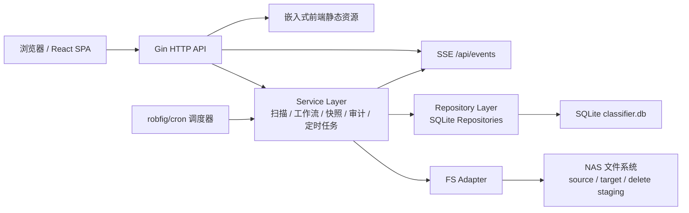

# Classifier 系统架构总览（当前实现）

> 版本：current | 日期：2026-04-02
> 本文以仓库当前代码实现为准，优先级高于历史性的 `架构概览.md` 与 `架构概览（版本3）.md`。旧文档仍保留，主要用于回溯设计演进。

## 1. 系统定位

Classifier 是一个面向 NAS Docker 部署的媒体目录整理系统。当前仓库已经不是早期的“扫描 + 移动”单链路工具，而是一个由以下部分组成的单体应用：

- Go 后端：HTTP API、SSE 推送、工作流执行引擎、定时任务调度、SQLite 持久化
- React SPA：目录管理、工作流定义管理、可视化工作流编辑器、作业历史、定时任务配置、系统配置
- FFmpeg 运行时：为缩略图、压缩等处理节点预留运行能力
- SQLite：保存目录、作业、工作流定义、工作流运行、节点运行、快照、审计日志、应用配置、定时任务

当前实现形态仍然是单容器、单二进制、单 SQLite 文件，但内部业务已经具备明显的“执行平台”特征。

## 2. 运行拓扑



## 3. 部署与运行边界

### 3.1 容器边界

生产部署由单个 `classifier` 服务组成：

- 容器镜像通过多阶段构建生成
- 前端先在 Node 镜像中构建，再复制到后端 `cmd/server/web/dist`
- 后端编译为单个 Go 可执行文件，并在 Alpine 运行时中启动
- 运行时安装 `ffmpeg`、`ca-certificates`、`tzdata`

### 3.2 文件系统边界

运行时边界同时来自环境变量和应用配置：

- 环境变量负责定义默认运行目录
- `app_config` 表负责定义业务级配置，例如扫描目录、目标目录、输出目录、扫描 cron
- 容器通过 bind mount 访问 NAS 根目录，通过 named volume 持久化 `/config`

默认运行目录来自 `backend/internal/config/config.go`：

- Linux 默认 `SOURCE_DIR=/data/source`
- Linux 默认 `TARGET_DIR=/data/target`
- Linux 默认 `DELETE_STAGING_DIR=/data/delete_staging`
- Linux 默认 `CONFIG_DIR=/data/config`

`docker-compose.yml` 当前配置体现了以下部署约束：

- 宿主 `NAS_ROOT` 以读写方式挂载进容器
- `/config` 使用独立 volume 保存数据库和日志
- 端口默认暴露 `8080`
- `MAX_CONCURRENCY`、`TZ` 等运行参数通过环境变量注入

### 3.3 前端交付方式

前端不是独立部署服务，而是由后端统一托管：

- API 路由走 `/api/*`
- 非 API 路由由 Gin 的 `NoRoute` 回退到 `index.html`
- 静态资源通过 `embed.FS` 内嵌进后端二进制

这意味着部署时只有一个对外服务入口，没有额外的 Nginx 或独立前端容器。

## 4. 后端架构

## 4.1 分层结构

后端当前可以概括为 6 层：

| 层 | 位置 | 职责 |
|---|---|---|
| 启动装配层 | `backend/cmd/server/main.go` | 读取配置、打开数据库、构建 repo/service/handler、注册路由、托管前端 |
| 传输层 | `backend/internal/handler`、`backend/internal/sse` | 处理 HTTP 请求、参数校验、JSON 序列化、SSE 事件流 |
| 业务服务层 | `backend/internal/service` | 扫描、工作流执行、快照、审计、定时任务、节点执行 |
| 仓储层 | `backend/internal/repository` | SQLite CRUD、查询过滤、模型映射 |
| 基础设施层 | `backend/internal/db`、`backend/internal/fs`、`backend/internal/logger` | 数据库打开与迁移、文件系统抽象、日志输出 |
| 外部系统 | NAS 文件系统、浏览器、Docker 运行时 | 提供目录、运行环境与用户交互 |

代码约束也比较清晰：

- Handler 依赖接口，不直接依赖具体实现
- Service 不直接调用 `os.*`
- 所有文件系统读写都经由 `internal/fs.FSAdapter`
- 所有持久化都落到 repository 层
- 实时通知统一通过 SSE broker 发出

## 4.2 启动装配

`backend/cmd/server/main.go` 是整个后端的 composition root，启动过程如下：

1. 读取环境配置并初始化日志
2. 打开 SQLite 数据库并执行内嵌迁移
3. 构造各类 repository
4. 构造 `OSAdapter` 与 `SSE Broker`
5. 构造核心 service
6. 注册默认工作流与默认处理工作流
7. 启动定时工作流调度器
8. 装配 Gin 路由与前端静态资源托管
9. 启动 `:PORT`

当前在 main 中显式装配的核心服务包括：

- `AuditService`
- `SnapshotService`
- `ScannerService`
- `ScanJobStarterService`
- `WorkflowRunnerService`
- `ScheduledWorkflowService`
- `ScheduledWorkflowScheduler`

这说明当前系统已经由“以扫描为中心”演化为“以作业和工作流为中心”。

## 4.3 传输层

### HTTP API

Gin 路由按资源划分为：

- `/health`
- `/api/events`
- `/api/folders`
- `/api/jobs`
- `/api/workflow-runs`
- `/api/workflow-defs`
- `/api/scheduled-workflows`
- `/api/snapshots`
- `/api/config`
- `/api/node-types`
- `/api/audit-logs`
- `/api/fs/dirs`

### SSE

`backend/internal/sse/broker.go` 实现了一个轻量广播器：

- 内存中维护订阅 channel 集合
- 发布时将 payload JSON 序列化并广播给所有订阅者
- 浏览器通过 `EventSource('/api/events')` 订阅
- 连接断开时自动取消订阅

它是当前“实时反馈”能力的中心枢纽。

## 4.4 核心服务边界

| 服务 | 核心职责 | 关键依赖 |
|---|---|---|
| `ScannerService` | 从扫描目录发现顶层文件夹，计算目录指标，自动分类，落库，记录快照与审计，推送 SSE | FS、FolderRepo、JobRepo、Snapshot、Audit、Broker |
| `ScanJobStarterService` | 创建扫描 Job，并异步触发扫描；定时扫描时带有去重保护 | JobRepo、ScannerService |
| `WorkflowRunnerService` | 创建工作流 Job / WorkflowRun / NodeRun，调度节点执行、恢复、回滚、事件广播 | 多个 repo、FS、Broker、Audit |
| `SnapshotService` | 保存 before/after 状态，支持快照回退 | FS、SnapshotRepo、FolderRepo |
| `AuditService` | 将业务动作记录到 `audit_logs`，并可同步写文件日志 | AuditRepo、logger |
| `ScheduledWorkflowService` | 管理计划任务定义，支持立即执行、兼容 legacy scan cron | ScheduledWorkflowRepo、WorkflowRunner、ScanJobStarter |
| `ScheduledWorkflowScheduler` | 基于 `robfig/cron` 将启用的计划任务同步到内存调度器 | ScheduledWorkflowRepo、ScheduledWorkflowService |

## 4.5 执行模型

当前后端存在三层执行抽象：

```text
Job
  ├─ scan job
  │    └─ ScannerService.Scan(...)
  └─ workflow job
       └─ WorkflowRun
            └─ NodeRun[]
```

### Job

`jobs` 表是统一顶层作业记录，负责：

- 暴露统一的历史列表
- 记录状态、进度、失败数
- 为前端 SSE + 轮询混合机制提供稳定查询面

### WorkflowRun

`workflow_runs` 表表示一次具体工作流执行实例，负责：

- 关联顶层 job
- 记录当前工作流状态
- 标记最近执行节点、待恢复节点、错误信息
- 支持 resume / provide-input / rollback

### NodeRun

`node_runs` 表表示一次节点执行记录，负责：

- 保存节点输入输出 JSON
- 记录节点状态、错误、恢复 token、恢复数据
- 为前端节点级运行可视化提供明细数据

## 4.6 工作流引擎

`WorkflowRunnerService` 是当前系统最重要的执行内核，包含两部分能力。

### 图模型

工作流定义保存在 `workflow_definitions.graph_json`，图结构为：

- `nodes[]`：节点类型、节点配置、输入绑定、UI 坐标、是否启用
- `edges[]`：节点之间的端口连接关系

### 执行器注册

Runner 在启动时会注册一组 `WorkflowNodeExecutor`。当前代码中已注册的节点执行器包括：

- 触发与输入：`trigger`、`folder-picker`、`folder-tree-scanner`
- 分类与识别：`name-keyword-classifier`、`file-tree-classifier`、`ext-ratio-classifier`
- 逻辑控制：`confidence-check`、`signal-aggregator`、`folder-splitter`、`category-router`、`collect-node`
- 数据读写：`classification-reader`、`classification-writer`、`db-subtree-reader`
- 处理动作：`rename-node`、`move-node`、`thumbnail-node`、`compress-node`
- 结果展示：`classification-db-result-preview`、`processing-result-preview`
- 审计：`audit-log`

节点执行器共同实现统一接口：

- `Type()`
- `Schema()`
- `Execute()`
- `Resume()`
- `Rollback()`

这使工作流系统具备扩展新的节点类型而不改动主执行循环的能力。

## 4.7 定时任务体系

当前定时任务不是外部调度器，而是应用内自带调度系统：

- 定义存储在 `scheduled_workflows` 表
- 启动时由 `ScheduledWorkflowScheduler.Start()` 载入所有启用项
- 每条任务使用标准 cron 表达式注册到 `robfig/cron`
- 触发后调用 `ScheduledWorkflowService.RunNow()`

计划任务支持两种 `job_type`：

- `workflow`：执行某个工作流定义
- `scan`：执行目录扫描

其中扫描型计划任务带有“同一组 source dirs 去重”的保护，避免同一批目录被定时器重复并发扫描。

## 5. 数据持久化架构

## 5.1 SQLite 使用策略

数据库由 `backend/internal/db/db.go` 打开，当前策略比较务实：

- 驱动为 `modernc.org/sqlite`
- `CGO_ENABLED=0`
- `PRAGMA journal_mode=WAL`
- `PRAGMA busy_timeout=5000`
- `PRAGMA foreign_keys=ON`
- `SetMaxOpenConns(1)` 和 `SetMaxIdleConns(1)`，避免并发写时频繁 `SQLITE_BUSY`

数据库文件默认位于：

- `${CONFIG_DIR}/classifier.db`

## 5.2 迁移组织

迁移脚本位于 `backend/internal/db/migrations`，启动时按文件名字典序执行。迁移可以看出系统的演进轨迹：

- `001` ~ `004`：基础目录、快照、审计、扫描历史
- `005` ~ `006`：工作流定义、工作流运行、节点运行、节点快照
- `007`：应用配置表 `app_config`
- `009` ~ `010`：计划任务与任务类型扩展
- `011`：工作流引擎 v2，补充 `source_dir`、`resume_data` 等字段

## 5.3 核心数据表

| 表 | 作用 |
|---|---|
| `folders` | 当前扫描得到的目录实体，包含分类、状态、来源目录、软删除信息 |
| `jobs` | 统一作业表，承载 scan / workflow 顶层进度与状态 |
| `workflow_definitions` | 工作流定义，GraphJSON 持久化 |
| `workflow_runs` | 一次工作流执行实例 |
| `node_runs` | 工作流中每个节点的执行记录 |
| `node_snapshots` | 节点级快照，支持结果回滚与补偿 |
| `snapshots` | 目录级快照，用于扫描、移动等文件夹变更回溯 |
| `audit_logs` | 审计日志 |
| `app_config` | 应用级 JSON 配置 |
| `scheduled_workflows` | 计划任务定义 |

## 6. 前端架构

## 6.1 总体结构

前端是一个 React 19 + TypeScript + Vite 的 SPA，结构遵循“API + store + page + shared component”分层：

| 层 | 位置 | 职责 |
|---|---|---|
| API 层 | `frontend/src/api` | 发起 HTTP 请求，统一错误处理，返回 typed data |
| Store 层 | `frontend/src/store` | 持有页面态与异步动作，承接 SSE 更新 |
| 页面层 | `frontend/src/pages` | 路由页面，组合 UI 与 store |
| 组件层 | `frontend/src/components` | 可复用界面组件，如 `DirPicker`、`SnapshotDrawer`、`CronExpressionField` |
| 类型层 | `frontend/src/types` | 前后端共享的主要 TypeScript 类型 |

## 6.2 路由结构

`frontend/src/App.tsx` 当前定义的主要页面：

- `/`：目录列表页 `FolderListPage`
- `/audit-logs`：审计日志页 `AuditLogsPage`
- `/jobs`：作业历史与计划任务页 `JobsPage`
- `/settings`：系统配置页 `SettingsPage`
- `/workflow-defs`：工作流定义列表页 `WorkflowDefsPage`
- `/workflow-defs/:id/editor`：工作流编辑器 `WorkflowEditorPage`

除工作流编辑器外，其余页面都挂在统一 `Layout` 下，由侧边栏和全局通知包裹。

## 6.3 状态管理

前端的状态管理不是全局单仓库，而是按领域拆分的 Zustand store：

| Store | 职责 |
|---|---|
| `folderStore` | 目录列表、筛选、扫描进度、分类/状态更新、软删除与恢复 |
| `jobStore` | 作业列表、进度轮询、SSE 回退策略 |
| `workflowDefStore` | 工作流定义 CRUD |
| `workflowRunStore` | 工作流运行详情、节点执行详情、恢复/回滚/提供输入 |
| `configStore` | 轻量加载系统配置中的 `source_dir` |
| `activityStore` | 最近审计日志 |
| `notificationStore` | 顶部通知消息 |
| `themeStore` | 主题状态 |

## 6.4 API 与 SSE 协作方式

前端采用“HTTP 负责读写，SSE 负责实时更新，轮询负责兜底”的混合模式。

### API

所有 API 调用统一通过 `frontend/src/api/client.ts` 的 `request<T>()`：

- 默认前缀 `/api`
- 非 2xx 自动抛出 `ApiRequestError`
- 204 响应返回 `undefined as T`

### SSE

`useSSE()` 在应用启动时建立单个 `EventSource('/api/events')` 连接，并把事件分发到多个 store：

- 扫描事件进入 `folderStore`
- 作业事件进入 `jobStore`
- 工作流节点事件进入 `workflowRunStore`
- 完成或失败时写入 `notificationStore`
- 完成后触发目录列表和审计日志刷新

### 轮询兜底

`jobStore` 对运行中的作业开启轮询：

- SSE 正常时，轮询只是兜底
- SSE 丢失时，`startScanPolling()` 会在扫描完成后主动刷新目录并收敛扫描状态

这个设计兼顾了实时性和稳健性，避免“只靠 SSE 导致前端状态卡死”。

## 6.5 工作流编辑器

`WorkflowEditorPage` 是前端最复杂的页面，核心特点如下：

- 基于 `@xyflow/react` 实现图编辑
- 节点 schema 来自后端 `/api/node-types`
- 节点与边被序列化回 `graph_json`
- 支持节点配置、输入端口、输出端口、启用状态、布局坐标
- 支持直接发起工作流运行，并查看节点执行结果
- 支持分类结果预览和处理结果预览

前端编辑器并不内置节点规则，而是由后端 `WorkflowRunnerService.ListNodeSchemas()` 提供节点元信息，这保证了编辑器和执行器的契约一致。

## 7. 关键业务链路

## 7.1 扫描链路

```text
FolderListPage / SettingsPage
  -> folderStore.triggerScan()
  -> POST /api/folders/scan
  -> FolderHandler.Scan
  -> ScanJobStarterService.StartJob
  -> jobs.create(type=scan)
  -> goroutine -> ScannerService.Scan
  -> folders.upsert + snapshots + audit_logs
  -> SSE: scan.started / scan.progress / scan.done / job.progress / job.done
  -> folderStore + jobStore 收敛状态
```

扫描本质上是“目录发现 + 目录指标计算 + 自动分类 + 落库 + 实时反馈”的流水线。

## 7.2 工作流执行链路

```text
WorkflowEditorPage / JobsPage
  -> POST /api/jobs { workflow_def_id, source_dir }
  -> JobHandler.StartWorkflow
  -> WorkflowRunnerService.StartJob
  -> jobs.create(type=workflow)
  -> workflow_runs.create
  -> 遍历 GraphJSON 执行 NodeExecutor
  -> node_runs.create/update
  -> node_snapshots.create
  -> SSE: workflow_run.node_started / node_done / node_failed
  -> workflowRunStore 更新节点态
```

工作流链路比扫描链路更像一个执行引擎：

- 顶层统一记 Job
- 中间层记 WorkflowRun
- 细粒度记 NodeRun
- 节点可以失败、等待输入、恢复、回滚

## 7.3 计划任务链路

```text
JobsPage
  -> POST /api/scheduled-workflows
  -> scheduled_workflows 表
  -> ScheduledWorkflowScheduler.Sync
  -> robfig/cron entry
  -> RunNow()
  -> 启动 workflow job 或 scan job
```

计划任务页面和作业历史页被放在同一页，体现的是“计划任务最终也只是生成新的 Job”。

## 7.4 快照与回滚链路

目录级和节点级快照共同存在：

- 目录级快照：面向文件夹扫描、移动等业务动作
- 节点级快照：面向工作流节点补偿与回滚

这使系统具备两种回溯粒度：

- 面向业务对象的回滚
- 面向执行步骤的回滚

## 8. 当前架构特征总结

当前项目的架构特征可以概括为：

1. 单体应用，但边界已经比较清楚
2. 统一用 Job 承载异步执行
3. 工作流执行引擎已经是系统核心，不再只是附加功能
4. 前端通过 store + SSE + 轮询构成稳健的运行态反馈机制
5. SQLite 仍然是唯一持久化介质，但通过多表模型承载了较完整的执行历史
6. 文件系统访问被严格封装，便于测试与后续扩展
7. 部署形态依然简单，适合 NAS 场景

## 9. 当前实现与历史文档的关系

仓库里现有的历史文档主要反映了不同阶段的设计快照：

- `架构概览.md`：更接近早期扫描/移动中心架构
- `架构概览（版本3）.md`：反映 v3 设计阶段，但对“工作流执行已落地”的描述已过时
- 本文：对照 `main.go`、`service/`、`repository/`、`frontend/src/` 后整理出的当前实现版总览

后续若继续演进，建议优先维护本文，再把更细分的专题文档作为补充。
