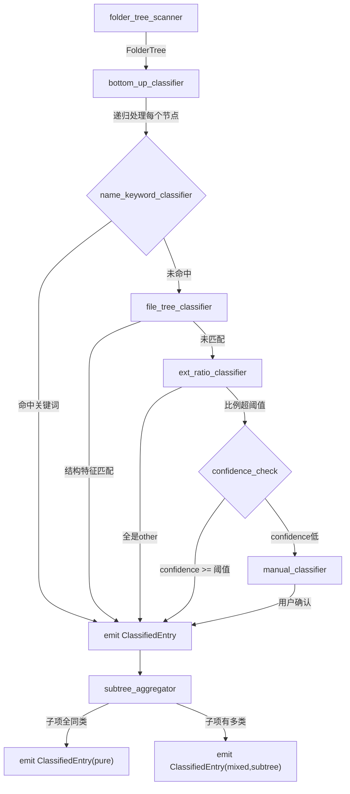
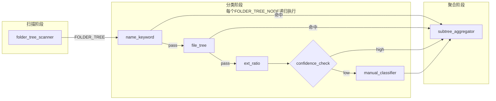
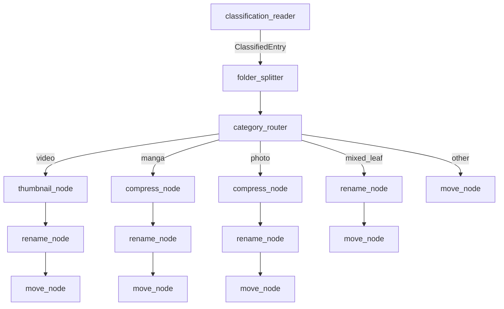

# 节点工作流系统设计

## 核心数据类型

节点之间传递的数据只有两种基础类型，类似 ComfyUI 的 `IMAGE`/`LATENT`：

```
FolderTree           — 递归扫描结果（分类管道输入）
ClassifiedEntry      — 单条分类结果（分类管道输出，处理管道输入）
```

```
FolderTree:
  path          string
  name          string
  files         []FileEntry           // 直接子文件
  subdirs       []FolderTree          // 递归子目录

FileEntry:
  name          string
  ext           string
  size_bytes    int64

ClassifiedEntry:
  source_path   string
  folder_name   string
  category      string               // photo|video|manga|mixed|other
  confidence    float64
  reason        string
  classifier    string               // 哪个节点做出了最终判定
  subtree       []ClassifiedEntry    // mixed 时填充，记录各子项分类
  files         []FileEntry          // 该 entry 的直接文件列表（处理管道使用）
```

---

## 一、分类管道（Classification Pipeline）

### 执行逻辑图




### 节点定义

**1. `folder-tree-scanner`**

```
输入端口：  source_dir (PATH)
输出端口：  tree (FOLDER_TREE)
配置项：
  max_depth:          int   = 5        // 递归深度上限
  exclude_patterns:   []string         // 排除的目录名模式
  min_file_count:     int   = 0        // 过滤空目录
```

说明：递归扫描 source_dir 的完整子树，每个顶层文件夹输出一个 FOLDER_TREE。注意这与现有 ScannerService 的区别：当前只扫描直接子目录，新节点需要深度递归。

---

**2. `name-keyword-classifier`**

```
输入端口：  folder (FOLDER_TREE_NODE)
输出端口：  result (CLASSIFICATION_SIGNAL)
配置项：
  rules: [
    { keywords: ["漫画","manga","comic","Comics"], category: "manga", priority: 10 },
    { keywords: ["写真","photobook","gravure"],    category: "photo", priority: 9  },
    { keywords: ["电影","movie","film"],           category: "video", priority: 8  }
  ]
  match_mode: "folder_name_contains" | "folder_name_exact" | "any_file_name"
```

输出 CLASSIFICATION_SIGNAL = `{category, confidence:1.0, reason:"keyword:XXX"}`，若无匹配则输出空信号（pass-through）。

---

**3. `file-tree-classifier`**

```
输入端口：  folder (FOLDER_TREE_NODE)
输出端口：  result (CLASSIFICATION_SIGNAL)
配置项：
  rules: [
    { condition: "has_ext(.cbz|.cbr|.cb7)",           category: "manga", confidence: 0.95 },
    { condition: "all_dirs_same_category AND no_files", category: "inherit_children",       },
    { condition: "flat_images_no_subdir",              category: "photo", confidence: 0.85 },
    { condition: "has_subtitle_file AND has_video",    category: "video", confidence: 0.90 }
  ]
```

`condition` 是内置条件表达式，对文件扩展名、目录结构进行模式匹配。

---

**4. `ext-ratio-classifier`**

```
输入端口：  folder (FOLDER_TREE_NODE)
输出端口：  result (CLASSIFICATION_SIGNAL)
配置项：
  photo_threshold:      float = 0.85
  video_threshold:      float = 0.85
  mixed_min_ratio:      float = 0.15
  count_mode:           "direct_files_only" | "recursive_all"
```

与现有 `ClassifyService` 算法一致，但作为节点封装，可以插拔替换。

---

**5. `confidence-check`** (条件节点)

```
输入端口：  signal (CLASSIFICATION_SIGNAL)
输出端口0： high_confidence (CLASSIFICATION_SIGNAL)   // confidence >= threshold
输出端口1： low_confidence  (CLASSIFICATION_SIGNAL)   // 需要人工确认
配置项：
  threshold:  float = 0.70
```

这是一个分叉节点，两个输出端口对应两条边（借鉴 ComfyUI 多输出语义）。

---

**6. `manual-classifier`**

```
输入端口：  folder (FOLDER_TREE_NODE),  hint (CLASSIFICATION_SIGNAL)
输出端口：  result (CLASSIFICATION_SIGNAL)
配置项：
  timeout_seconds: int    = 0   // 0 = 无限等待
  timeout_action:  string = "fail" | "use_hint" | "skip"
```

触发后 NodeRun 进入 `waiting_input` 状态（对应 ComfyUI PENDING）。前端展示待确认队列，用户选择分类后 Resume。

---

**7. `subtree-aggregator`**（分类管道唯一的聚合节点）

```
输入端口：  node      (FOLDER_TREE_NODE)
            children  ([]CLASSIFICATION_SIGNAL)  // 各子目录的分类结果
输出端口：  result    (CLASSIFIED_ENTRY)
逻辑：
  1. 若 node 无子目录 → 直接用当前 signal 输出
  2. 若所有子目录分类相同 && 直接子文件与子目录同类 → 输出 pure ClassifiedEntry
  3. 否则 → 输出 mixed ClassifiedEntry，subtree 字段填充各子项结果
```

这是"从下往上"聚合的关键节点。它不在 ComfyUI 原有模型里，是 Classifier 特有的语义。

---

### 分类管道默认工作流图




---

## 二、处理管道（Processing Pipeline）

### 各分类子工作流总览




说明：thumbnail-node 在 video 子流中位于 rename/move 之前（先在源目录生成缩略图，再整体移动）；compress-node 在 manga/photo 子流中同样在 rename/move 之前（先打包，再移动产物）。

### 节点定义

**8. `classification-reader`**

```
输入端口：  job_id (STRING)
输出端口：  entries ([]CLASSIFIED_ENTRY)
```

从数据库读取指定 Job 的分类结果树，作为处理管道的入口。也可直接接 `subtree-aggregator` 的输出（两条管道串联时）。

---

**9. `folder-splitter`**

```
输入端口：  entry (CLASSIFIED_ENTRY)
输出端口：  items ([]PROCESSING_ITEM)
配置项：
  split_mixed:   bool = true   // true: mixed 父目录拆分为子项; false: 整体进入 mixed 工作流
  split_depth:   int  = 1      // 拆分层数（1=只拆第一层混合）
```

逻辑：

- 若 entry.category == "mixed" 且 split_mixed == true → 展开 entry.subtree，每个子项成为独立 PROCESSING_ITEM
- 否则 → 直接输出整个 entry 作为 PROCESSING_ITEM

```
PROCESSING_ITEM:
  source_path    string
  folder_name    string
  category       string
  files          []FileEntry
  parent_path    string          // 原始父目录，用于结构保持
```

---

**10. `category-router`**

```
输入端口：  item (PROCESSING_ITEM)
输出端口0： video    (PROCESSING_ITEM)
输出端口1： manga    (PROCESSING_ITEM)
输出端口2： photo    (PROCESSING_ITEM)
输出端口3： other    (PROCESSING_ITEM)
输出端口4： mixed    (PROCESSING_ITEM)   // leaf-level mixed（用户选择整体处理）
配置项：
  category_map:  object  // 可自定义映射，如把 "photo" 也发到 video 端口
```

这是一个纯路由节点，无副作用，无 Rollback 需求。

---

**11. `rename-node`**

```
输入端口：  item (PROCESSING_ITEM)
输出端口：  item (PROCESSING_ITEM)   // folder_name 字段已被替换为 target_name

配置项：
  strategy:    "static" | "template" | "regex_extract" | "conditional"

  // strategy = "static"
  static_name: string             // 例："整理后的电影"

  // strategy = "template"
  template:    string             // 例："{category}-{name}" 或 "{year}_{name}"
  // 可用变量：{name} {category} {year} {index} {ext} {parent}
  // {year}：从原文件夹名用内置正则提取 4 位年份；未匹配时留空

  // strategy = "regex_extract"
  extract_pattern:  string        // 正则，带命名分组，例：(?P<title>.+)\s\((?P<year>\d{4})\)
  output_template:  string        // 例："{title} ({year})"

  // strategy = "conditional"
  conditions: [
    { match_expr: "name CONTAINS '(20'",  strategy: "regex_extract", ... },
    { match_expr: "DEFAULT",              strategy: "template",       template: "{name}" }
  ]

  // 通用选项
  dry_run:     bool = false        // true 时只预览，不真正重命名
```

---

**12. `move-node`**

```
输入端口：  item (PROCESSING_ITEM)
输出端口：  result (MOVE_RESULT)

配置项：
  target_dir:          string      // 输出根目录，必填，如 "/data/target/video"
  move_unit:           "folder" | "files"
  // "folder"：将整个文件夹移动到 target_dir 下
  // "files"：将文件夹内的文件平铺移动到 target_dir 下（不创建子目录）

  preserve_substructure: bool = true
  // 仅在 move_unit="folder" 时有效
  // true: 保持多层结构（如 Season 1/ Season 2/ 保持在父目录下）
  // false: 只移动当前节点，忽略内部子目录

  conflict_policy:     "skip" | "overwrite" | "auto_rename"
  // auto_rename: 目标已存在时自动追加 _1 _2 ...

  create_target_if_missing: bool = true

snapshot_before: true   // 固定行为，移动前强制创建 NodeSnapshot
```

```
MOVE_RESULT:
  source_path    string
  target_path    string
  status         "success" | "skipped" | "failed"
  error          string
```

---

**13. `thumbnail-node`**（视频子工作流专用）

```
输入端口：  item (PROCESSING_ITEM)
输出端口：  item (PROCESSING_ITEM)    // 同类型透传，item.files 中会追加生成的缩略图记录

配置项：

  scope:
    "folder_cover"   — 为整个文件夹生成一张代表性封面图（默认）
                       选取策略：优先已存在 poster.jpg/folder.jpg；
                                 否则取文件夹内体积最大的视频文件的指定时间点帧
    "per_video"      — 为每个视频文件各生成一张缩略图（{video_name}-thumb.jpg）

  extract_time:     string = "00:00:10"
                    // 支持绝对时间 "HH:MM:SS" 或相对比例 "10%"（取视频时长的 10%）

  output_format:    "jpg" | "png"  = "jpg"

  output_naming:
    "emby_poster"   → poster.jpg          // Emby 标准封面
    "emby_folder"   → folder.jpg          // 部分播放器识别的格式
    "template"      → 使用 output_name_template 字段

  output_name_template: string            // 仅 output_naming="template" 时有效
                                          // 可用变量：{name} {ext} {index}
                                          // 例："{name}-thumb.{ext}"

  target_size:      string = "1280x720"   // 输出尺寸，"original" 表示不缩放

  fit_mode:
    "pad"           → 保持原始比例，黑边填充至目标尺寸（FFmpeg pad 滤镜，Emby 推荐）
    "cover"         → 裁剪填满目标尺寸
    "contain"       → 等比缩小，不裁剪，不填充

  skip_if_exists:   bool = true           // 已存在同名缩略图时跳过
  write_location:   "source_dir"          // 缩略图写入源文件夹内（随 move-node 一起移动）
```

**副作用与回退**：

- 在 `item.source_path` 内写入一到多个图片文件（poster.jpg 等）
- Rollback = 删除本节点创建的所有缩略图文件
- NodeSnapshot（pre）记录执行前 source_path 内已有的文件列表；post 记录新增文件

**与 Emby 的关系**：

- 输出满足 `[docs/功能/视频缩略图规范.md](docs/功能/视频缩略图规范.md)` 中的命名约定
- 电影/单文件夹：生成 `poster.jpg`；剧集总目录：生成 `folder.jpg`
- scope = "per_video" 时生成 `{name}-thumb.jpg`，Emby 可按集索引

---

**14. `compress-node`**（漫画 / 写真子工作流专用）

```
输入端口：  item (PROCESSING_ITEM)
输出端口：  item (PROCESSING_ITEM)    // source_path 不变，但 item.files 更新为打包后的文件列表

配置项：

  format:
    "cbz"    — Comic Book Zip，漫画阅读器首选
    "zip"    — 通用压缩，写真集归档推荐

  scope:
    "folder"            — 将 source_path 内的所有匹配文件打包为单个归档
                          输出位置：source_path/{folder_name}.cbz（放在文件夹内部）
    "subfolder_each"    — 将 source_path 的每个子目录分别打包为独立归档
                          输出位置：每个子目录旁边生成对应的 .cbz 文件
                          适合：多卷漫画（每个 Vol.xx 子目录 → Vol.xx.cbz）
    "flat_recursive"    — 递归收集所有匹配文件打包为单个归档（忽略子目录层级）

  archive_naming:       string = "{name}"
                        // 归档文件名模板，可用变量 {name} {index} {parent}
                        // 最终文件名 = archive_naming + "." + format

  include_patterns:     []string = ["*.jpg","*.jpeg","*.png","*.webp","*.gif","*.avif"]
  exclude_patterns:     []string = [".DS_Store","Thumbs.db","desktop.ini"]

  sort_order:
    "natural"           — 自然排序（001 < 002 < 10），适合漫画页码
    "name"              — 字母序
    "mtime"             — 修改时间序

  compression_level:    int = 0           // 0 = 仅打包不压缩（cbz 惯例，已是图片无需二次压缩）
                                          // 1-9 = 压缩（zip 归档时可用）

  delete_source:        bool = false      // 打包成功后是否删除原始图片文件
                                          // false：文件夹内同时保有图片和归档
                                          // true：只保留归档（节省空间，需谨慎）

  skip_if_already_packed: bool = true     // 若文件夹内已全部为 .cbz/.zip，直接跳过
```

**副作用与回退**：

- 在 `item.source_path` 内创建 `.cbz` / `.zip` 文件
- 若 `delete_source = true`，同时删除被打包的原始文件
- Rollback 分两种情况：
  - `delete_source = false`：删除本节点生成的归档文件即可
  - `delete_source = true`：解压归档恢复原始文件，再删除归档（NodeSnapshot pre 中已记录原始文件列表）
- NodeSnapshot（pre）记录执行前文件夹完整内容；post 记录打包后状态

**典型使用场景**：


| 场景                   | scope            | delete_source | 效果                 |
| -------------------- | ---------------- | ------------- | ------------------ |
| 扁平漫画（images 直接在文件夹内） | `folder`         | `true`        | 打包为单个 .cbz，原图删除    |
| 多卷漫画（子目录按卷分）         | `subfolder_each` | `false`       | 每卷生成独立 .cbz，原子目录保留 |
| 写真集归档（保留原图）          | `folder`         | `false`       | 生成 .zip，原图保留       |
| 多卷写真集                | `subfolder_each` | `true`        | 每册打包，原图删除          |


**与 move-node 的配合**：

compress-node 始终在 source_path **内部**生成归档文件，source_path 本身不变，因此 downstream 的 move-node 可以直接使用 `move_unit = "folder"` 整体移动文件夹（包含归档在内）。若用户希望只移动归档文件（不要外层文件夹），则将 move-node 的 `move_unit` 设为 `"files"`。

---

## 三、节点框架层设计

### NodeExecutor 接口（Go）

```go
type NodeExecutor interface {
    Type()   string
    Schema() NodeSchema
    Execute(ctx context.Context, in NodeExecutionInput) NodeExecutionResult
    Resume(ctx context.Context, in NodeExecutionInput, token string) NodeExecutionResult
    Rollback(ctx context.Context, in NodeRollbackInput) error
}

type NodeExecutionResult struct {
    Status        ExecutionStatus   // Success | Failure | Pending
    Outputs       []any             // 按输出端口索引排列
    Error         error
    PendingReason string            // "waiting_user_input"
    ResumeToken   string
}
```

### 端口类型系统


| 类型标识                    | 说明                                          | 主要节点                                  |
| ----------------------- | ------------------------------------------- | ------------------------------------- |
| `FOLDER_TREE`           | 递归目录扫描结果                                    | folder-tree-scanner 输出                |
| `FOLDER_TREE_NODE`      | 树中单个目录节点（分类器操作的基本单元）                        | 各 classifier 的输入/输出                   |
| `CLASSIFICATION_SIGNAL` | 单次分类器的判定信号（category + confidence + reason）  | 各 classifier 输出，subtree-aggregator 输入 |
| `CLASSIFIED_ENTRY`      | 聚合后的完整分类结果，含 subtree 字段                     | subtree-aggregator 输出                 |
| `PROCESSING_ITEM`       | 处理管道的工作单元，贯穿 compress/thumbnail/rename/move | folder-splitter 输出，各 action 节点透传      |
| `MOVE_RESULT`           | 移动操作结果（只读，用于日志/后续节点感知）                      | move-node 输出                          |
| `PATH`                  | 文件系统路径字符串                                   | folder-tree-scanner 输入                |
| `BOOLEAN`               | 条件分支布尔值                                     | confidence-check 的变体，未来 condition 节点  |


### NodeSchema（用于前端属性面板自动渲染）

```go
type NodeSchema struct {
    TypeID      string
    DisplayName string
    Category    string    // "scanner" | "classifier" | "aggregator" | "router" | "action"
    Inputs      []PortSchema
    Outputs     []PortSchema
}
type PortSchema struct {
    Name     string
    PortType string
    Required bool
    Lazy     bool    // condition 节点的分支输入标记为 lazy
    Widget   *WidgetConfig
}
```

### GET /api/node-types 端点

前端编辑器调用此端点获取所有已注册节点的 Schema，动态渲染左侧节点面板和右侧属性表单。

---

## 四、两条管道的数据库支撑

在现有 `workflow_definitions` / `workflow_runs` / `node_runs` / `node_snapshots` 规划表（见 `[docs/架构/数据模型（版本3）.md](docs/架构/数据模型（版本3）.md)`）基础上，增加以下字段：

```sql
-- node_runs 新增字段
ALTER TABLE node_runs ADD COLUMN input_signature TEXT;   -- 节点缓存 key
ALTER TABLE node_runs ADD COLUMN resume_token     TEXT;  -- manual-classifier 等待凭证
-- status 新增枚举值: waiting_input | skipped

-- workflow_runs 新增字段
ALTER TABLE workflow_runs ADD COLUMN external_blocks INTEGER DEFAULT 0;
-- 记录当前有多少节点处于 waiting_input，>0 时整个 run 状态为 waiting_input
```

---

## 五、完整节点速查表


| #   | 节点 ID                     | 分类         | 管道              | 有副作用     | 可回退        |
| --- | ------------------------- | ---------- | --------------- | -------- | ---------- |
| 1   | `folder-tree-scanner`     | scanner    | 分类              | 否        | —          |
| 2   | `name-keyword-classifier` | classifier | 分类              | 否        | —          |
| 3   | `file-tree-classifier`    | classifier | 分类              | 否        | —          |
| 4   | `ext-ratio-classifier`    | classifier | 分类              | 否        | —          |
| 5   | `confidence-check`        | control    | 分类              | 否        | —          |
| 6   | `manual-classifier`       | classifier | 分类              | 否（DB写入）  | 清除分类结果     |
| 7   | `subtree-aggregator`      | aggregator | 分类              | 否（DB写入）  | 清除聚合结果     |
| 8   | `classification-reader`   | source     | 处理              | 否        | —          |
| 9   | `folder-splitter`         | router     | 处理              | 否        | —          |
| 10  | `category-router`         | router     | 处理              | 否        | —          |
| 11  | `rename-node`             | action     | 处理              | 是（FS重命名） | 恢复原名       |
| 12  | `move-node`               | action     | 处理              | 是（FS移动）  | 移回原路径      |
| 13  | `thumbnail-node`          | action     | 处理（video）       | 是（写入图片）  | 删除生成文件     |
| 14  | `compress-node`           | action     | 处理（manga/photo） | 是（写入归档）  | 删除归档/恢复原文件 |


---

## 六、实施计划

文档持久化到 `docs/功能/节点系统设计.md`，内容包括：

- 两条管道的完整节点规格（输入/输出/配置项/副作用说明）
- FolderTree / ClassifiedEntry / ProcessingItem 的 Go struct 定义
- 默认分类工作流 JSON 示例（可直接导入数据库）
- 默认处理工作流 JSON 示例（含 video / manga / photo / mixed 四条分支）
- 节点端口类型系统速查表
- 与现有代码的接驳点：
  - `ScannerService` → `folder-tree-scanner`（深度递归替代浅层扫描）
  - `ClassifyService` → `ext-ratio-classifier`（算法不变，封装为节点）
  - `MoveService` → `move-node`（现有移动逻辑封装为节点）
  - FFmpeg runtime → `thumbnail-node`（已在 Docker 镜像中内置）
  - Go 标准库 `archive/zip` → `compress-node`（无额外依赖）

