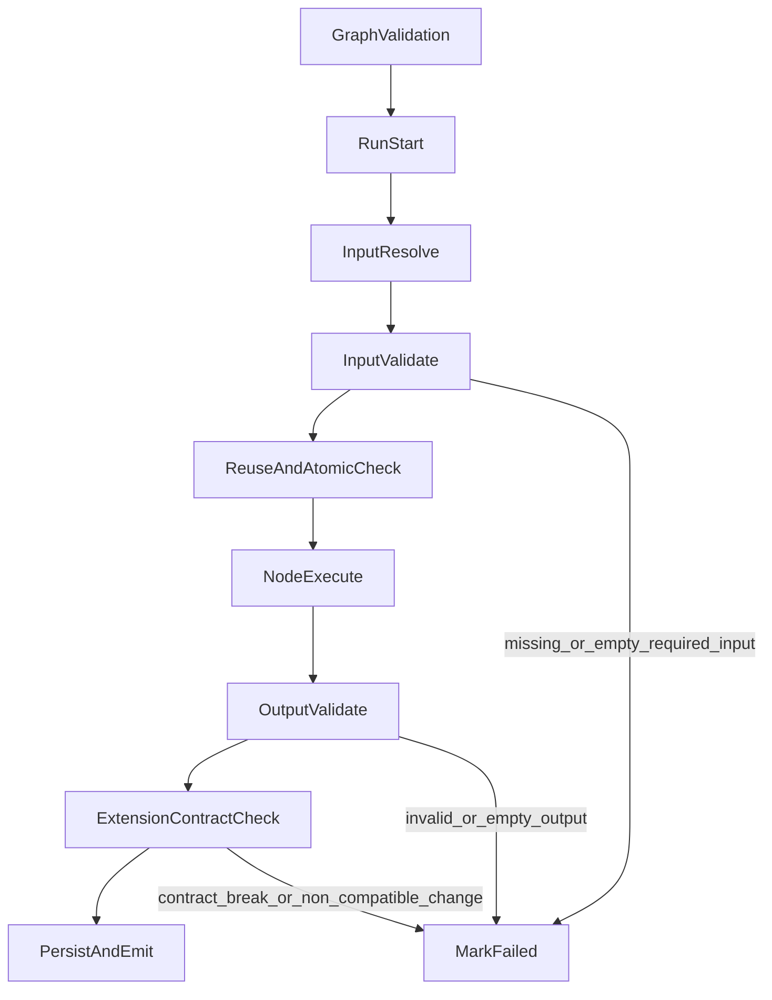

# 工作流节点设计规范

> 版本：v1.0  
> 日期：2026-03-29  
> 适用范围：`backend/internal/service/workflow_runner.go`、`backend/internal/service/workflow_graph_validator.go` 及所有 `node_*.go` 执行器

---

## 1. 背景与目标

当前工作流引擎已具备 DAG 拓扑执行、节点级运行记录、失败回滚与人工恢复能力，但节点输入输出契约仍以“约定为主”，存在以下风险：

- 必填输入在运行时可能被解析为“空值”，节点被跳过或执行器自行兜底，导致行为不一致。
- 节点返回 `succeeded` 时允许空输出，存在“假成功”风险。
- 输出端口与 `Schema()` 的一致性缺少统一校验，跨节点复用时容易出现隐性耦合。
- 节点职责边界在设计层未强约束，容易出现“大节点”导致复用性和可维护性下降。

本规范的目标是建立统一的节点设计与验收标准，保证：

- 输入有效：不接受空输入、类型错误输入、语义无效输入。
- 输出可信：成功状态必须产出满足契约的有效输出。
- 状态真实：禁止“假成功”，失败可定位、可审计、可回放。
- 节点可复用：语义清晰、职责单一、组合优先。
- 工作流可拓展：节点可平滑演进，契约变更可控且向后兼容。

---

## 2. 术语定义

- `节点契约`：由 `Schema()` 声明的输入端口、输出端口、类型和约束规则。
- `空输入`：`nil`、空字符串、空集合、无效结构体或缺少关键字段的对象。
- `假成功`：节点状态为 `succeeded`，但输出缺失、类型不符或语义无效。
- `原子节点`：只完成一个可独立验证的业务动作，不承担多阶段编排。
- `可复用节点`：不依赖特定工作流上下文，可在多个流程中直接复用。

---

## 3. 节点生命周期与校验主线

---

## 4. 节点契约规范（强制）

### 4.1 Schema 声明规范

每个节点必须实现并维护完整 `Schema()`，满足：

- 必须声明全部 `input_ports` 与 `output_ports`，禁止“隐式端口”。
- 必填输入必须显式标记 `Required=true`。
- 每个端口必须有稳定 `Type`，禁止运行时动态改写端口类型。
- 端口命名必须使用业务语义名称，禁止使用无法表达含义的名称。

### 4.2 输入契约规范

对 `Required && !Lazy` 端口，运行时必须通过以下校验：

- 绑定存在：图中已配置 `const_value` 或 `link_source`。
- 值非空：不得为 `nil`、空字符串、空集合。
- 类型匹配：值类型与端口类型一致。
- 语义有效：对象类型必须满足最小关键字段约束。

任一校验失败，节点必须标记为 `failed`，不得返回 `succeeded` 或以 `waiting_input` 掩盖。

### 4.3 输出契约规范

节点返回 `ExecutionSuccess` 必须满足：

- 必须产出所有声明为“必需输出”的端口值。
- 输出值必须非空且类型匹配。
- 输出对象必须通过语义校验（关键字段完整、结构合法）。

不满足时统一判定为 `failed`（输出非法），禁止入库为成功。

### 4.4 状态语义规范

- `succeeded`：输入合法、执行成功、输出合法，三者同时满足。
- `failed`：输入非法、执行异常、输出非法任一成立。
- `waiting_input`：仅用于明确的人机交互或外部依赖等待场景，不可用于校验失败。
- `skipped`：仅用于设计允许的分支缺省语义，不可作为“输入不合法”的替代状态。

---

## 5. 双层校验策略

### 5.1 图级校验（定义保存前）

由 `workflow_graph_validator` 执行，至少覆盖：

- 节点类型合法性、端口存在性、连线合法性。
- 上下游端口类型匹配。
- 必填输入端口具备绑定。
- 图拓扑无环，连线与 `node.Inputs` 一致。

图级校验失败时禁止保存或执行。

### 5.2 运行时校验（节点执行期）

由 `workflow_runner` 统一执行，至少覆盖：

- 输入解析后非空与类型一致性校验。
- 执行器输出端口覆盖率校验。
- 输出类型校验与语义校验。
- 成功状态与输出一致性校验（防假成功）。

运行时校验失败必须统一落 `failed`，并记录错误码与节点上下文。

---

## 6. 可复用性与原子性规范

### 6.1 可复用性（强制）

- 节点输入输出应使用领域通用语义，不绑定某个具体工作流 ID、页面行为或临时上下文。
- 节点副作用必须可声明、可观测、可回滚。
- 节点配置项必须最小化，优先使用稳定参数，禁止隐式读取外部全局状态。

### 6.2 原子性（强制）

- 一个节点仅完成一个业务动作（如“读取分类结果”“执行移动”“生成缩略图”）。
- 禁止把“分类 + 路由 + 落库”等多个阶段合并进同一节点。
- 复杂流程必须通过多个原子节点编排，不得在单节点内嵌子流程引擎。

---

## 7. 工作流可拓展性规范

### 7.1 契约演进

- 新增端口或字段时必须保证向后兼容（新增可选项）。
- 删除或重命名端口必须版本化，不得直接破坏已有定义。
- 节点类型语义发生变化时必须引入新类型或新版本标识。

### 7.2 接入标准

新节点接入必须同时满足：

- 完整 `Schema()` 声明。
- 统一注册到执行器注册表。
- 支持统一校验、统一审计、统一事件上报。
- 至少具备成功、失败、空输入、空输出、类型错误五类测试。

---

## 8. 错误分级与审计规范

建议统一错误码前缀（示例）：

- `NODE_INPUT_*`：输入缺失、空值、类型错误、语义错误。
- `NODE_EXEC_*`：执行器内部异常。
- `NODE_OUTPUT_*`：输出缺失、空值、类型错误、语义错误。
- `NODE_CONTRACT_*`：契约不兼容或版本冲突。

每次失败必须至少记录：

- `workflow_run_id`、`node_run_id`、`node_id`、`node_type`
- 错误码、错误信息、触发阶段（输入/执行/输出）
- 输入摘要与输出摘要（脱敏后）

---

## 9. 测试基线与准入门禁

### 9.1 节点级测试矩阵

每个节点必须覆盖：

- 必填输入缺失。
- 必填输入为空值。
- 输入类型错误。
- 执行异常路径。
- 成功路径（输出完整且语义有效）。
- 输出缺失/空值导致失败（防假成功）。

### 9.2 Runner 级测试矩阵

引擎必须覆盖：

- 图级校验失败阻断执行。
- 运行时输入校验失败统一标记 `failed`。
- 成功但空输出被拒绝并落 `failed`。
- `waiting_input` 与 `failed` 语义不混淆。
- 分支 `skipped` 与“输入非法失败”语义区分。

通过门禁：

- `CGO_ENABLED=0 go test ./...` 全通过。
- 不允许新增“成功但无有效输出”的回归用例通过。

---

## 10. 存量节点改造清单

建议按以下顺序落地：

1. 在 `workflow_runner` 增加统一输入/输出契约校验入口。
2. 为 `PortDef` 补充输出必需性与可空性定义（如 `RequiredOutput` / `AllowEmpty`）。
3. 给所有 `node_*.go` 节点补充“输出语义校验”。
4. 补齐 runner 与节点单测，覆盖空输入与假成功场景。
5. 对历史工作流定义做兼容检查，必要时自动迁移或标记版本。

---

## 11. 规范执行规则（MUST / SHOULD）

- MUST：任何节点不得在输入非法或输出非法时返回 `succeeded`。
- MUST：任何必填输入端口不得接受空值。
- MUST：`waiting_input` 只能用于真实等待外部输入场景。
- MUST：节点必须保持原子职责，禁止多阶段耦合。
- SHOULD：节点默认可跨工作流复用，避免上下文绑定。
- SHOULD：节点契约变更遵循向后兼容策略并提供迁移路径。

---

## 12. 附：与现有代码的映射关系

- 图级校验入口：`backend/internal/service/workflow_graph_validator.go`
- 运行时主流程：`backend/internal/service/workflow_runner.go`
- 节点实现集合：`backend/internal/service/node_*.go`
- 现有跳过语义测试：`backend/internal/service/workflow_runner_skip_test.go`
- 现有 runner 测试：`backend/internal/service/workflow_runner_test.go`

本规范用于统一“节点设计、节点实现、节点验收”三套标准，后续新增节点与改造存量节点均必须按本文件执行。
